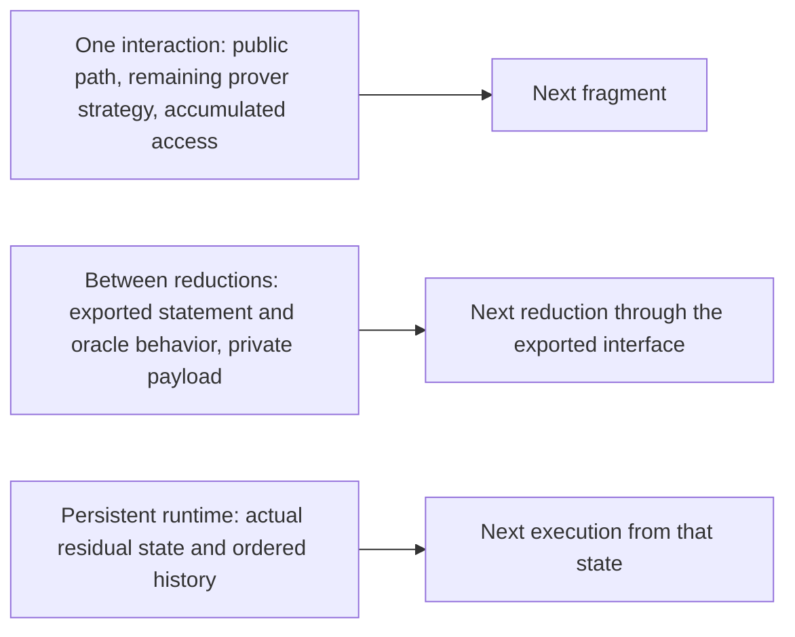

# 02 — Oracle Reduction Core: Claims, Closing, and Composition

**Architecture and semantic requirements.** This chapter explains the read-only claim-resource
layer, denoted Δ: what an oracle reduction receives, what it exports, and how those claims close
and compose. The reader is assumed to know protocols, oracles, and soundness. Code snippets are
schematic descriptions unless linked to an implemented declaration.
[Current status](00-current-status.md) records the proved results; the
[roadmap](05-roadmap.md) records implementation targets. Persistent worlds and probability
premises belong to [the execution chapter](03-adversarial-oracle-execution.md).

## 1. What an oracle reduction contains

An oracle reduction transforms claims about oracles into new claims about (possibly derived) oracles. Four layers, four purposes:

| Layer | Object | Records | Consumed by |
|---|---|---|---|
| backing | `SourceCtx` env/handler | what this execution can query | executor, composer, extractor |
| derived view | `VirtualOracle`; `eval` | typed query program; behavior by interpretation | verifier, composer, compiler |
| relation boundary | `ClosedClaim` | statement + output behavior | relations/games |
| representation | `Materialization`, commitments | concrete storage, binding, cost | honest prover, compiler |

Three objects around any oracle, never conflated: **(1)** concrete data (a polynomial), **(2)** arbitrary behavior (answers to all queries), **(3)** a query program deriving answers from other resources. The verifier defines (3); relations consume (2); the honest prover often has (1). The stable point:

> A virtual oracle program is the operational representation; behavior is its mathematical meaning;
> concrete data is an optional witness to that behavior.

A FRI round illustrates why both derived and fresh oracles matter. It exports a virtual fold of
an earlier word and receives a fresh prover word `g`, then checks their agreement by sampling.
An output interface must be able to contain both views. Exporting only existing resource handles
cannot express the derived view; exporting only concrete data hides how later queries are routed.

## 2. Representation-indexed claims

The implemented [claim layer](../../ArkLib/Interaction/Oracle/Claim.lean) uses one claim shape
with three representations. Omitting universe and indexing arguments, its structure is:

```lean
structure ClaimWith (Rep : OracleFamily → Type) (Stmt : Type) (Out : OracleFamily) where
  stmt    : Stmt
  oracles : Rep Out

abbrev OpenClaim (srcSpec) Stmt Out := ClaimWith (VirtualOracle srcSpec) Stmt Out  -- open
abbrev ClosedClaim Stmt Out          := ClaimWith OracleFamily.Behavior Stmt Out    -- closed
abbrev ConcreteClaim Stmt Out            := ClaimWith (fun O => ∀ i, O.Realization i) Stmt Out  -- concrete realizations
-- HonestProverOutput = ConcreteClaim × Witness
```

Representation morphisms into behavior: `eval` (open → closed, per handler) and `OracleFamily.behaviorOfRealizations` (realizations → behavior). `ConcreteClaim.closesTo` states that interpreting a concrete claim gives exactly the specified closed claim. This is equality of statements and observable behavior; it does not assert honesty, relation membership, or execution provenance. `stmt` is produced by the verifier's own (possibly query-dependent) terminal computation; scalar outputs computed from oracle queries (sumcheck's `Tᵢ := sᵢ(rᵢ)`, STIR shift values) live in `stmt`, never in the oracle component. `stmt` is *run*-determined, not env-determined — the joint execution artifact (`03` §2) ties them; there is no theorem "`ClosedClaim` is a function of `Env`" and none should be attempted.

Sumcheck gives a concrete distinction between a verifier query and an output relation. Its final
claim retains the original polynomial oracle; the relation says that this oracle evaluated at the
full challenge vector equals the final target. This is an obligation on the closed output, not an
extra final verifier query to the original polynomial.

## 3. Core objects

### 3.1 Families and behavior

```lean
structure OracleFamily (Index : Type u) (Realization : Index → Type v) where
  interface : (i : Index) → OracleInterface.{v, w} (Realization i)

abbrev OracleFamily.Behavior {I : Type u} {Data : I → Type v}
    (Out : OracleFamily.{u, v, w} I Data) := QueryImpl ([Data]ₒ' Out.interface) Id
```

Interfaces are explicit structure data. ArkLib's explicit-instance spec notation `[…]ₒ'` supplies
the chosen interface without assuming that a structure field is a typeclass instance.

An optional structured presentation can provide a type `Sem` and a map `Sem → Behavior`, with
injectivity as an additional assumption. These proposed `SemanticPresentation` and
`FaithfulPresentation` interfaces are conveniences for clients. Relations authored on any such
presentation must be invariant under equality of behavior.

### 3.2 Source contexts

```lean
structure SourceCtx where
  ι    : Type
  spec : OracleSpec ι          -- the *signature* (call it srcSpec when passed alone)
  Env  : Type                  -- what realizes it
  impl : Env → QueryImpl spec Id
```

`SourceCtx` is deliberately extensional. Pure `SourceHom` routes handlers and is the only morphism
needed by semantic substitution. An `OracleModel` assigns realizations, interfaces, provenance,
and interpreted property symbols to stable names. A `NamedContext` selects distinct names from that model; its `Inclusion` preserves
names, while a `View` may alias them. Promised properties hold for every admissible realization.
An inclusion induces a `SourceHom` on interpreted sources. A later `BackendAssignment` is
indexed by the named context. This keeps semantic substitution independent of compiler metadata
without leaving provenance prose-only.

For a reduction at ambient `shared` and branch path `path`, the source context has **three** parts:

```lean
def sourcesAt (shared) (path) : SourceCtx :=
  (setupSources shared).sum ((inputSources shared).sum (messageSources shared path))
```

- **Setup part:** preprocessing/indexer oracles, CRS handles, correlated public parameters. Each setup source is classified in the companion `OracleModel` as public data (in `shared`), read-only Δ behavior (here), or a persistent Γ runtime (`03` §1). Systems without setup take this part empty.
- **Input part:** `InputImpl` — arbitrary deterministic behavior for the input-oracle interfaces. Soundness quantification is unchanged and unweakened.
- **Execution-path part:** the structural hidden-message fiber

```lean
def Oracle.TypeTree.OracleMessagesAt :
    (s : Oracle.TypeTree) → Oracle.TypeTree.BranchPath s → Type
  | .done, _ => PUnit
  | .public _ rest, ⟨x, tail⟩ => OracleMessagesAt (rest x) tail
  | .oracle X cont, ⟨_, tail⟩ => X × OracleMessagesAt (cont ⟨⟩) tail
```

with `answerAt` (taking the `OracleDecoration`) the structural sibling of `answerQuery`. Not "always
inhabited": the correct statement is that **every realized execution path canonically produces
one** — the conversion is the theorem the execution layer exports.

### 3.3 Guarantees travel with oracles (D1 — normative)

Prover-sent oracle message types **may be refined**: sumcheck's round message is `degree ≤ d` polynomials; an IOP proof slot may be typed as a codeword. This is the ideal model working as intended: the verifier can never inspect the underlying object, so the slot's *type is the interface guarantee* — the same way the literature hands the IOP verifier oracles *promised* to satisfy a predicate, with soundness stated against the promise. Consequences:

1. `OracleMessagesAt` stores concrete typed payloads. Malicious execution-path oracle behavior
   ranges over *representable* values of the declared message type. This is faithful to both the
   runtime (the prover physically sends a value) and the textbook (IOP strings are literal strings).
2. Behavior-generality applies where it must: input oracles in games, and closed output claims. A *promise-free* slot is declared by choosing an unrefined message type; the two styles coexist per-slot.
3. **The compiler owes GuaranteeTransport** (`04` §2): each type-level guarantee on an oracle slot becomes, under compilation, an explicit obligation of the commitment scheme's commit/open phases (degree enforcement, proximity testing, well-formedness proofs). A guarantee that no backend can discharge blocks compilation of that slot — by design, loudly.
4. Relations still carry *claim-level* validity (proximity parameters, admissibility); the type carries *slot-level* interface promises. Rule of thumb: if the honest prover establishes it by construction and the ideal verifier consumes it as an interface assumption, it may live in the type; if it is what the protocol *establishes or tests*, it lives in the relation.

### 3.4 Virtual oracles

```lean
structure VirtualOracle (srcSpec : OracleSpec ι) (Out : OracleFamily) where
  query : QueryImpl ([Out.Realization]ₒ' Out.interface) (OracleComp srcSpec)

def VirtualOracle.eval (v) (ρ : QueryImpl srcSpec Id) : Out.Behavior :=
  fun q => simulateQ ρ (v.query q)
```

No stored denotation, no stored coherence: `eval` *is* the denotation; smart constructors ship `eval`-simplification lemmas; coherence is by construction. This is the algebraic-effects reading of the existing `simulate` field — `OracleComp` the free program, handlers the models, `simulateQ` interpretation, substitution handler-composition.

### 3.5 Closing

```lean
def OpenClaim.closeWith (c) (ρ : QueryImpl srcSpec Id) : ClosedClaim Stmt Out :=
  ⟨c.stmt, c.oracles.eval ρ⟩
```

`closeWith` is a semantic helper; it accepts a handler explicitly. Supported games instead use
[`CoreRun.closed`](../../ArkLib/Interaction/Oracle/CoreRun.lean), which closes with the input
behavior and messages paired by the same execution. The carrier alone does not certify that a run
occurred: executor equations or support membership supply that provenance.

Closing forgets the presentation while retaining the exported behavior. If a later reduction needs
an earlier resource, the output interface must export it, for example by an identity view. A fused
implementation may use the original sources beneath that interface, provided it proves the routing
and observation laws described below.

## 4. Constructors

Minimal set: `id`/passthrough, `reindex`, `sumWeaken`, `mapSource`, `substSource`, `subst`, and the escape hatch `ofQuery`. Algebraic constructors (`linComb`, `fold`, `quotient` with its validity predicate in the relation) land when a protocol port first needs them, each with its `eval` lemma and, where applicable, a `Materialization`. Boundaries ("lenses", historically): projection direction = a virtual view + `subst`; reverse direction = materialization/witness transport with its own coherence — call them dependent refinement boundaries unless lens laws are actually proved.

## 5. Composition

Composition has two claim-resource boundaries. They require different access rules even when a
fused implementation runs both through the same interaction tree. A third boundary, persistent
world state, is covered in [the execution chapter](03-adversarial-oracle-execution.md).



### 5.1 Continuing one interaction or starting the next reduction

Inside one interaction, a suffix continues from the prefix's public structural path, verifier-local
values, and accumulated oracle access. The prover continues with the actual remaining strategy,
including its private memory. Earlier oracle messages remain available at the declared interfaces;
their representations do not become arguments to verifier authoring code.

Between reductions, the suffix receives the declared exported statement and oracle behavior, plus
any separately carried private prover payload. It queries that exported interface. The prefix's
input resources and sent messages implement the interface, but the suffix verifier cannot inspect
their hidden environment. [`ExecutionInterface` and `ClosedStage`](../../ArkLib/Interaction/Oracle/Composition.lean)
express this boundary for ordered execution of separate reductions. Their sequencing laws do not
establish equality with one flattened native tree or a general composition-security theorem.

An exported virtual oracle may derive one answer from several source queries, transform an answer,
or hide a source slot entirely. Consequently, the exported-query log and source-query log need not
be identical. A routing theorem must preserve their specified relationship, including query order,
responses, multiplicity, and any charged expansion cost.

### 5.2 Native strategies and suffix shape

“Native” means using the existing interaction tree, prover strategy, and paired runner directly.
The plain [`run_appendFlat_splitPrefix`](../../ArkLib/Interaction/CompositionSoundness.lean)
equation extracts the actual suffix strategy from every whole prover on the appended tree. It
requires only a lawful monad. Selecting the suffix counterpart is a pure function of the prefix
path and counterpart output; effects inside either strategy remain unrestricted.

Plain native append permits the suffix tree to depend on the complete prefix path. The proposed
restricted oracle append must instead select its shape from `BranchPath`, the public structural
path which hides concrete oracle messages. The runtime `ExecutionPath` retains those messages to
interpret resource answers. Verifier-local query results may affect the verifier's strategy within
the selected shape, and query-dependent public moves may select structural branches. A private
computation cannot silently choose a different tree: that choice must be represented in public
branching or supported by a coherent extension of the interaction model.

### 5.3 Effect order and terminal computation

The current [verifier interpreter](../../ArkLib/Interaction/Oracle/Execution.lean) returns a pending
terminal computation. `executeStrategies` executes the paired interaction first and then runs that
computation exactly once. Appending a suffix can remove the intermediate terminal leaf, so simply
moving its callback to the beginning of the suffix is not an execution law. For example, a check
performed after the first suffix send can observe a different world state from the same check
performed before that send.

The first restricted composition target joins fragments returning ordinary data at the boundary,
with no pending interpreted action there. This is a sufficient initial scope; effects at existing
protocol nodes and private prover continuations remain allowed. A client needing an effectful
boundary can preserve its actual schedule, place the action at an explicit protocol node, or prove
that the particular crossed effects can be interchanged for the claimed observation. A global
commutative-monad assumption is stronger than this local requirement. An explicit barrier that
changes the schedule needs its own execution law; changing only a final callback is insufficient.
The existing paired runner remains the execution semantics.

“No pending effect” is a condition after interpretation. A deterministic read-only Δ query may
normalize to an ordinary value under its pure handler. The common first world-backed target thus
allows read-only claim resources while excluding terminal-view Γ queries. However, logging can
still observe Δ reads: an equation after log erasure does not establish logged execution equality.
General effectful boundaries require a proved ordering argument, rather than an assumption that
all effectful composition is impossible.

### 5.4 Virtual substitution and routing

Handler substitution uses explicit interfaces:

```lean
def SourceCtx.sum (S T : SourceCtx) : SourceCtx          -- alternative queries; paired environments
def OracleFamily.asBehaviorSource (A : OracleFamily) : SourceCtx    -- Env := A.Behavior, impl := id

def VirtualOracle.substWithSuffix
    (v : VirtualOracle S.spec A) (extra : OracleSpec J)
    (w : VirtualOracle (A.spec + extra) B) : VirtualOracle (S.spec + extra) B

-- For extra := T.spec:
-- (v.substWithSuffix T.spec w).eval (QueryImpl.add ρS ρT)
--   = w.eval (QueryImpl.add (v.eval ρS) ρT)
```

Sharing, renaming, and weakening are explicit context morphisms. Duplicating a handle is contraction
along a resource identity; it does not create a fresh source by disjoint union. The implemented
ordinary-substitution laws (`subst_assoc` and identities) use `VirtualOracle.SemEquiv`: the same
answers under every deterministic handler. Suffix substitution exposes the evaluation equation
above. Source presentation changes use `SourceEquiv`, whose inverse environment maps serve a
separate purpose.

`subst` replaces queries in exported oracle programs. It does not route access at intermediate
verifier actions or prove that the closing resources match a composed native run. Those are
execution-bridge obligations. Likewise, ArkLib's [`Reduction.execute_then`](../../ArkLib/Interaction/Reduction.lean) requires a commutative
monad for general effectful suffix construction, while the native split equation uses pure suffix
selection. Neither law permits reordering arbitrary persistent-world queries.

Compiler proofs need an operational relation preserving typed traces, order, multiplicity, and
cost; extensional virtual-oracle equivalence does not supply it. Reduction-level operational
associativity is not promised. A three-stage client should first use PolyFun's existing
`TypeTree.Chain.then`, path equivalences, and reassociation laws. Extend the upstream interface only
when a concrete client demonstrates a missing law. Shared-prefix products, lock-step repetition,
and batched shared challenges remain separate combinators with their own challenge scopes.

## 6. Core security shape (Δ side; games live in 03)

```lean
structure ClaimFamily (PublicCtx : Type) where
  Claim : PublicCtx → Type

structure Problem {PublicCtx : Type} (S : ClaimFamily PublicCtx) where
  Witness        : ∀ ctx, S.Claim ctx → Type      -- claim-dependent (committed relations!)
  admissible     : ∀ ctx, S.Claim ctx → Prop
  rel            : ∀ ctx claim, Witness ctx claim → Prop
  rel_admissible : ∀ ctx claim wit, rel ctx claim wit → admissible ctx claim

def Problem.language (P) (ctx) (claim) : Prop := ∃ w, P.rel ctx claim w
abbrev Relation (S) := { P : Problem S // P.admissible = fun _ _ => True }  -- promise-free
```

`Relation` is the promise-free case. Closed oracle claim families specialize
`Claim ctx := ClosedClaim (Stmt ctx) (Out ctx)`. Relations receive public context, a **closed claim**, and a witness — never the environment, the plan, or provenance. `admissible` covers promises, well-formedness, size bounds, and accumulator invariants (input promise / output-admissibility obligation / inductive invariant are different *proof roles* of the same mechanism, kept as named aliases). Impl-facing predicates are **generated adapters** by evaluation + closing; legacy handwritten predicates owe a two-way equivalence proof, per protocol. There is no generic bridge; the legacy namespace remains until every consumer is bridged.

Completeness requires `ConcreteClaim.closesTo` (including statement agreement) and `rel_out` on the closed claim; the old `OutputRealizes` is a derived interpreter lemma; literal data equality only under `Faithful` interfaces. Soundness/KS/RBR games, extractors, outcomes (`accept/reject/fault`), and error accounting are `03`'s subject — they require the execution layer.

## 7. Materialization

The planned representation-refinement interface has the following shape:

```lean
structure Materialization (Src : SourceCtx) (v : VirtualOracle Src.spec Out)
    (ConcreteSrc OutData : Type) where
  forget      : ConcreteSrc → Src.Env
  materialize : ConcreteSrc → OutData
  answerData  : OutData → Out.Behavior
  correct     : ∀ src, answerData (materialize src) = v.eval (Src.impl (forget src))
-- ExecutableMaterialization extends it with cost.
```

Materialization is total in this design and supports concrete representation and later executable
refinement. Security is stated on oracle behavior and closed claims; it does not rely on selecting
a concrete representation of every adversarial behavior.

## 8. Universe and notation discipline

The structural layer is universe-polymorphic: `Oracle.TypeTree.{u} : Type (u + 1)`, and its
branch and execution paths retain that generality. Later query and runtime layers preserve
independent universes until an `OracleInterface` or `OracleSpec` operation forces a concrete
constraint; existing legacy clients commonly use `OracleSpec.{0,0}`, but that is not a
foundation-wide pin. Naming: `srcSpec` for bare signatures, `Src : SourceCtx` for contexts;
`OStatementIn/Out` spellings per the consensus note; declaration-name references, not line
numbers.
