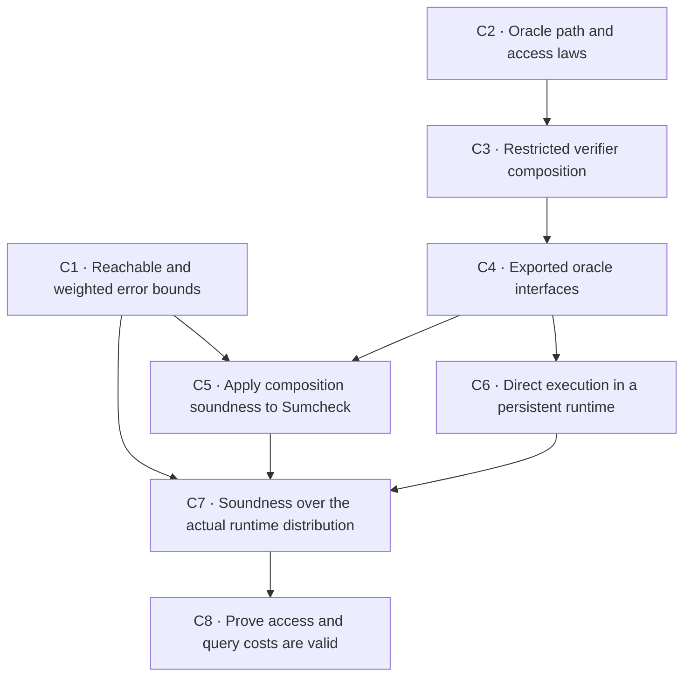

# Interaction framework roadmap

**Status date: 2026-09-26.** This is the single active roadmap for implementation of ArkLib's typed
interaction framework. The [current-status page](00-current-status.md) records what has landed and
the supported dependency versions. The design documents define the model: see the
[oracle-reduction core](02-oracle-reduction-core.md),
[oracle execution and security games](03-adversarial-oracle-execution.md), and
[oracle-elimination compiler](04-oracle-elimination-compiler.md).

The immediate goal is to compose restricted oracle protocols using the ordinary interaction
runner, then prove soundness while preserving the prover's private memory, actual oracle resources,
and any persistent runtime state.

**Status terms:** *Landed* means on `main`; *active* means one of the next composition steps below;
*later* means a follow-up client or project that uses the composition work; *conditional* means do
the work only when a real client demonstrates the need.

## Scope and contracts

Continue from the ordinary paired runner and the native results listed in
[current status](00-current-status.md). Preserve the prover's actual continuation, its private
memory, declared oracle access, and the order of effects. Do not add a second executor or a separate
prover-state machine.

The exact tree, access, closing, and effect-order contracts belong to the
[access and execution contract](01c-access-execution-contract.md) and
[oracle-reduction core](02-oracle-reduction-core.md). Persistent state, the adversary's view,
security events, and fault accounting belong to
[oracle execution and security games](03-adversarial-oracle-execution.md). The first verifier
composition result uses a boundary that returns data and has no pending action. If a protocol needs
an effect at that boundary, represent it as a protocol move or prove the local effect-order law.

For Sumcheck, the final equality between the original polynomial oracle and the claimed value stays
in the output oracle relation; it is not an extra final verifier query.

## Active work: oracle composition (C1–C8)

The issue IDs are the tracking record for these steps. C1 and C2 can proceed in parallel; the rest
follow the dependencies shown below.

### Milestone 1 — Oracle composition and complete Sumcheck (C1–C5)

These five steps prove that restricted oracle protocols compose correctly. They then use the
composition theorems to recover the existing Sumcheck soundness bound and completeness result.
They are the entry point for later protocol clients.

### C1 — Reachable and weighted soundness bounds

**Tracked in:** [issue #1222](https://github.com/Verified-zkEVM/ArkLib/issues/1222).

**Proposed PR:** `feat(interaction): add reachable soundness bounds`.

**Depends on:** none; may proceed alongside C2.

Extend [`CompositionSoundness.lean`](../../ArkLib/Interaction/CompositionSoundness.lean) using
VCVio's existing measure and event-bound tools. The current theorem asks for a prefix bound for
every prefix strategy and a suffix bound for every intermediate path and output, including
unreachable ones. Add useful versions for the actual whole prover, for reachable boundary results,
and for suffix errors that vary by result. Keep the current uniform `ε₁ + ε₂` and
`ε₁ + δ + ε₂` statements as easy-to-use corollaries.

For an exceptional set `E` of boundary results, actual boundary distribution `μ`, and suffix error
bound `e(b)` at boundary `b`, the target is
`Pr[success] ≤ Pr[E] + ∫_{b∉E} e(b) dμ(b)`. This averages the suffix error over actual boundary
results outside `E`; it does not require one worst-case bound everywhere.

Also add an almost-everywhere form: a suffix premise may fail on a set of boundary results with
probability zero. Where support is defined, a result can lie in the support and still have
probability zero, so support membership alone is not a positive-mass condition.

**Acceptance check:** Use two public branches with different suffix errors and an invalid boundary
that the prefix cannot reach. Also include a supported boundary point of probability zero where the
suffix bound fails. The theorem should retain branch-specific errors and ignore both exceptions.
Do not introduce new probability semantics beside VCVio.

### C2 — Oracle path and access laws

**Tracked in:** [issue #1223](https://github.com/Verified-zkEVM/ArkLib/issues/1223).

**Proposed PR:** `feat(interaction): prove append laws for oracle access`.

**Depends on:** none; may proceed alongside C1.

Connect tree append and path splitting to the access accumulated by the actual path. Work in the
owning modules: [`TypeTree`](../../ArkLib/Interaction/Oracle/TypeTree.lean),
[`Access`](../../ArkLib/Interaction/Oracle/Access.lean), and
[`RunSources`](../../ArkLib/Interaction/Oracle/RunSources.lean). Reuse existing path-composition,
access-composition, and query-evaluation laws; prove the missing append-specific connections instead
of defining another resource representation.

**Acceptance check:** Use a public branch whose suffix shapes differ. Show that a query to the
original oracle, a message sent in the prefix, and a message sent in the suffix each receive the
same answer in the combined and split execution.

### C3 — Restricted verifier composition

**Tracked in:** [issue #1224](https://github.com/Verified-zkEVM/ArkLib/issues/1224).

**Proposed PR:** `feat(interaction): compose native oracle verifiers`.

**Depends on:** C2.

Extend the existing restricted-verifier interpreter in
[`Execution.lean`](../../ArkLib/Interaction/Oracle/Execution.lean) so it can represent fragments
that return ordinary values, while keeping the current effectful terminal form for completed
protocols. Prove that the composed verifier runs through the ordinary paired runner and that the
suffix uses the continuation returned by the actual prefix for every whole prover. Do not add a
second recursive executor.

**Acceptance check:** A prover has effects before and after challenges and retains private memory
between fragments. Exercise public abort and its prover response. Show the final verifier action
runs once, and show that composing the fragments preserves the actual effect order. Start with a
boundary that has no pending action.

### C4 — Exported oracle interfaces and closing

**Tracked in:** [issue #1225](https://github.com/Verified-zkEVM/ArkLib/issues/1225).

**Proposed PR:** `feat(interaction): compose exported oracle interfaces`.

**Depends on:** C2 and C3.

Connect verifier composition to [`Virtual.lean`](../../ArkLib/Interaction/Oracle/Virtual.lean),
[`Claim.lean`](../../ArkLib/Interaction/Oracle/Claim.lean), and
[`RunSources.lean`](../../ArkLib/Interaction/Oracle/RunSources.lean). A suffix may query only the
oracle interface exported by the prefix. Interpret those queries using the input resources and
messages from that same prefix execution, then prove that closing the output claim agrees with this
interpretation. A caller must not replace those resources with an unrelated handler.

**Acceptance check:** Export an oracle that combines or transforms source answers and hides another
source slot. Run the two Sumcheck rounds through the composed interface. Preserve the actual
prover continuation and challenge/abort behavior. One exported query may expand to several source
queries, so do not require the two query logs to be identical.

### C5 — Apply soundness composition to Sumcheck

**Tracked in:** [issue #1226](https://github.com/Verified-zkEVM/ArkLib/issues/1226).

**Proposed PR:** `feat(interaction): derive oracle soundness composition`.

**Depends on:** C1 and C4.

Prove a soundness theorem for the actual composed oracle execution. State separate bounds for a
false claim becoming true at the boundary, the prefix failing the suffix's input assumptions, and
the suffix succeeding from a false admissible claim. Include the weighted form from C1 as well as
the familiar uniform-error corollary. Derive the two-round Sumcheck bound `2d / |F|` for fresh
uniform challenges through this API, then extend the argument to the existing arbitrary-round
statement. Keep the current public Sumcheck theorem until the new derivation proves the same
claim. The final polynomial equality remains in the output oracle relation.

**Acceptance check:** The formal derivation follows the same execution used by the existing native
Sumcheck theorem and applies to every ordinary whole-protocol prover. Derive the uniform
`count * d / |F|` soundness bound and honest completeness through the same composed execution; the
completeness result must cover the whole protocol, not only one round. Prove true-output
preservation for every supported honest execution. Claim probability-one completeness only when
the challenge computation has total successful mass one (or state the required mass explicitly).

### Milestone 2 — Persistent runtime composition (C6–C8)

These steps connect the oracle-composition theorems to persistent runtime state, ordered logs, and
resource accounting. They preserve correlations with the prover's actual view without revealing
hidden runtime state to the prover. The native runner remains the execution engine.

### C6 — Direct execution in a persistent runtime

**Tracked in:** [issue #1227](https://github.com/Verified-zkEVM/ArkLib/issues/1227).

**Proposed PR:** `refactor(interaction): run native strategies in the shared runtime`.

**Depends on:** C4.

Extend the direct-strategy entry point through VCVio's existing runtime adapter in
[`Runtime.lean`](../../ArkLib/Interaction/Oracle/Runtime.lean). Reduction entry points should
prepare their strategies, then call the shared runner. Prove that erasing runtime instrumentation
recovers ordinary execution, while retaining the actual final state and ordered log across both
fragments. Reuse VCVio's runtime; do not build an ArkLib-only state machine.

**Acceptance check:** Use one counter or cache in both fragments. Show its second-fragment behavior
depends on the state left by the first, and show that the combined log has the same order as the
actual execution.

### C7 — Soundness over the actual runtime distribution

**Tracked in:** [issue #1228](https://github.com/Verified-zkEVM/ArkLib/issues/1228).

**Proposed PR:** `feat(interaction): prove runtime composition soundness`.

**Depends on:** C1, C5, and C6.

Combine the weighted soundness result with the persistent-runtime execution law. The suffix bound
must apply to the actual distribution of runtime state, prover memory, intermediate claim, and
relevant history. Preserve what the prover has learned; do not require the prover to be secure for
each fixed hidden runtime state, and do not let it choose a strategy after seeing hidden state.
Keep rejection, explicit returned faults, and missing probability mass distinct. Charge an explicit
fault term only when the theorem's event or model requires it.

**Acceptance check:** Use a hidden random bit and a prover that guesses it. The average success
bound should be useful even though conditioning on the fixed bit makes one guess succeed surely.
Make the prover's allowed view explicit in the experiment.

### C8 — Prove oracle access and query costs are valid

**Tracked in:** [issue #1229](https://github.com/Verified-zkEVM/ArkLib/issues/1229).

**Proposed PR:** `feat(interaction): certify composed oracle access and cost`.

**Depends on:** C6 and C7.

Connect the classifications in [`WorldSegments`](../../ArkLib/Interaction/Oracle/WorldSegments.lean)
to resources actually available at each point in execution. Show that resource identity and
intentional sharing survive composition, charge for the source queries used to answer virtual
queries, and prove how prefix and suffix budgets combine. Apply C7 to one concrete runtime client.

**Acceptance check:** Cover a shared resource, a virtual query that expands to multiple source
queries, and an unavailable query. The unavailable query must not receive a valid resource or cost
certificate. #889's current profile additivity alone does not establish these properties.

## Later protocol clients

FRI and Spartan protocol slices can start after C1–C5, once the oracle-composition and soundness
API has been exercised by Sumcheck. They do not wait for persistent-world work in C6–C8 unless a
slice makes a world-state, trace, or cost claim.

- **FRI slice:** use a derived virtual oracle view and prove a two-way bridge to the established
  presentation.
- **Spartan-like slice:** use a fresh prover message and prove the corresponding two-way bridge.
- **Broader migration:** port further FRI, Spartan, BCS, and Nova protocols one at a time. Keep the
  legacy security namespace until each migrated protocol has its own proved correspondence.

For each slice, record the exact statement, oracle interface, prover information, success event,
and error bound. A protocol's use of the generic API is evidence for that client; it does not
automatically prove every legacy equivalence.

## Later extraction and compiler work

### State restoration and knowledge composition

After runtime and log composition are available, prove the causal trace and witness facts needed by
extractors and state-restoration games. The generic PolyFun causal finite-trace transducer and a
VCVio query-log specialization are current upstream gaps. A reusable conditioning and dynamic-
programming interface may also be needed; add it when the first formalization requires it.

Knowledge soundness needs an additional causal argument. An extractor for the completed protocol
does not automatically provide a witness at the point where the suffix needs it. A composition
theorem must establish prefix-available witness extraction or a suitable guarantee against the
information passed to the suffix. The design and exact games belong in
[03-adversarial-oracle-execution.md](03-adversarial-oracle-execution.md).

### Oracle-elimination compiler

Build the compiler only after the ordinary security, runtime, query-trace, and extraction results
needed by its passes exist. Follow the interfaces and pass order in
[04-oracle-elimination-compiler.md](04-oracle-elimination-compiler.md): represent ideal oracle
guarantees, assign backends, plan reads, lower and transport claims, then prove concrete Merkle and
homomorphic adapters. Carry soundness, extraction, privacy, query costs, and running time through
each pass. Do not fill unsupported backend capabilities with placeholder guarantees.

### AR-11 — Merkle adapter

The first Merkle backend adapter depends on the named-context and source-routing API (#864), the
persistent runtime (#884), terminal outcomes (#886), and the access/resource evidence from C8. It
must adapt VCVio's existing shared-ROM execution and extractability theorem to ArkLib's declared
oracle interface. Do not restate the VCVio security game in ArkLib. This adapter supplies one
backend capability; it does not by itself prove the full Fiat–Shamir, BCS, or compiler theorem.

## Conditional upstream work

Use upstream PolyFun or VCVio only for a demonstrated client need. VCVio's runtime and
failure-to-return support are already available. The missing generic trace transducer, certified
query-log bridge, reusable conditioning, or error-bearing reduction API should be added at its
owning repository when an ArkLib proof needs that exact capability. Operational
`DynSystem.Prefix` concatenation is needed only if a client cannot use ordinary monadic sequencing.
Any temporary adapter must name the upstream destination, have a deletion condition, and disappear
when the upstream API lands.

If a real protocol needs an effect at an intermediate boundary, first express it at an explicit
interaction node. If that cannot preserve the protocol, prove the local effect-order law or propose
the smallest coherent PolyFun extension. If a suffix tree needs a dependency not represented by
the interaction's public choices, document that client and propose the needed upstream change. Do
not assume global effect commutativity and do not create a second ArkLib executor to work around
either limitation.

## Delivery rules

- Start each implementation PR from current `main` and give it one main theorem or API as its
  focus. Include the laws, acceptance examples, and documentation needed to use that result.
- Reuse a supported upstream API before adding another wrapper or executor. Put reusable additions
  in the library that owns them; remove temporary ArkLib adapters when the upstream API lands.
- Use a real protocol or security theorem to test each foundational API. Keep the legacy namespace
  until each migrated protocol has a proved correspondence.
- Keep dependency bumps separate from theorem changes. Add no new `sorry` and run the repository's
  required validation before commit.
- Update [00-current-status.md](00-current-status.md) when a result lands.

Use names and docstrings that a cryptographer can understand without knowing the internal Lean
representation. State who chooses the prover, what the verifier observes, which event is bounded,
and how the error depends on the assumptions. Have an independent reviewer explain the principal
theorem in those terms and compare it with the intended game. Treat a failed proof as evidence about
the theorem or its assumptions, not as a reason to hide a stronger claim behind a weaker name.
