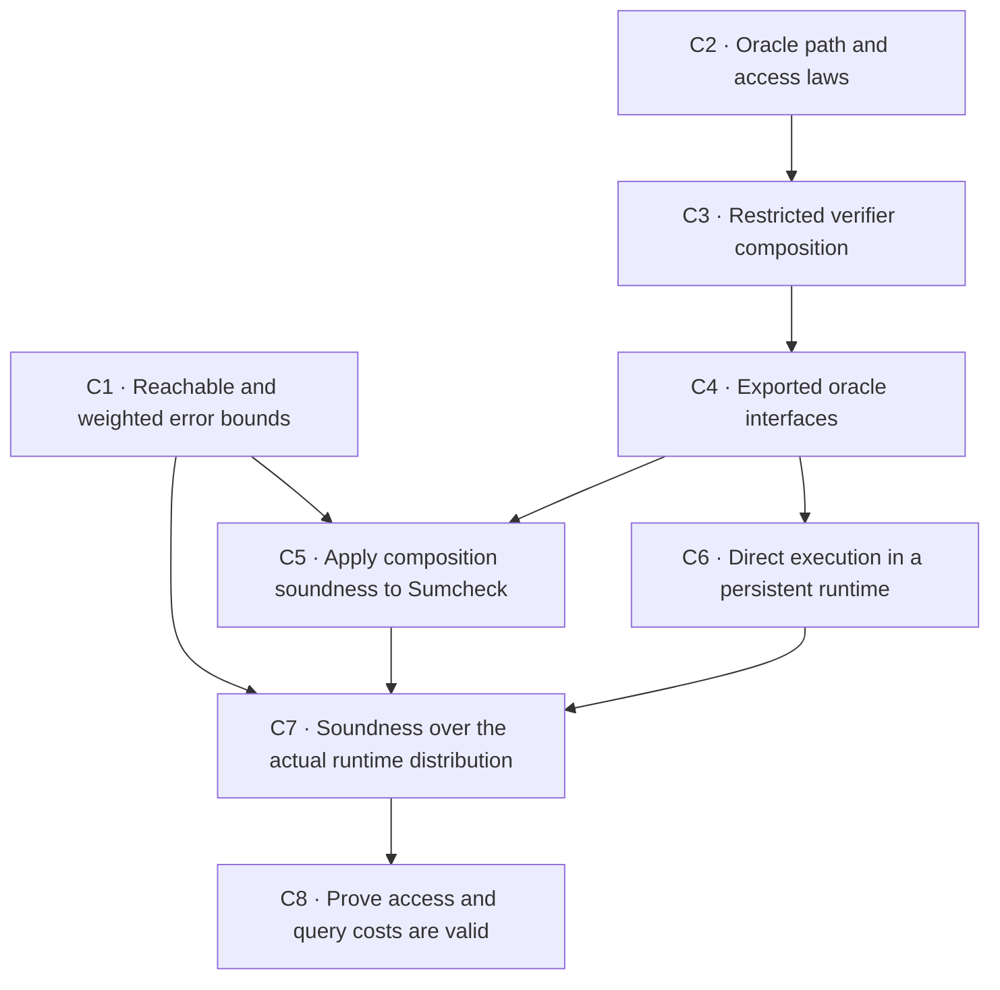

# Interaction framework roadmap

**Status date: 2026-09-26.** This is the single active roadmap for implementation of ArkLib's typed
interaction framework. The [current-status page](00-current-status.md) records what has landed and
the supported dependency versions. The design documents define the model: see the
[oracle-reduction core](02-oracle-reduction-core.md),
[oracle execution and security games](03-adversarial-oracle-execution.md), and
[oracle-elimination compiler](04-oracle-elimination-compiler.md).

The composition milestones C1–C8 are merged. The immediate goal is to complete native Sumcheck:
computable messages and honest execution, round-by-round security, and precisely stated extraction
guarantees. Preserve the ordinary interaction runner, private prover memory and actual oracle
resources throughout this work.

**Status terms:** *Landed* means on `main`; *active* means one of the next implementation steps below;
*later* means a follow-up client or project that uses the composition work; *conditional* means do
the work only when a real client demonstrates the need.

## Scope and contracts

Continue from the ordinary paired runner and the native results listed in
[current status](00-current-status.md). Preserve the prover's actual continuation, its private
memory, declared oracle access, and the order of effects. Do not add a second executor or a separate
prover-state machine.

The exact tree, access, closing, and effect-order contracts belong to the
[access and execution contract](01c-access-execution-contract.md) and
[oracle-reduction core](02-oracle-reduction-core.md). Persistent state, the adversary's view,
security events, and fault accounting belong to
[oracle execution and security games](03-adversarial-oracle-execution.md). The first verifier
composition result uses a boundary that returns data and has no pending action. If a protocol needs
an effect at that boundary, represent it as a protocol move or prove the local effect-order law.

For Sumcheck, the final equality between the original polynomial oracle and the claimed value stays
in the output oracle relation; it is not an extra final verifier query.

## Oracle composition sequence (C1–C8)

C1–C8 landed in #1231–#1238. The dependencies below record how the results fit together; the
issues record their implementation PRs and merge status.


```mermaid
flowchart TD
    C1["C1 · Reachable and weighted error bounds"]
    C2["C2 · Oracle path and access laws"]
    C3["C3 · Restricted verifier composition"]
    C4["C4 · Exported oracle interfaces"]
    C5["C5 · Apply composition soundness to Sumcheck"]
    C6["C6 · Direct execution in a persistent runtime"]
    C7["C7 · Soundness over the actual runtime distribution"]
    C8["C8 · Prove access and query costs are valid"]
    C2 --> C3 --> C4
    C1 --> C5
    C4 --> C5
    C4 --> C6
    C1 --> C7
    C5 --> C7
    C6 --> C7 --> C8
```

### Milestone 1 — Oracle composition and complete Sumcheck (C1–C5)

These five steps prove that restricted oracle protocols compose correctly. They then use the
composition theorems to recover the existing Sumcheck soundness bound and completeness result.
They are the entry point for later protocol clients.

### C1 — Reachable and weighted soundness bounds

**Landed in [PR #1231](https://github.com/Verified-zkEVM/ArkLib/pull/1231).**
Tracked in [issue #1222](https://github.com/Verified-zkEVM/ArkLib/issues/1222).

[`CompositionSoundness.lean`](../../ArkLib/Interaction/CompositionSoundness.lean) now provides
fixed-prover, support, almost-everywhere, and weighted bounds using VCVio's existing measure
semantics. It retains the uniform `ε₁ + ε₂` and `ε₁ + δ + ε₂` interfaces as corollaries.
The exact assumptions belong to [the security chapter](03-adversarial-oracle-execution.md#42-probability-premises-at-the-actual-boundary).

The acceptance client distinguishes two branch-dependent errors, an unreachable boundary, and a
structurally supported response of probability zero. The latter demonstrates why a support premise
is stronger than an almost-everywhere premise. See [current status](00-current-status.md) for the
available declarations. C1 required no dependency changes.

### C2 — Oracle path and access laws

**Landed in [PR #1232](https://github.com/Verified-zkEVM/ArkLib/pull/1232).**
Tracked in [issue #1223](https://github.com/Verified-zkEVM/ArkLib/issues/1223).

The owning modules now connect oracle append to runtime trees and roles, concrete path append and
split, accumulated access, and deterministic query answers. The laws reuse PolyFun's existing
paths and decorations and the existing closing handler. They add no resource representation or
executor. See [current status](00-current-status.md) for their scope.

The acceptance client uses two genuinely different suffix shapes, mixed prover/verifier roles,
and distinct initial, prefix, and suffix oracle answers. This establishes the path and handler
facts used by C3. The C2 path laws alone make no claim about execution by a prover and verifier.

### C3 — Restricted verifier composition

**Landed in [PR #1233](https://github.com/Verified-zkEVM/ArkLib/pull/1233).**
Tracked in [issue #1224](https://github.com/Verified-zkEVM/ArkLib/issues/1224).
C3 uses C2's path and access laws.

`Verifier.Fragment` returns an ordinary leaf value; `Verifier.Strategy` retains the completed
form with a final oracle action. Both use the same recursive interpreter.
[`Sequential.lean`](../../ArkLib/Interaction/Oracle/Sequential.lean) provides `Verifier.append`
and `executeStrategies_append`. The theorem splits every whole native prover at the actual
boundary, preserving its remaining strategy, private output, oracle resources, and effect order.
Its exact constraints belong to [the composition contract](02-oracle-reduction-core.md#5-composition).

The acceptance client checks private memory, challenge and abort responses, both possible owners
of the first suffix move, and one final action. An effect-order counterexample shows why moving a
pending prefix action across the next send is outside this theorem's scope.

### C4 — Exported oracle interfaces and closing

**Tracked in:** [issue #1225](https://github.com/Verified-zkEVM/ArkLib/issues/1225).

**Merged:** [PR #1234](https://github.com/Verified-zkEVM/ArkLib/pull/1234).

**Depends on:** C2 and C3.

[`SourceRouting.lean`](../../ArkLib/Interaction/Oracle/SourceRouting.lean) connects verifier
composition to virtual oracle substitution and claim closing. `Verifier.appendExported` takes a
prefix returning a statement and an exported oracle interface. The suffix receives that statement
and is written against only that interface; each new oracle message adds its own query slot.
`executeStrategies_appendExported_close` proves agreement with sequential execution using the
actual prefix resources and the actual remaining prover strategy. Closing the final claim uses
those same resources. The [composition contract](02-oracle-reduction-core.md#54-virtual-substitution-and-routing)
records the precise scope and restrictions.

**Acceptance check:** Export an oracle that combines or transforms source answers and hides another
source slot. Run the two Sumcheck rounds through the composed interface. Preserve the actual
prover continuation and challenge/abort behavior. One exported query may expand to several source
queries, so do not require the two query logs to be identical.

### C5 — Apply soundness composition to Sumcheck

**Implemented in [PR #1235](https://github.com/Verified-zkEVM/ArkLib/pull/1235).** Tracked in
[issue #1226](https://github.com/Verified-zkEVM/ArkLib/issues/1226).
C5 uses C1 and C4.

[`Oracle/CompositionSoundness.lean`](../../ArkLib/Interaction/Oracle/CompositionSoundness.lean)
proves uniform and weighted bounds for the actual composed oracle execution. It separately charges
true intermediate claims, false claims outside the suffix assumptions, and success from false
admissible claims. A true intermediate claim is not charged twice. The suffix event includes the
final verifier action and closing under the actual resources.

[`Sumcheck/Interaction/Composition.lean`](../../ArkLib/ProofSystem/Sumcheck/Interaction/Composition.lean)
identifies the existing native execution with its first round followed by the remaining rounds.
The soundness proof now applies the general oracle bound to recover `count * deg / |F|`, retaining
the original theorem statement and its arbitrary whole native prover. Honest full-protocol
completeness follows through the same composed execution. Support truth holds for any ambient
challenge program; probability-one completeness uses normalized `ProbComp` execution. The final
polynomial equality remains in the output oracle relation.

The oracle probability client checks a derived exported oracle, a random final decision, separate
truth and input-assumption errors, and a supported branch of probability zero. The native clients
check adaptive two-round execution and the original challenge/abort effect order. Current
constraints belong to [the security chapter](03-adversarial-oracle-execution.md#42-probability-premises-at-the-actual-boundary).

### Milestone 2 — Persistent runtime composition (C6–C8)

These steps connect the oracle-composition theorems to persistent runtime state, ordered logs, and
resource accounting. They preserve correlations with the prover's actual view without revealing
hidden runtime state to the prover. The native runner remains the execution engine.

### C6 — Direct execution in a persistent runtime

**Implemented in [PR #1236](https://github.com/Verified-zkEVM/ArkLib/pull/1236).** Tracked in
[issue #1227](https://github.com/Verified-zkEVM/ArkLib/issues/1227).
C6 uses C4 and reuses VCVio's existing runtime.

The direct native-strategy entry points now cover logged, phased, and persistent-runtime
execution. Reduction setup remains inside the same initialized runtime, including any ambient
queries it makes. Erasure recovers ordinary core execution with the actual final state. The
phased/logged comparison also preserves the paired source observations and chronological ambient
history. No new interpreter or ArkLib-only state machine is introduced.

The acceptance client checks counter answers `1, 2, 3` across prover setup and both protocol
stages, with final state `3`. A separate actual exported-interface client checks one-to-many source
query expansion, private prover output, and exact source and ambient logs. The generic
`withQueryLog_simulateQ` law compares these logs through the handler's actual query programs.
C7 below adds the probability bound; C8 supplies access and cost certificates.

### C7 — Soundness over the actual runtime distribution

**Tracked in:** [issue #1228](https://github.com/Verified-zkEVM/ArkLib/issues/1228).

**Implemented in [PR #1237](https://github.com/Verified-zkEVM/ArkLib/pull/1237):**
`Oracle/RuntimeSoundness`; acceptance examples in
`ArkLibTest/Interaction/Oracle/RuntimeSoundness`.

**Depends on:** C1, C5, and C6.

`Oracle/RuntimeSoundness` now connects the actual native execution split to one persistent
runtime. Its main theorem bounds final closed-claim success by an exceptional prefix event plus
an average suffix error. The averaging uses the actual joint distribution of runtime state,
prover continuation, intermediate claim, and ambient history.

The client proves that average suffix bound for its runtime. The theorem does not require a bound
at each fixed hidden state, and the whole prover is fixed before runtime initialization. A bound
for almost every fixed full result after the prefix gives a stronger, convenient sufficient
condition. Erasing logs alone does not transfer ordinary oracle soundness to an arbitrary runtime.

The suffix program receives the actual prefix output, including the extracted native continuation.
Runtime resumption supplies hidden state internally. A function called a prover view does not by
itself restrict information: the experiment must show which answers the prover receives before it
chooses a message. Retain the actual state and ordered ambient history in the execution equality.
Keep rejection, explicit returned faults, and missing probability mass distinct. Charge an explicit
fault term only when the theorem's event or model requires it.

**Acceptance:** The native hidden-bit client initializes its secret once. A fixed guess made before
any revealing answer succeeds with probability `1/2`, and the proof applies the main composition
theorem. A matching fixed secret gives success one, ruling out a uniform fixed-secret half bound.
A second fixed whole prover queries the secret before committing and succeeds with probability one;
its averaged half premise is proved false. Both clients retain the actual query history and state.

### C8 — Prove oracle access and query costs are valid

**Tracked in:** [issue #1229](https://github.com/Verified-zkEVM/ArkLib/issues/1229).

**Implementation:** `Oracle/Access`, `Oracle/Prefix`, and `Data/OracleComp/QueryBounds`;
acceptance examples in `ArkLibTest/Interaction/Oracle/QueryBounds` and `RuntimeQueryBounds`.

**Depends on:** C6 and C7.

`Oracle/Prefix` derives available query names from the actual accumulated source signature.
Continuation and append preserve earlier identities and concrete messages. `Data/OracleComp/QueryBounds`
transports allowed-query conditions through the actual route, bounds its weighted query expansion,
and adds sequential budgets. The same received oracle may be queried repeatedly; its name stays
shared and each query still contributes to the cost.

The generic access condition checks all authored queries. Cost bounds cover complete paths, so a
numerical cost certificate alone does not establish availability. The pinned cost layer uses small
query/response types and natural-number costs; the structural prefix laws retain their universes.
No independent stages, normalized probability distribution or nonempty answer types are needed for
these generic laws.

**Acceptance:** The actual phased two-send run supplies the join and terminal prefixes used by
its source-resource certificates. It retains a shared old oracle, expands one virtual query into
two old calls, then reads a fresh oracle. Its weighted bound is five, and a completed execution
rules out budget four. The fresh resource fails access at the actual join for every cost budget.
Ambient phase logs and source-query logs remain distinct.

The second client imports C7's same hidden-bit experiment and half-bound theorem. It proves actual
export provenance, source access, a routed suffix budget of five, a whole-runtime imported-query
budget of one, and actual ambient history charges four and seven for the guessing and informed
provers. The latter still succeeds surely. Certificates accompany the fixed-prover security proof;
they do not turn a numerical budget into a soundness theorem for arbitrary adversaries.
Arbitrary world-query classifiers still require a separate proof connecting labels to resources.

## Complete native Sumcheck first

The full native ordinary-soundness and honest-completeness theorems are proved. They do not finish
the computational implementation or the round-by-round and knowledge-security work. Complete the
following Sumcheck work before starting the FRI and Spartan migrations.

1. **Computable messages and verifier.** Use bounded CompPoly coefficient arrays and Horner
   evaluation in the existing native protocol. Keep one verifier definition, prove whole-execution
   correspondence for arbitrary native provers, and transfer the existing soundness bound. Compile
   and run a client that checks private continuation effects, public abort and the output relation.
   This source revision implements this step in `Impl/Representation`, `Interaction/Protocol`,
   `Interaction/Computable` and `Interaction/ComputableSoundness`.
2. **Computable honest prover.** Construct each round polynomial directly from CompPoly multivariate
   data, for the existing general degree and summation-domain parameters. Prove projection and
   whole-prover correspondence, transfer completeness, and execute the actual honest interaction.
   Mathematical conversions belong in proofs, not in the running algorithm. This source revision
   implements the general finite-enumeration construction in `Impl/Projection`, and proves actual
   honest execution correspondence and completeness in `Interaction/ComputableCompleteness`.
   The compiled runtime client uses the computational input oracle and honest strategy.
3. **Native round-by-round security.** Define the security condition on actual execution prefixes,
   instantiate it with Sumcheck's proved per-challenge bound, and prove the connection to the full
   error bound. Distinguish a bound for every fixed prefix from an average over an actual run.
4. **Knowledge and extraction.** Define native knowledge and round-by-round knowledge games with
   explicit extractor access and timing. Current oracle Sumcheck has a `Unit` witness: its
   polynomial is already an input oracle. A theorem recovering a hidden polynomial or committed
   witness needs a different, explicit witness relation. Prove the required implication and
   composition results without inheriting the legacy admissions.
5. **Efficient implementations and legacy migration.** Optimize the Boolean multilinear case using
   CompPoly evaluation tables, with proved message/update algorithms and separately stated costs.
   The computable general prover alone makes no efficiency claim. Repair or migrate legacy
   Sumcheck claims with correspondence and axiom checks; do not treat the native result as silently
   proving those old declarations.

## Bounded interaction theory investigation (proposed)

This is a proposed overnight work package within the native-security steps above, recorded on
October 2, 2026 and broadened on October 3 after the literature review. It has not been launched
or adopted as a replacement architecture. The
[Chiesa-Yogev comparison](../kb/audits/chiesa-yogev-interaction.md) records source versions,
evidence, the larger pipeline and unresolved alternatives. The long-term requirement is to
recover the textbook's results in our language and generality, ideally across the whole book.
The [broader source map](../kb/audits/interaction-literature-map.md) additionally anchors
knowledge transport in WARP/ABF26 and keeps Funky, duplex-sponge FS, FICS/FACS, compositional
zero knowledge and post-quantum IORs in scope. The textbook is not the sole conformance target.

The purpose of this run is to resolve a few precise questions with checked mathematics, while
leaving broader choices open. A useful morning result is an ordinary local-security bridge and
a source-backed witness-transport theorem, not an assertion that the entire compiler or
knowledge hierarchy is settled. Plan around a six-to-eight-hour window if one is later chosen;
the durations below are estimates, not an active timer or a promise of completion.

### Questions this package should answer

1. Can one ordinary prefix certificate recover the book's fixed-round local experiment and
   also express native Sumcheck's actual guarded verifier step without changing its executor?
2. Can a native witness-indexed certificate recover WARP/ABF's local bad-edge condition and
   support offline backward extraction along actual protocol prefixes?
3. Can small checked examples distinguish these contracts from weaker averages and exercise
   actual non-`Unit` witness transport?

The first two are the primary targets. The third supplies acceptance and optional separation
examples within the same two workstreams.
Full state restoration, universal knowledge composition and BCS security are later targets;
this run must leave their requirements visible without inventing universal APIs for them.

### Initial statement review and ownership

Before implementation, the orchestrator records the exact baseline and proposed theorem
statements, including the quantified adversary/prefix, sampling order, observation, event,
error and any runtime restriction. Recheck overlapping upstream work, especially the legacy
Sumcheck/RBR repairs and the toolchain/probability migration. Use the pins that already support
the first package; do not make a toolchain or dependency migration a prerequisite without a
specific missing declaration.

Use at most four active agents: the orchestrator, two Sol High workers and one independent
reviewer. The orchestrator owns integration, shared API decisions, this roadmap, validation
and the final evidence record. Each worker owns a separate worktree and named files. The
reviewer authors neither lane and first reads the target statements against the source
experiment. No recursive delegation is needed. Use one build coordinator when dependency
artifacts are physically shared; separate worktrees alone do not isolate `.lake/packages`.

Working names below are provisional. Follow the repository naming guide; do not create a
parallel namespace named after the textbook. A prototype must not silently become the public
contract for all dependent/effectful protocols.

### Lane A: ordinary local security and native Sumcheck

**Owner and scope:** one worker, tentatively
`ArkLib/Interaction/Oracle/Security/RoundByRound.lean`,
`ArkLib/ProofSystem/Sumcheck/Interaction/RoundByRound.lean`, and their small acceptance clients.
Inspect existing names before creating these modules. No edits to the runtime, protocol tree,
shared oracle semantics or legacy security definitions unless integration review identifies
an unavoidable, separately justified change.

**A1. Scalar prefix contract and source specialization.** Reuse pinned VCVio's
`RoundByRound.GameFamily` and `IsBounded`. Add the missing protocol interpretation and state
laws. The proposed mathematical obligation is:

```text
For each false input and each concrete pre-challenge prefix b,
  State(b) = false implies
  Pr[a sampled by the interpreted local verifier move at b]
    [State(extend(b, a)) = true] <= error(round(b)).
```

The state laws must state empty state false, preservation of falsity on every prover move,
and terminal success implying state true. Prove how the fixed-round, stateless, independently
uniform specialization recovers CY's ordinary definition, including randomized authors of
prefixes. Give the null-conditioning convention explicitly, or state the positive-mass
conditioning lemma. The security quantifier must not require earlier challenges to be honestly
sampled or a prefix to have positive probability in an ordinary run.

Keep general world-state security outside this first contract unless its exact state and
freshness premises can be proved from the existing runtime. In particular, never use a fresh
initialization to justify a statement about a prover-modified world. Fixed-round specialization
and actual guarded native execution must be distinct theorems.

**A2. Sumcheck local theorem and prefix correspondence.** Quantify over any authored challenge
history/current statement, any degree-bounded sent polynomial `q`, and a retained original
oracle realized by the specified bounded multivariate polynomial `p`. Under the false current
closed relation, the local verifier returns `none` if the sum check fails and `some r` for a
fresh uniform `r` otherwise. With abort post-state false and continuing post-state the next
closed relation, prove error at most `deg / |F|`.

Reuse `uniform_successor_soundness` and `execute_succ`. Prove that the current statement,
sent polynomial and retained original view are observations of the native concrete prefix;
merely wrapping an already proved inequality in `GameFamily` is insufficient. Preserve the
effectful prover response on both continuation and abort. Do not replace the original retained
oracle with the newly sent polynomial when stating the successor relation.

For a full scalar certificate, address the all-input empty-state law explicitly: a positive-round
candidate resets the state before the first challenge, then uses the current closed relation.
Treat zero-round false-input security separately. Do not claim that native early-aborting
Sumcheck literally has the book's fixed-round transcript syntax. Padding and all-transcript
acceptance correspondence remain a separate possible bridge.

**A3. Aggregate connection, after A1/A2 pass review.** Derive an execution-averaged consequence
and a terminal-error theorem for the supported finite fragment, tied to the existing executor.
For Sumcheck recover `count * deg / |F|` from the local certificate and compare the event with
the existing ordinary theorem. Supply an explicit challenge-rank bound. This is an aggregate
theorem, not the stronger SR `(B + r)` theorem.

**Acceptance:** checked source-specialization, actual native-prefix/local-step correspondence,
passing and rejecting Sumcheck cases, and the exact error bound. New principal theorems must
have no admissions or hidden dependency on `sorryAx`. Build and axiom evidence identify exact
declarations. Report A1, A2 and A3 separately if only part is complete.

### Lane B: relational RBR and backward witness transport

**Owner and scope:** second worker, a narrowly scoped native knowledge-certificate module
and acceptance examples. Do not edit Lane A's definitions concurrently. The orchestrator owns
any shared prefix observations. Inspect the legacy extractor-aware API before inventing a
replacement; use the existing native concrete prefix/path carrier rather than a second executor.

**B1. Source specialization.** State the local contract for every authored pre-challenge prefix:

```text
Pr[r fresh; exists w,
    not K(tr, E(tr ++ r, w)) and K(tr ++ r, w)] <= error_i.
```

Define named backward extractors, endpoint relations and the prover-move transport law.
Keep stage-dependent witness fibers available, but prove a restricted WARP/ABF specialization
with a common witness carrier, identity transport on prover moves, a deterministic terminal
verifier and the source's endpoint iff. Identify the legacy one-way terminal clause and
noncomputable-function freedom as additional generalizations, not source equivalences.
Executable extraction and a proof of its running time are separate acceptance levels.

**B2. Deterministic backward-extraction lemma.** Given a complete native path and an output
witness, compose the named local extractors backward. Prove:

```text
valid output witness and invalid extracted input witness
  implies some challenge edge on this same path satisfies the local bad event.
```

The law on prover moves must rule out unexplained failures between challenges. Retain the
existential later witness inside the event, so the proof supports a witness chosen after the
suffix. Do not add an online witness supplier merely to force composition through an ordinary
terminal-knowledge theorem. This is the deterministic core of WARP Appendix B's proof; the
adaptive SR query game and its `(t+k)` bound remain separate obligations.

**Acceptance:** source correspondence for the restricted certificate, a named computable
backward algorithm, the bad-edge theorem on native paths, and a small non-`Unit` client in
which extraction really uses a later witness. Demonstrate preservation under a two-stage
composition or split/glue of that client. Choose a finite vector or explicit-response example
if a full protocol migration would dominate the night. No witness may be manufactured by
classical choice from relation membership. Require kernel checks and principal-declaration
axiom reports. Report which source time/efficiency clauses remain unproved.

**Optional quantitative separation after the primary lemmas.** Use two uniform bits and
acceptance iff both are zero, on an always-false instance. Prove uniform averaged error `1/4`
is attainable but every local scalar certificate has uniform error at least `1/2`. This is
CY's two-round tightness example, compared additionally with ArkLib's averaged notion.
Quantify over all candidate state certificates; if the security-API bridge is unfinished,
report the result as a standalone finite lemma.

**Retained later experiment:** the supplied committed-scalar fork and ring-switching `Lift`
bridge from the [research notes](../kb/audits/chiesa-yogev-interaction.md) remains useful.
It should read leaf witnesses from actual response messages and prove equality with the
legacy named extractor. It does not prove WARP-to-tree extraction, which FICS/FACS leaves
unresolved, and it does not establish efficient malicious-prover tree finding.

### Integration gates and stopping rules

| Approximate point in the run | Evidence to review | Action |
|---|---|---|
| First 30-60 minutes | Frozen statements, source correspondence, pin/build readiness and nonoverlapping ownership | Start bounded proof work; unresolved general architecture remains in the research ledger |
| After roughly 2 hours | A1 and B1 statement/elaboration, including source-specific access | Reject any reachability weakening or changed event; reduce implementation breadth if a foundational mismatch appears |
| Middle of run | A2 actual-prefix bridge and B2 named backward extraction | Review theorems independently; continue A3 and optional examples only with stable prerequisites |
| Final 60-90 minutes | Exact integrated revision, compile/axiom results and reviewer findings | Stop expanding scope, fix correctness issues, run repository checks, commit checked work and a precise handoff |

If a target proves false, preserve the counterexample and corrected candidate theorem separately.
If a target is blocked by missing mathematics, preserve a checked partial lemma and the exact
remaining goal. Do not fill the gap with `sorry`, classical witness choice disguised as an
algorithm, an assumed bridge labeled as proved, or silently stronger hypotheses. A narrow
true theorem can be useful, but its status must remain narrow.

At most one optional next step should begin after the primary work is complete: either sketch
the exact consistent-query SR game and its `B + r` completion lemma, or analyze challenge-erasure
factorization on a small knowledge example. A sketch is not a security theorem. Do not also
start the Merkle payload adapter, full hash-chain compiler or time semantics in this run.

The integrator runs the required `./scripts/validate.sh --axioms` for new proofs, including
the repository's test and warning gates, and inspects axiom results for the principal declarations.
Use `LAKE_ARTIFACT_CACHE=false LAKE_NO_CACHE=true` in the shared workspace and coordinate
physical dependency build writes. Keep validation logs and exact commands with the handoff;
do not claim a passing suite if environmental failures prevent it. Update current status only
for completed, integrated results. Local commits preserve work; pushing, opening PRs and
merging are separate from this proposal and follow the authorization active at launch.

### Questions intentionally still open after the run

The dependent/effectful SR model; general extractor observation and challenge erasure; efficient
tree finding and fork provenance; online versus offline knowledge composition; realization of
ideal algebraic messages; salted encoded-payload Merkle extraction; hash-chain entropy and
backtracking; exact failure/time substitution; zero knowledge; preprocessing; and the remainder
of the book's theorem inventory all remain live targets. No worker should turn an overnight
scope restriction into a permanent limitation of the framework.

The morning handoff should contain the commit(s), exact theorem statements and assumptions,
validation and independent-review results, the questions actually answered, and the smallest
next experiment for each newly exposed obstruction. It should also preserve competing candidate
designs where the evidence does not yet distinguish them.

## Later protocol clients

FRI and Spartan slices follow the Sumcheck work above. The composition infrastructure is ready;
protocol migration is deferred while the computational and security contracts are completed.

- **FRI slice:** use a derived virtual oracle view and prove a two-way bridge to the established
  presentation.
- **Spartan-like slice:** use a fresh prover message and prove the corresponding two-way bridge.
- **Broader migration:** port further FRI, Spartan, BCS, and Nova protocols one at a time. Keep the
  legacy security namespace until each migrated protocol has its own proved correspondence.

For each slice, record the exact statement, oracle interface, prover information, success event,
and error bound. A protocol's use of the generic API is evidence for that client; it does not
automatically prove every legacy equivalence.

## Later extraction and compiler work

### State restoration and knowledge composition

After runtime and log composition are available, prove the causal trace and witness facts needed by
extractors and state-restoration games. The generic PolyFun causal finite-trace transducer and a
VCVio query-log specialization are current upstream gaps. A reusable conditioning and dynamic-
programming interface may also be needed; add it when the first formalization requires it.

Knowledge soundness needs additional access and witness-transport arguments. An extractor for
the completed protocol does not automatically provide a witness at an intermediate boundary.
Prefix-available extraction is one sufficient route. A uniform local certificate can instead
support offline backward extraction when its observation and effect hypotheses permit it;
the legacy tree algebra supplies useful examples. Plain terminal knowledge soundness alone
does not establish either route. The design and exact games belong in
[03-adversarial-oracle-execution.md](03-adversarial-oracle-execution.md).

### Oracle-elimination compiler

Build the compiler only after the ordinary security, runtime, query-trace, and extraction results
needed by its passes exist. Follow the interfaces and pass order in
[04-oracle-elimination-compiler.md](04-oracle-elimination-compiler.md): represent ideal oracle
guarantees, assign backends, plan reads, lower and transport claims, then prove concrete Merkle and
homomorphic adapters. Carry soundness, extraction, privacy, query costs, and running time through
each pass. Do not fill unsupported backend capabilities with placeholder guarantees.

### AR-11 — Merkle adapter

The first Merkle backend adapter depends on the named-context and source-routing API (#864), the
persistent runtime (#884), terminal outcomes (#886), and the access/resource evidence from C8. It
must adapt VCVio's existing shared-ROM execution and extractability theorem to ArkLib's declared
oracle interface. Do not restate the VCVio security game in ArkLib. This adapter supplies one
backend capability; it does not by itself prove the full Fiat–Shamir, BCS, or compiler theorem.

## Conditional upstream work

Use upstream PolyFun or VCVio only for a demonstrated client need. VCVio's runtime and
failure-to-return support are already available. The missing generic trace transducer, certified
query-log bridge, reusable conditioning, or error-bearing reduction API should be added at its
owning repository when an ArkLib proof needs that exact capability. Operational
`DynSystem.Prefix` concatenation is needed only if a client cannot use ordinary monadic sequencing.
Any temporary adapter must name the upstream destination, have a deletion condition, and disappear
when the upstream API lands.

If a real protocol needs an effect at an intermediate boundary, first express it at an explicit
interaction node. If that cannot preserve the protocol, prove the local effect-order law or propose
the smallest coherent PolyFun extension. If a suffix tree needs a dependency not represented by
the interaction's public choices, document that client and propose the needed upstream change. Do
not assume global effect commutativity and do not create a second ArkLib executor to work around
either limitation.

## Delivery rules

- Give each implementation PR one main theorem or API as its focus. Include the laws, acceptance
  examples, and documentation needed to use that result.
- Begin the next step while the current PR runs validation or CI, using isolated build outputs.
  Merge in dependency order after validation and independent review. After a dependency merges,
  bring the next PR onto the updated `main` and verify that the change was preserved.
- Reuse a supported upstream API before adding another wrapper or executor. Put reusable additions
  in the library that owns them; remove temporary ArkLib adapters when the upstream API lands.
- Use a real protocol or security theorem to test each foundational API. Keep the legacy namespace
  until each migrated protocol has a proved correspondence.
- Keep dependency bumps separate from theorem changes. Add no new `sorry` and run the repository's
  required validation before commit.
- Update [00-current-status.md](00-current-status.md) when a result lands.

Use names and docstrings that a cryptographer can understand without knowing the internal Lean
representation. State who chooses the prover, what the verifier observes, which event is bounded,
and how the error depends on the assumptions. Have an independent reviewer explain the principal
theorem in those terms and compare it with the intended game. Treat a failed proof as evidence about
the theorem or its assumptions, not as a reason to hide a stronger claim behind a weaker name.
