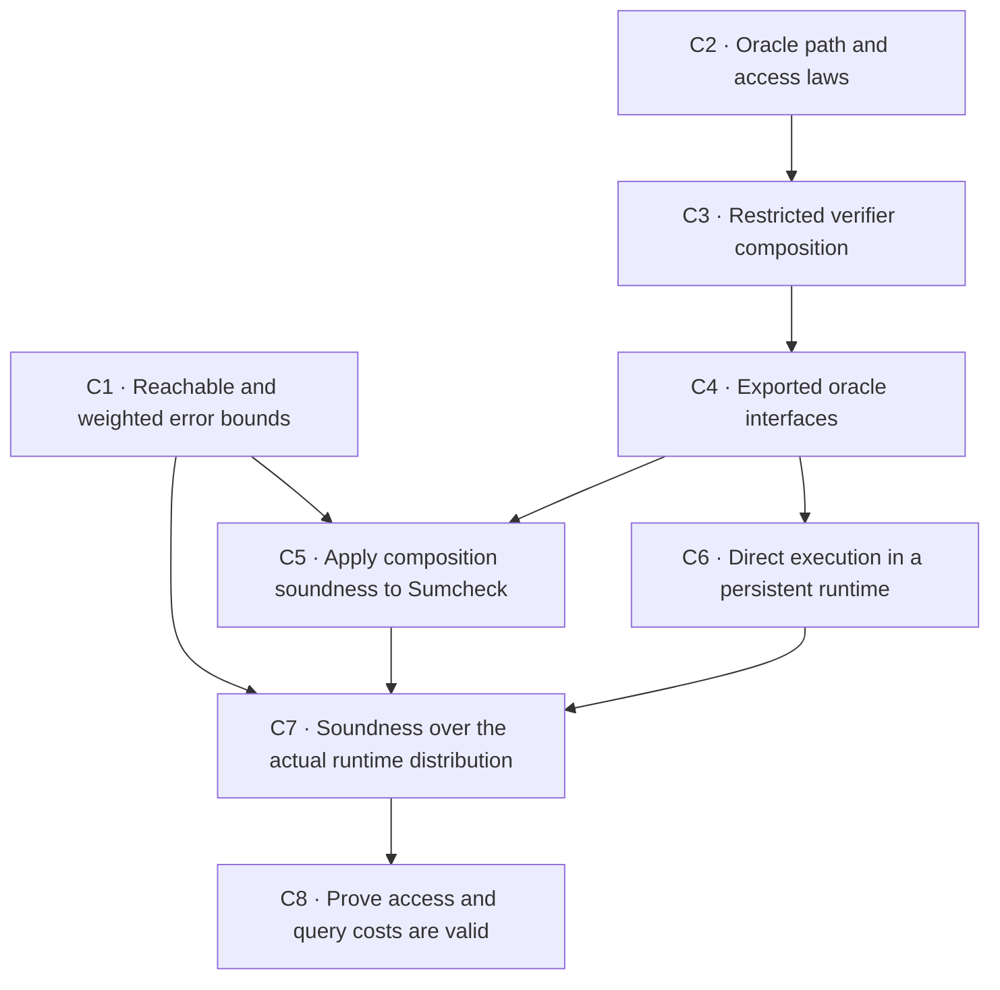

# Interaction framework roadmap

**Status date: 2026-10-04.** This is the implementation roadmap for ArkLib's Interaction
framework. The [current-status page](00-current-status.md) records what is on `main` and the
supported dependency versions. The [project roadmap](../../ROADMAP.md) covers other areas, and
[Moving protocols to the Interaction framework](../../roadmap/interaction-migration.md) lists the
open PRs with their statements and says what a port of a legacy protocol must show.

In this document, *native* means stated in the Interaction framework (`ArkLib/Interaction/`)
rather than the legacy framework (`ArkLib/OracleReduction/`), and a *client* is a protocol or
theorem that uses the framework.

The composition milestones C1–C8 are merged. Open PRs prove round-by-round soundness, knowledge
soundness under composition, state-restoration knowledge soundness, the sum-check instance of
state restoration, and a real-to-ideal transfer for Merkle openings sent in one final batch.
The contracts for C1–C8 below are kept as a record of what was required; that work is done.

The next step is to merge those PRs in dependency order. After that, implementation should
address what they leave open: verifiers that reject early and protocols of variable length under
state restoration, extraction of a non-trivial witness, ports of FRI and Spartan, and general
oracle elimination.

**Status terms:** *merged* means on `main`; *open PR* means proved on a branch whose pull request
is not yet merged; *planned* means not yet proved.

## Scope and contracts

Continue from the ordinary paired runner and the native results listed in
[current status](00-current-status.md). Preserve the prover's actual continuation, its private
memory, declared oracle access, and the order of effects. Do not add a second executor or a separate
prover-state machine.

The exact tree, access, closing, and effect-order contracts belong to the
[access and execution contract](01c-access-execution-contract.md) and
[oracle-reduction core](02-oracle-reduction-core.md). Persistent state, the adversary's view,
security events, and fault accounting belong to
[oracle execution and security games](03-adversarial-oracle-execution.md). The first verifier
composition result uses a boundary that returns data and has no pending action. If a protocol needs
an effect at that boundary, represent it as a protocol move or prove the local effect-order law.

For Sumcheck, the final equality between the original polynomial oracle and the claimed value stays
in the output oracle relation; it is not an extra final verifier query.

## Oracle composition sequence (C1–C8)

C1–C8 landed in #1231–#1238. The dependencies below record how the results fit together; the
issues record their implementation PRs and merge status.

```mermaid
flowchart TD
    C1["C1 · Reachable and weighted error bounds"]
    C2["C2 · Oracle path and access laws"]
    C3["C3 · Restricted verifier composition"]
    C4["C4 · Exported oracle interfaces"]
    C5["C5 · Apply composition soundness to Sumcheck"]
    C6["C6 · Direct execution in a persistent runtime"]
    C7["C7 · Soundness over the actual runtime distribution"]
    C8["C8 · Prove access and query costs are valid"]
    C2 --> C3 --> C4
    C1 --> C5
    C4 --> C5
    C4 --> C6
    C1 --> C7
    C5 --> C7
    C6 --> C7 --> C8
```

### Milestone 1 — Oracle composition and complete Sumcheck (C1–C5)

These five steps prove that restricted oracle protocols compose correctly. They then use the
composition theorems to recover the existing Sumcheck soundness bound and completeness result.
They are the entry point for later protocol clients.

### C1 — Reachable and weighted soundness bounds

**Landed in [PR #1231](https://github.com/Verified-zkEVM/ArkLib/pull/1231).**
Tracked in [issue #1222](https://github.com/Verified-zkEVM/ArkLib/issues/1222).

[`CompositionSoundness.lean`](../../ArkLib/Interaction/CompositionSoundness.lean) now provides
fixed-prover, support, almost-everywhere, and weighted bounds using VCVio's existing measure
semantics. It retains the uniform `ε₁ + ε₂` and `ε₁ + δ + ε₂` interfaces as corollaries.
The exact assumptions belong to [the security chapter](03-adversarial-oracle-execution.md#42-probability-premises-at-the-actual-boundary).

The acceptance client distinguishes two branch-dependent errors, an unreachable boundary, and a
structurally supported response of probability zero. The latter demonstrates why a support premise
is stronger than an almost-everywhere premise. See [current status](00-current-status.md) for the
available declarations. C1 required no dependency changes.

### C2 — Oracle path and access laws

**Landed in [PR #1232](https://github.com/Verified-zkEVM/ArkLib/pull/1232).**
Tracked in [issue #1223](https://github.com/Verified-zkEVM/ArkLib/issues/1223).

The owning modules now connect oracle append to runtime trees and roles, concrete path append and
split, accumulated access, and deterministic query answers. The laws reuse PolyFun's existing
paths and decorations and the existing closing handler. They add no resource representation or
executor. See [current status](00-current-status.md) for their scope.

The acceptance client uses two genuinely different suffix shapes, mixed prover/verifier roles,
and distinct initial, prefix, and suffix oracle answers. This establishes the path and handler
facts used by C3. The C2 path laws alone make no claim about execution by a prover and verifier.

### C3 — Restricted verifier composition

**Landed in [PR #1233](https://github.com/Verified-zkEVM/ArkLib/pull/1233).**
Tracked in [issue #1224](https://github.com/Verified-zkEVM/ArkLib/issues/1224).
C3 uses C2's path and access laws.

`Verifier.Fragment` returns an ordinary leaf value; `Verifier.Strategy` retains the completed
form with a final oracle action. Both use the same recursive interpreter.
[`Sequential.lean`](../../ArkLib/Interaction/Oracle/Sequential.lean) provides `Verifier.append`
and `executeStrategies_append`. The theorem splits every whole native prover at the actual
boundary, preserving its remaining strategy, private output, oracle resources, and effect order.
Its exact constraints belong to [the composition contract](02-oracle-reduction-core.md#5-composition).

The acceptance client checks private memory, challenge and abort responses, both possible owners
of the first suffix move, and one final action. An effect-order counterexample shows why moving a
pending prefix action across the next send is outside this theorem's scope.

### C4 — Exported oracle interfaces and closing

**Tracked in:** [issue #1225](https://github.com/Verified-zkEVM/ArkLib/issues/1225).

**Merged:** [PR #1234](https://github.com/Verified-zkEVM/ArkLib/pull/1234).

**Depends on:** C2 and C3.

[`SourceRouting.lean`](../../ArkLib/Interaction/Oracle/SourceRouting.lean) connects verifier
composition to virtual oracle substitution and claim closing. `Verifier.appendExported` takes a
prefix returning a statement and an exported oracle interface. The suffix receives that statement
and is written against only that interface; each new oracle message adds its own query slot.
`executeStrategies_appendExported_close` proves agreement with sequential execution using the
actual prefix resources and the actual remaining prover strategy. Closing the final claim uses
those same resources. The [composition contract](02-oracle-reduction-core.md#54-virtual-substitution-and-routing)
records the precise scope and restrictions.

**Acceptance check:** Export an oracle that combines or transforms source answers and hides another
source slot. Run the two Sumcheck rounds through the composed interface. Preserve the actual
prover continuation and challenge/abort behavior. One exported query may expand to several source
queries, so do not require the two query logs to be identical.

### C5 — Apply soundness composition to Sumcheck

**Implemented in [PR #1235](https://github.com/Verified-zkEVM/ArkLib/pull/1235).** Tracked in
[issue #1226](https://github.com/Verified-zkEVM/ArkLib/issues/1226).
C5 uses C1 and C4.

[`Oracle/CompositionSoundness.lean`](../../ArkLib/Interaction/Oracle/CompositionSoundness.lean)
proves uniform and weighted bounds for the actual composed oracle execution. It separately charges
true intermediate claims, false claims outside the suffix assumptions, and success from false
admissible claims. A true intermediate claim is not charged twice. The suffix event includes the
final verifier action and closing under the actual resources.

[`Sumcheck/Interaction/Composition.lean`](../../ArkLib/ProofSystem/Sumcheck/Interaction/Composition.lean)
identifies the existing native execution with its first round followed by the remaining rounds.
The soundness proof now applies the general oracle bound to recover `count * deg / |F|`, retaining
the original theorem statement and its arbitrary whole native prover. Honest full-protocol
completeness follows through the same composed execution. Support truth holds for any ambient
challenge program; probability-one completeness uses normalized `ProbComp` execution. The final
polynomial equality remains in the output oracle relation.

The oracle probability client checks a derived exported oracle, a random final decision, separate
truth and input-assumption errors, and a supported branch of probability zero. The native clients
check adaptive two-round execution and the original challenge/abort effect order. Current
constraints belong to [the security chapter](03-adversarial-oracle-execution.md#42-probability-premises-at-the-actual-boundary).

### Milestone 2 — Persistent runtime composition (C6–C8)

These steps connect the oracle-composition theorems to persistent runtime state, ordered logs, and
resource accounting. They preserve correlations with the prover's actual view without revealing
hidden runtime state to the prover. The native runner remains the execution engine.

### C6 — Direct execution in a persistent runtime

**Implemented in [PR #1236](https://github.com/Verified-zkEVM/ArkLib/pull/1236).** Tracked in
[issue #1227](https://github.com/Verified-zkEVM/ArkLib/issues/1227).
C6 uses C4 and reuses VCVio's existing runtime.

The direct native-strategy entry points now cover logged, phased, and persistent-runtime
execution. Reduction setup remains inside the same initialized runtime, including any ambient
queries it makes. Erasure recovers ordinary core execution with the actual final state. The
phased/logged comparison also preserves the paired source observations and chronological ambient
history. No new interpreter or ArkLib-only state machine is introduced.

The acceptance client checks counter answers `1, 2, 3` across prover setup and both protocol
stages, with final state `3`. A separate actual exported-interface client checks one-to-many source
query expansion, private prover output, and exact source and ambient logs. The generic
`withQueryLog_simulateQ` law compares these logs through the handler's actual query programs.
C7 below adds the probability bound; C8 supplies access and cost certificates.

### C7 — Soundness over the actual runtime distribution

**Tracked in:** [issue #1228](https://github.com/Verified-zkEVM/ArkLib/issues/1228).

**Implemented in [PR #1237](https://github.com/Verified-zkEVM/ArkLib/pull/1237):**
`Oracle/RuntimeSoundness`; acceptance examples in
`ArkLibTest/Interaction/Oracle/RuntimeSoundness`.

**Depends on:** C1, C5, and C6.

`Oracle/RuntimeSoundness` now connects the actual native execution split to one persistent
runtime. Its main theorem bounds final closed-claim success by an exceptional prefix event plus
an average suffix error. The averaging uses the actual joint distribution of runtime state,
prover continuation, intermediate claim, and ambient history.

The client proves that average suffix bound for its runtime. The theorem does not require a bound
at each fixed hidden state, and the whole prover is fixed before runtime initialization. A bound
for almost every fixed full result after the prefix gives a stronger, convenient sufficient
condition. Erasing logs alone does not transfer ordinary oracle soundness to an arbitrary runtime.

The suffix program receives the actual prefix output, including the extracted native continuation.
Runtime resumption supplies hidden state internally. A function called a prover view does not by
itself restrict information: the experiment must show which answers the prover receives before it
chooses a message. Retain the actual state and ordered ambient history in the execution equality.
Keep rejection, explicit returned faults, and missing probability mass distinct. Charge an explicit
fault term only when the theorem's event or model requires it.

**Acceptance:** The native hidden-bit client initializes its secret once. A fixed guess made before
any revealing answer succeeds with probability `1/2`, and the proof applies the main composition
theorem. A matching fixed secret gives success one, ruling out a uniform fixed-secret half bound.
A second fixed whole prover queries the secret before committing and succeeds with probability one;
its averaged half premise is proved false. Both clients retain the actual query history and state.

### C8 — Prove oracle access and query costs are valid

**Tracked in:** [issue #1229](https://github.com/Verified-zkEVM/ArkLib/issues/1229).

**Implementation:** `Oracle/Access`, `Oracle/Prefix`, and `Data/OracleComp/QueryBounds`;
acceptance examples in `ArkLibTest/Interaction/Oracle/QueryBounds` and `RuntimeQueryBounds`.

**Depends on:** C6 and C7.

`Oracle/Prefix` derives available query names from the actual accumulated source signature.
Continuation and append preserve earlier identities and concrete messages. `Data/OracleComp/QueryBounds`
transports allowed-query conditions through the actual route, bounds its weighted query expansion,
and adds sequential budgets. The same received oracle may be queried repeatedly; its name stays
shared and each query still contributes to the cost.

The generic access condition checks all authored queries. Cost bounds cover complete paths, so a
numerical cost certificate alone does not establish availability. The pinned cost layer uses small
query/response types and natural-number costs; the structural prefix laws retain their universes.
No independent stages, normalized probability distribution or nonempty answer types are needed for
these generic laws.

**Acceptance:** The actual phased two-send run supplies the join and terminal prefixes used by
its source-resource certificates. It retains a shared old oracle, expands one virtual query into
two old calls, then reads a fresh oracle. Its weighted bound is five, and a completed execution
rules out budget four. The fresh resource fails access at the actual join for every cost budget.
Ambient phase logs and source-query logs remain distinct.

The second client imports C7's same hidden-bit experiment and half-bound theorem. It proves actual
export provenance, source access, a routed suffix budget of five, a whole-runtime imported-query
budget of one, and actual ambient history charges four and seven for the guessing and informed
provers. The latter still succeeds surely. Certificates accompany the fixed-prover security proof;
they do not turn a numerical budget into a soundness theorem for arbitrary adversaries.
Arbitrary world-query classifiers still require a separate proof connecting labels to resources.

## Native Sumcheck: results and remaining work

Soundness and completeness of native Sumcheck are proved on `main`. The list below separates
what is merged, what is in open PRs, and what is planned.

1. **Computable messages and verifier (merged, [#1242](https://github.com/Verified-zkEVM/ArkLib/pull/1242)).** The native protocol uses bounded
   CompPoly coefficient arrays and Horner evaluation. Whole-execution correspondence and
   soundness transfer are proved in `Interaction/Computable` and `Interaction/ComputableSoundness`.
2. **Computable honest prover (merged, [#1243](https://github.com/Verified-zkEVM/ArkLib/pull/1243)).** `Impl/Projection` constructs messages by
   general finite enumeration. `Interaction/ComputableCompleteness` proves honest execution
   correspondence and completeness. This prover can be executed, but it is not an efficient
   multilinear implementation.
3. **Round-by-round soundness (open PR [#1261](https://github.com/Verified-zkEVM/ArkLib/pull/1261)).** Round-by-round soundness on actual
   execution prefixes implies soundness with the sum of the per-challenge errors, and
   Sumcheck's per-challenge bound gives its full error bound. The theorem keeps the distinction
   between a bound for every fixed prefix and an average over an actual run.
4. **Knowledge soundness and extraction (open PRs, partial).** Knowledge soundness under
   composition is proved in [#1260](https://github.com/Verified-zkEVM/ArkLib/pull/1260), state restoration for randomized provers in [#1268](https://github.com/Verified-zkEVM/ArkLib/pull/1268),
   and the Sumcheck instance in [#1269](https://github.com/Verified-zkEVM/ArkLib/pull/1269). Current oracle Sumcheck has a `Unit` witness: its
   polynomial is already an input oracle. Recovering a hidden polynomial or committed witness
   needs a different explicit relation, extractor, and proof. These PRs do not provide that.
5. **Efficient implementations and legacy Sumcheck (planned).** Optimize the Boolean multilinear
   case using CompPoly evaluation tables, with proved message and update algorithms and
   separately stated costs. Repair or port the legacy Sumcheck declarations with correspondence
   proofs and axiom checks. The native theorems do not prove those declarations.

## Later protocol clients

FRI and Spartan are the next protocols to port. The Sumcheck results above are a starting point.
Each port still needs its own execution correspondence and security proofs. The open research
questions are not prerequisites for every port.

- **FRI slice:** use a derived virtual oracle view and prove a two-way bridge to the established
  presentation.
- **Spartan-like slice:** use a fresh prover message and prove the corresponding two-way bridge.
- **Broader migration:** port existing FRI and Spartan clients one at a time; develop BCS and
  IVC protocols as separate constructions where no legacy implementation exists. Keep the
  legacy security namespace until each migrated protocol has its own proved correspondence.

For each slice, record the exact statement, oracle interface, prover information, success event,
and error bound. A protocol's use of the generic API is evidence for that client; it does not
automatically prove every legacy equivalence.

## Later extraction and compiler work

### State restoration and knowledge composition

Knowledge soundness under composition and state-restoration knowledge soundness for a fixed
number of rounds are proved in the open PRs listed above, including provers with private
randomness and a bound that charges each distinct query once in expectation. The remaining
question is how to extend them to the next client while preserving extractor access, timing,
witness relations, rejection behavior, and actual query costs.

Do not require a generic causal transducer as a prerequisite for theorems that are already
proved. Add a new upstream abstraction only for a concrete unproved client obligation. State
restoration for verifiers that reject early and extraction of a non-trivial witness remain open.
Knowledge soundness of the completed protocol does not by itself give an extractor that works
on a prefix.

### Oracle-elimination compiler

Build the compiler only after the ordinary security, runtime, query-trace, and extraction results
needed by its passes exist. Follow the interfaces and pass order in
[04-oracle-elimination-compiler.md](04-oracle-elimination-compiler.md): represent ideal oracle
guarantees, assign backends, plan reads, lower and transport claims, then prove concrete Merkle and
homomorphic adapters. Carry soundness, extraction, privacy, query costs, and running time through
each pass. Do not fill unsupported backend capabilities with placeholder guarantees.

### AR-11 — Merkle adapter

**Open PRs [#1270](https://github.com/Verified-zkEVM/ArkLib/pull/1270) and [#1271](https://github.com/Verified-zkEVM/ArkLib/pull/1271).** Native protocols that commit with a Merkle root and open
positions in one final batch now have a real-to-ideal transfer: the real verifier accepts with
probability at most that of an ideal verifier reading the values extracted at commitment time,
plus VCVio's shared-ROM error. The second PR allows each queried position to depend on earlier
answers. Soundness of the ideal protocol is a separate premise in both.

Openings interleaved with later rounds and the full BCS, Fiat–Shamir, and oracle-elimination
compiler remain planned. See
[Merkle commitments](../../roadmap/interaction-migration.md#merkle-commitments) for the division
between VCVio and ArkLib and for the exact restrictions.

## Conditional upstream work

Use upstream PolyFun or VCVio only for a demonstrated client need. VCVio's runtime and
failure-to-return support are already available. The missing generic trace transducer, certified
query-log bridge, reusable conditioning, or error-bearing reduction API should be added at its
owning repository when an ArkLib proof needs that exact capability. Operational
`DynSystem.Prefix` concatenation is needed only if a client cannot use ordinary monadic sequencing.
Any temporary adapter must name the upstream destination, have a deletion condition, and disappear
when the upstream API lands.

If a real protocol needs an effect at an intermediate boundary, first express it at an explicit
interaction node. If that cannot preserve the protocol, prove the local effect-order law or propose
the smallest coherent PolyFun extension. If a suffix tree needs a dependency not represented by
the interaction's public choices, document that client and propose the needed upstream change. Do
not assume global effect commutativity and do not create a second ArkLib executor to work around
either limitation.

## Delivery rules

- Give each implementation PR one main theorem or API as its focus. Include the laws, acceptance
  examples, and documentation needed to use that result.
- Begin the next step while the current PR runs validation or CI, using isolated build outputs.
  Merge in dependency order after validation and independent review. After a dependency merges,
  bring the next PR onto the updated `main` and verify that the change was preserved.
- Reuse a supported upstream API before adding another wrapper or executor. Put reusable additions
  in the library that owns them; remove temporary ArkLib adapters when the upstream API lands.
- Use a real protocol or security theorem to test each foundational API. Keep the legacy namespace
  until each migrated protocol has a proved correspondence.
- Keep dependency bumps separate from theorem changes. Add no new `sorry` and run the repository's
  required validation before commit.
- Update [00-current-status.md](00-current-status.md) when a result is merged, and the
  [area roadmap](../../roadmap/interaction-migration.md) when a PR is opened, changed, or merged.

Use names and docstrings that a cryptographer can understand without knowing the internal Lean
representation. State who chooses the prover, what the verifier observes, which event is bounded,
and how the error depends on the assumptions. Have an independent reviewer explain the principal
theorem in those terms and compare it with the intended game. Treat a failed proof as evidence about
the theorem or its assumptions, not as a reason to hide a stronger claim behind a weaker name.
