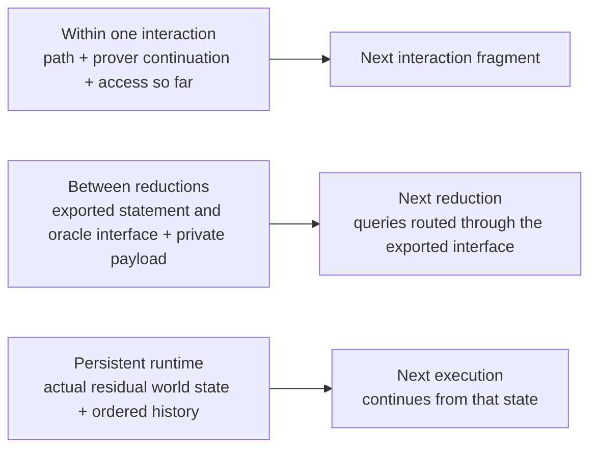
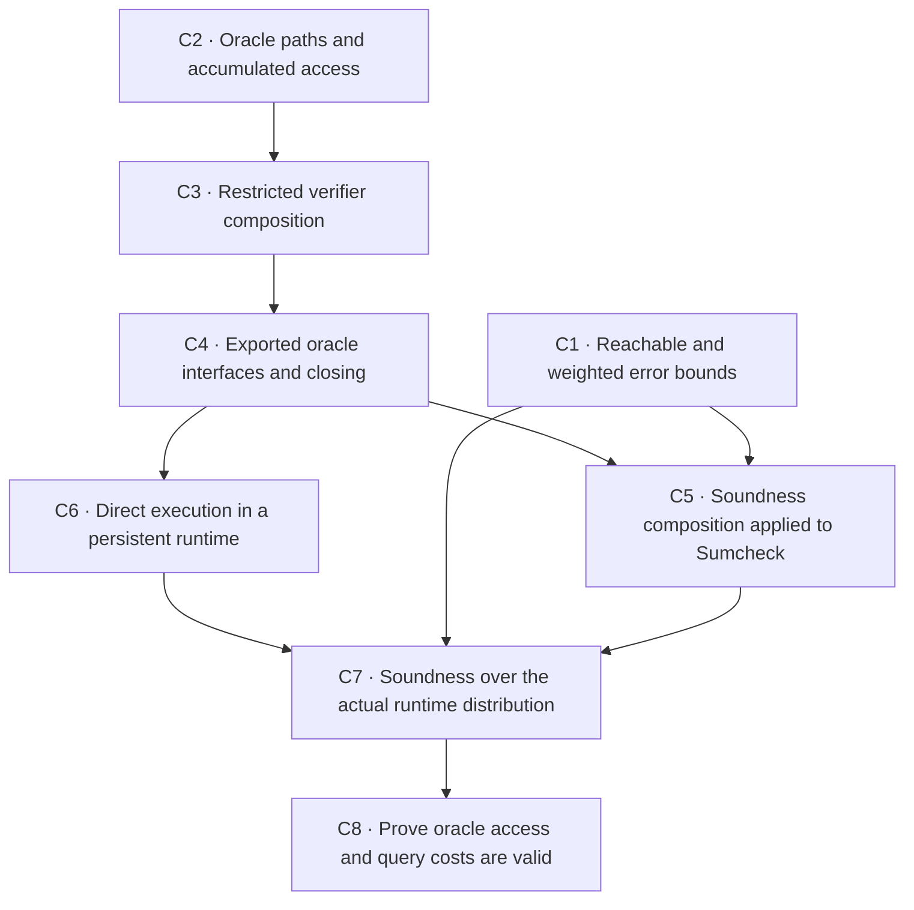

# Interaction composition: current results and next steps

**Status date: 2026-09-26.** This page tracks the work needed to compose oracle protocols and
prove security for the combined protocol. It is a plan, not a claim that the proposed theorems or
APIs already exist. The reader is assumed to know the usual meanings of prover, verifier,
transcript, oracle, soundness, and completeness. Here, "native" means using the existing
interaction tree, prover strategy, and paired runner directly.

The goal is to run protocols one after another while preserving the prover's private memory, the
oracle answers available to each protocol, and the order of effects. We then want to prove that a
false claim stays false except with the sum of the stated error probabilities. The same execution
must support both the ordinary protocol argument and, later, an interpretation in a persistent
oracle world.

**Status terms:** *Proved* means the result is on `main`; *planned* means it is a target in C1–C8;
*conditional* means pursue it only if a real protocol needs it; *deferred* means it is outside this
composition plan.

## What is already proved

These results are on `main` in ArkLib PRs [#1214](https://github.com/Verified-zkEVM/ArkLib/pull/1214),
[#1216](https://github.com/Verified-zkEVM/ArkLib/pull/1216), and
[#1218](https://github.com/Verified-zkEVM/ArkLib/pull/1218).

| Result | What it establishes | What it does not establish |
|---|---|---|
| Full native Sumcheck interaction and security | The actual verifier has an explicit abort or challenge at each round. The ordinary prover strategy may keep private memory and react to challenges. Soundness and honest completeness are proved for the full execution. | It is not a general theorem for composing arbitrary oracle reductions or persistent worlds. |
| Sumcheck output check | The final equality between the original polynomial oracle and the claimed value is part of the output oracle relation. | The verifier does not make an extra final query to the original polynomial. |
| Direct strategy execution | The ordinary paired runner executes the prover and verifier strategies. The shared entry point avoids wrapping the prover in another state machine. | It does not by itself prove oracle-resource or world-security composition. |
| Native append execution | Every ordinary prover on the appended tree splits into its actual prefix strategy and the suffix strategy it returned. The equality preserves effect order and needs only a lawful monad. | It does not compose the restricted oracle-verifier interface or prove that its closing resources match. |
| Native append soundness | A prefix truth-transition bound `ε₁` and a suffix bound `ε₂` imply `ε₁ + ε₂`. An explicit intermediate inadmissibility bound `δ` gives `ε₁ + δ + ε₂`. | The current suffix premise covers every false prefix result, including unreachable ones, and every suffix strategy. It is stronger than needed for one fixed execution. |

The public statements are in [`CompositionSoundness.lean`](../../ArkLib/Interaction/CompositionSoundness.lean),
the shared runner is in [`CoreRun.lean`](../../ArkLib/Interaction/Oracle/CoreRun.lean), and the full
Sumcheck protocol and security are in
[`Protocol.lean`](../../ArkLib/ProofSystem/Sumcheck/Interaction/Protocol.lean) and
[`ProtocolSoundness.lean`](../../ArkLib/ProofSystem/Sumcheck/Interaction/ProtocolSoundness.lean).
The runner in [`Execution.lean`](../../ArkLib/Interaction/Oracle/Execution.lean) runs the paired
interaction first, then runs the verifier's terminal computation exactly once.

The plain append theorem permits suffix trees that depend on the complete prefix path. The
prover's remaining strategy may retain arbitrary private memory, and effects inside either
strategy remain unrestricted. Selecting the suffix verifier is a pure function of the prefix
path and verifier output. For the proposed restricted oracle version, tree selection must use the
public structural path, which hides concrete oracle messages. A separate private computation
cannot choose a new tree shape unless that choice is represented in the protocol.

The existing soundness statement uses **unconditioned successful-output probability mass**. It
does not assume lossless execution, independent rounds, uniform challenges, or finite message
sets. Missing measure mass is not classified as an explicit runtime fault.

## Three different composition boundaries

The plan must keep three interfaces separate. They share the same execution, but the suffix gets a
different interface at each boundary.



1. **Inside one interaction**, the suffix receives the public branch path, the prover's actual
   remaining strategy (including private memory), verifier-local values, and the oracle access
   accumulated along the prefix.
2. **Between reductions**, the suffix receives the declared output statement and exported oracle
   interface, plus any separately carried private payload. Its queries go through that exported
   interface. The prefix's actual input resources and sent messages implement the interface.
3. **Across a persistent runtime**, execution continues with the actual residual state and ordered
   history. The state can be correlated with the prover's memory and prior answers. Composition
   must preserve that joint distribution; it must not reset the runtime or give the prover hidden
   state it did not observe.

An **output oracle interface** specifies which queries the next protocol may ask. A virtual oracle
can compute an answer from one or more source queries. Thus one query to the exported interface
may cause several source queries; the source-query log need not equal the exported-query log.

## Constraints on the next theorems

### Preserve the actual order of execution

The current verifier interpreter leaves a terminal verifier computation pending until after the
paired interaction returns. Moving that computation to the start of the suffix can move it across
a prover action. Those programs need not behave the same.

The first composition API should therefore join fragments at a boundary that returns ordinary
data, with no pending action to run there. Effects inside each fragment remain unrestricted. A
client that needs an action at the boundary can put it at an explicit protocol node, preserve its
current schedule, or prove that the particular effects may be interchanged without changing the
claimed observation. Global commutativity of all effects is a stronger condition than this local
need.

“No effect at the boundary” means no effect after interpretation. A deterministic, read-only
oracle query can be syntactically effectful while leaving the runtime unchanged; its answer and
any observable query log still have to be preserved. The common world-backed target already
limits its first scope to deterministic read-only claim resources and no terminal-view world
queries; see [the adversarial execution design](03-adversarial-oracle-execution.md#4-games).

### State the weakest useful probability premises

There is no single weakest theorem without first fixing the experiment, success event, and what is
observable at the boundary. For a fixed composed execution, the basic quantity is the chance of
success in its *actual remaining execution*, averaged over the boundary results it can reach.
Uniform bounds at every possible boundary are convenient reusable premises, but stronger than
necessary.

The pinned VCVio library already has measure and event-bound tools for support restrictions and
weighted probability bounds. The new work should connect those tools to native interaction runs.
It should provide, in order of convenience:

- the current uniform `ε₁ + ε₂` and `ε₁ + δ + ε₂` corollaries;
- bounds restricted to boundary results the prefix can reach;
- bounds that hold except on a probability-zero set;
- variable suffix errors averaged over the actual boundary distribution.

In the last form, let `E` be the prefix event charged as an error, let `μ` be the distribution of
the actual boundary result, and let `e(b)` bound the suffix's success probability after boundary
result `b`. The target bound is

```text
Pr[final success] ≤ Pr[E] + ∫ over boundaries outside E, e(b) dμ(b).
```

This statement preserves branch-dependent error rates instead of replacing them with one worst-case
number. A reachable result is a structurally possible output of the chosen prefix program,
including its returned prover strategy; such a result can still have probability zero.
“Almost everywhere” allows exceptions of probability zero under the actual output distribution.
Neither condition means proving a uniform security bound for each fixed hidden runtime state.

### Preserve correlations in a persistent runtime

World-backed soundness should average over the actual joint distribution of residual runtime
state, prover memory, intermediate claim, and relevant history. Requiring a security bound for
every fixed hidden state can be too strong: a prover may guess a uniformly sampled secret with
probability one-half overall, while succeeding with probability one after conditioning on the
secret. Conversely, a suffix bound from a fresh runtime does not prove a bound after a prefix has
revealed information about the runtime.

The theorem must keep the adversary's view in the quantifiers. The suffix can adapt to information
the prover actually obtained, but it cannot choose a new strategy after seeing hidden runtime
state. Pointwise bounds for every reachable state are a useful special case when a protocol has
them; an averaged bound over the actual joint distribution is the broader goal.

### Separate rejection, faults, and missing probability mass

If the security event means “accept and output a true claim,” rejection, explicit faults, and
missing probability mass are all outside that event, but they remain different outcomes. Add a
fault term when the theorem promises a fault bound or treats faults as a security failure. Do not
call missing mass a returned fault. The current native composition result bounds successful output
mass and makes no fault claim.

## Proposed work

The IDs C1–C8 are stable plan references, each linked to its tracking issue. The PR titles and
theorem descriptions below are proposals; final names should use direct, familiar terms such as
`execute_append` and `soundness_append`, with namespaces supplying context. Avoid names that
foreground implementation machinery when they obscure the mathematical statement.



### C1 — Reachable and weighted error bounds

**Proposed PR:** `feat(interaction): add reachable soundness bounds`

**Work:** Extend `CompositionSoundness.lean` with bounds for one prover, reachable boundary results,
almost-everywhere conditions, and branch-dependent suffix errors. Reuse VCVio's measure tools and
keep the current uniform theorems as corollaries.

**Acceptance example:** A suffix has different error on each public branch, and a bad boundary the
prefix cannot reach does not invalidate the bound.

**Depends on:** Nothing; this can proceed alongside C2.

**Tracking:** [ArkLib #1222](https://github.com/Verified-zkEVM/ArkLib/issues/1222).

### C2 — Oracle paths and accumulated access

**Proposed PR:** `feat(interaction): prove append laws for oracle access`

**Work:** In [`TypeTree`](../../ArkLib/Interaction/Oracle/TypeTree.lean),
[`Access`](../../ArkLib/Interaction/Oracle/Access.lean), and
[`RunSources`](../../ArkLib/Interaction/Oracle/RunSources.lean), assemble the missing append-specific
path, role, query-interface, and closing laws. Reuse existing path and access composition lemmas.

**Acceptance example:** Use branch-dependent suffix shapes and distinguishable queries to the
original oracle, a prefix message, and a suffix message.

**Depends on:** Nothing; this can proceed alongside C1.

**Tracking:** [ArkLib #1223](https://github.com/Verified-zkEVM/ArkLib/issues/1223).

### C3 — Restricted verifier composition

**Proposed PR:** `feat(interaction): compose native oracle verifiers`

**Work:** Extend the existing verifier interpreter in
[`Execution.lean`](../../ArkLib/Interaction/Oracle/Execution.lean) for fragments that return data,
while preserving the existing effectful terminal form. Prove agreement with the ordinary paired
runner for every whole prover. Do not add a second executor.

**Acceptance example:** Check prover effects before and after challenges, retained private memory,
public abort and its response, and exactly-once terminal execution. Start at a boundary with no
pending action.

**Depends on:** C2.

**Tracking:** [ArkLib #1224](https://github.com/Verified-zkEVM/ArkLib/issues/1224).

### C4 — Exported oracle interfaces and closing

**Proposed PR:** `feat(interaction): compose exported oracle interfaces`

**Work:** Connect verifier composition to [`Virtual`](../../ArkLib/Interaction/Oracle/Virtual.lean),
[`Claim`](../../ArkLib/Interaction/Oracle/Claim.lean), and
[`RunSources`](../../ArkLib/Interaction/Oracle/RunSources.lean). Route suffix queries only through
the declared exported view, interpreted using resources from the actual prefix run. Prove that
closing agrees with this interpretation.

**Acceptance example:** An exported view combines or transforms source answers and hides another
source slot. Include two-round Sumcheck execution. Preserve the fact that one exported query may
expand to multiple source queries.

**Depends on:** C2 and C3.

**Tracking:** [ArkLib #1225](https://github.com/Verified-zkEVM/ArkLib/issues/1225).

### C5 — Soundness composition applied to Sumcheck

**Proposed PR:** `feat(interaction): derive oracle soundness composition`

**Work:** Combine prefix truth-transition error, failure of the suffix's input assumptions, and
suffix error for the actual composed oracle execution. Include uniform and weighted bounds. Derive
the two-round Sumcheck bound `2d / |F|` for fresh uniform challenges through this API, then extend
to the existing arbitrary-round result. Keep the original polynomial equality in the output oracle
relation, and retain the current public theorem until the new derivation proves the same result.

**Depends on:** C1 and C4.

**Tracking:** [ArkLib #1226](https://github.com/Verified-zkEVM/ArkLib/issues/1226).

### C6 — Direct execution in a persistent runtime

**Proposed PR:** `refactor(interaction): run native strategies in the shared runtime`

**Work:** Extend the direct-strategy path through the existing VCVio runtime adapter in
[`Runtime.lean`](../../ArkLib/Interaction/Oracle/Runtime.lean). Reduction entry points should
prepare their strategies and use the shared path. Prove erasure to ordinary execution and
preservation of final state and ordered logs.

**Acceptance example:** A counter or cache is shared across both fragments. The example must fail
if the runtime resets at the boundary.

**Depends on:** C4.

**Tracking:** [ArkLib #1227](https://github.com/Verified-zkEVM/ArkLib/issues/1227).

### C7 — Soundness over the actual runtime distribution

**Proposed PR:** `feat(interaction): prove runtime composition soundness`

**Work:** Combine C1 and C6. State suffix security over the actual distribution of runtime state,
prover memory, intermediate claim, and relevant history, while preserving what the prover may
observe. Reuse [`TerminalMeasure.lean`](../../ArkLib/Interaction/Oracle/TerminalMeasure.lean) to
keep accepted output, rejection, explicit fault, and missing mass distinct.

**Acceptance example:** A hidden-randomness example has a useful average bound even though no
useful bound holds for every fixed secret.

**Depends on:** C1, C5, and C6.

**Tracking:** [ArkLib #1228](https://github.com/Verified-zkEVM/ArkLib/issues/1228).

### C8 — Prove oracle access and query costs are valid

**Proposed PR:** `feat(interaction): certify composed oracle access and cost`

**Work:** Connect the world-query classifications in
[`WorldSegments`](../../ArkLib/Interaction/Oracle/WorldSegments.lean) to resources available at each
point in the execution. Show that resource identity and sharing are preserved, virtual-query
expansion is charged, and prefix/suffix budgets combine. Apply C7 to one concrete world client.

**Acceptance example:** Cover shared-resource use, expanded-query cost, and a query to an
unavailable resource.

**Depends on:** C6 and C7.

**Tracking:** [ArkLib #1229](https://github.com/Verified-zkEVM/ArkLib/issues/1229).

The test examples above are acceptance checks for the theorem, not a requirement to build a second
semantic system. Existing VCVio handlers, ArkLib path/access calculations, the restricted verifier
interpreter, and the ordinary paired runner remain the sources of execution behavior.

## Work that stays separate

- **Effectful actions at a fragment boundary:** support when a real client needs it. First try an
  explicit protocol node that preserves order. Otherwise prove the specific effect-interchange
  law required by that client and upstream it if PolyFun's interaction semantics must change.
  Changing only a final callback is insufficient if append removes that intermediate leaf. Do not
  introduce an ArkLib-only executor.
- **Suffix tree shape from hidden or verifier-local data:** the proposed restricted oracle append
  selects the suffix shape from the structural public path; plain native append permits the full
  prefix path. If a protocol needs another dependency, encode
  it in the protocol's public branching or propose a coherent upstream interaction-tree change.
- **Knowledge soundness and extraction:** soundness composition does not provide a middle witness
  when the next protocol needs one. Prove causal witness availability or an appropriate auxiliary-
  input guarantee before claiming knowledge composition.
- **State restoration and compiler security:** these additionally need causal query-log evidence,
  extraction, resource bounds, and guarantee transport. They build on the runtime work but are not
  delivered by C1–C8 alone.
- **FRI and Spartan:** protocol ports and two-way legacy correspondences remain separate clients
  of the composition API; they are not prerequisites for proving the API against Sumcheck.

## Related pages and source

- [Current interaction status](00-current-status.md)
- [Interaction framework roadmap](05-roadmap.md)
- [Oracle execution and world model](03-adversarial-oracle-execution.md)
- [Interaction naming guide](../wiki/interaction-naming.md)
- [Plain native composition](../../ArkLib/Interaction/CompositionSoundness.lean)
- [Oracle execution and access](../../ArkLib/Interaction/Oracle/Execution.lean)
- [Oracle claims and substitution](../../ArkLib/Interaction/Oracle/Virtual.lean)
