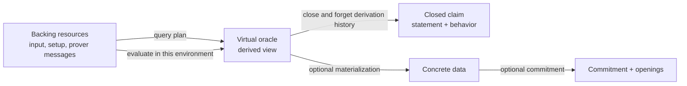
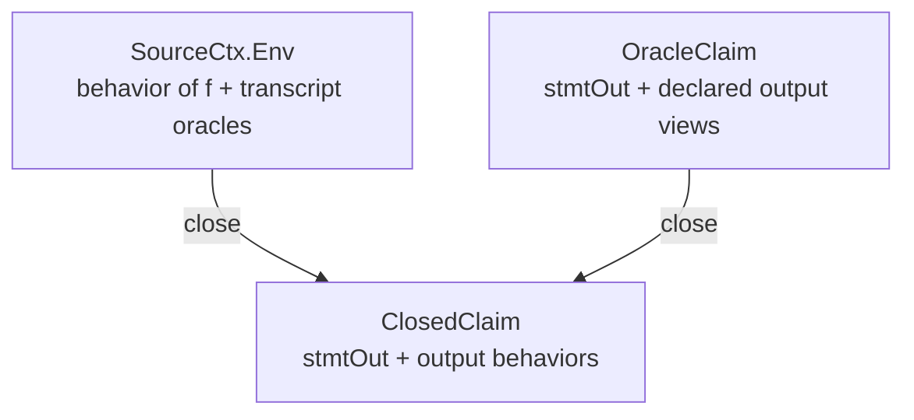

# The Oracle Reduction Layer: From Backing Resources to Virtual Claims

**Status:** design handover document, reorganized 2026-07-12 after security, extractor, compiler, and readability audits. The original version is archived verbatim as `ArkLib-Oracle-Reduction-Design.archived-2026-07-12.md`.
**Scope:** the canonical definition of *oracle reduction* for ArkLib's new `Interaction` framework (worktree `ArkLib-core-rebuild`, branch `quang/core-rebuild`), replacing the retired `ArkLib/OracleReduction/` design on `main`.
**Inputs:** direct reading of both codebases; the design-consensus notes in `paper-note` (`ArkLib-Refactor_oracle_reduction_as_ior.md`, `arklib-ior-knowledge-soundness-survey.md`, `ArkLib-Refactor_raw_append_spec_exploration.md`); the ArkLib talks (King's College deck, Oct 2025); a thorough survey of the old design on `main`; earlier code-grounded, literature, and adversarial reviews; and the present three-way adversarial audit of foundations/semantics, security/composition, and commitment elimination. Corrections are integrated throughout and tabulated in §10; archived inputs are listed in §13.

**How to read this document.** §§0–1 explain the proposal from one running example. §2 gives the precise ontology, including the distinction between backing resources, virtual views, closed claims, and committed representations. §§3–5 explain why ArkLib needs these distinctions and where they meet the current code. §6 gives the Lean-facing design. §§7–13 record resolutions, migration, risks, audit traceability, and sources.

---

## 0. The central picture

An oracle reduction does not usually manufacture a new long object. It establishes a new way of querying the objects already present in the execution. The output oracle is therefore best understood as a **view**: a named response function whose answers are computed from input oracles, setup oracles, prover-sent oracles, and public challenges.

This is the same distinction made by a database view. A table is stored; a view is a query over stored tables. The view is still a real mathematical object, and clients can query it as if it were a table, but it need not have independent storage. An oracle reduction adds one complication: in a soundness game, even a backing “table” may be represented only by arbitrary query behavior rather than by a well-formed concrete object.

The proposal tracks four objects, each for a different purpose:

1. **Backing resources** record what the execution can actually query. They include input and setup oracles and the oracle messages sent by the prover.
2. **A virtual oracle** records how to answer each output query from those backing resources. Its primitive content is an executable query program; its extensional behavior is obtained by interpreting that program in a particular backing environment.
3. **A closed claim** records only the public output statement and the resulting output behavior. This is the autonomous mathematical object consumed by the next relation.
4. **A materialized or committed representation** is introduced only when an implementation boundary requires independent storage, a commitment, or future openings.



The load-bearing sentence is:

> **ArkLib tracks both the backing layer and the virtual layer while executing a reduction. At an autonomous boundary it exports only the resulting behavior and the resources named by the output schema; the derivation environment is not an undeclared residual input.**

Forgetting the source environment at a relation boundary is not a claim that the backing objects never existed. It prevents a relation or an independently reusable next stage from depending on hidden derivation history. If a later stage needs an earlier resource directly, the first reduction must export it as an output slot (usually by an identity view). A *fused implementation* may still optimize through the old source by substitution, but that is an implementation of the declared output interface, not extra authority granted to the next reduction.

The rest of the design follows from this separation. `SourceCtx` describes a concrete presentation of the backing layer. `VirtualOracle` is a typed query program over the backing signature. Interpreting the program produces its behavior. The execution API closes the claim using the very environment produced by that run. `ClosedClaim` is the relation-facing object. `Materialization`, resource metadata, and the oracle-elimination compiler recover implementation-facing representations where required.

---

## 1. Running example: one FRI round

Let the reduction begin with oracle access to a function `f : D → F`. After sampling a challenge `r`, define the *exact fold view* `foldᵣ(f) : D' → F`. For each `x ∈ D'`, let `x₀,x₁ ∈ D` be its two preimages; schematically,

```text
foldᵣ(f)(x) = f(x₀) + r · f(x₁).
```

This exact view is the information-theoretic algebra inside FRI, but it is **not by itself the usual FRI round boundary**. A real round normally has the prover send a fresh alleged next word `g`, commits to or otherwise exposes that fresh oracle, samples positions, and checks that `g(x)` agrees with `foldᵣ(f)(x)` at those positions; the output claim also carries the appropriate low-degree/proximity assertion about `g`. Thus the same round contains both a derived virtual oracle and a fresh prover oracle. This distinction is precisely why “output oracle = simulator” is too crude unless the output schema records which slots are derived and which are fresh.

### 1.1 The backing layer

At execution time, the backing environment contains a behavior for `f` and the prover oracle messages already sent along the transcript. In an honest execution, the behavior for `f` is induced by concrete data. In a malicious execution, it is only a total answer function. ArkLib must support the latter because soundness quantifies over arbitrary oracle strategies, including behaviors that are not evaluations of a bounded-degree polynomial or any other valid data object.

The backing layer is therefore “real” in the operational sense: these are the resources to which the execution can dispatch queries. It is not necessarily “concrete data” in the mathematical sense. Validity, degree, code membership, and proximity remain predicates in the relation.

### 1.2 The virtual layer

The exact fold view has an operational description. Interpreting it in a source handler gives its extensional behavior.

```text
query_fold(x):
  a₀ ← query f(x₀)
  a₁ ← query f(x₁)
  return a₀ + r · a₁

eval_fold(env)(x):
  env.f(x₀) + r · env.f(x₁)
```

Here `eval_fold` should be *defined* by running `query_fold` under `env`, not stored as independent data with a coherence field. The program is intensional and compiler-facing: two programs can have different traces or costs while returning the same answers. Its evaluation is extensional and relation-facing: two implementations define the same oracle behavior when every output query receives the same answer.

### 1.3 Closing the output claim

There are now two legitimate boundaries.

- An **exact-fold boundary** exports `foldᵣ(f)` itself. This is useful inside a fused chain or for constructions whose next claim really is about that derived behavior.
- A **FRI round boundary** exports the fresh alleged word `g`. The virtual fold remains an internal checker used to formulate sampled consistency obligations; it is not silently identified with `g`.

In either case, an open output claim is a public scalar statement plus declared oracle views. It is open because those views still refer to a backing signature. Closing interprets them under the handler from the same execution and produces a statement plus autonomous behaviors.



The output relation sees the closed claim and a witness. It does not see the private representation of `f`, the transcript-message payloads as a separate environment, or the code of `query_g`. This gives the relation the intended literature semantics: a claim about an oracle `g`, not a claim about one particular program that computes `g`.

This does not prevent composition. If the next reduction asks an exported exact-fold oracle at `x`, composition substitutes `query_fold(x)` and routes the resulting requests to `f`. If the next reduction also needs `f`, then `f` must be an explicit retained slot of the first stage's output family. The second stage never receives the first stage's hidden environment merely because a fused evaluator happens to possess it.

### 1.4 What BCS does to the example

There are two cases.

If the next consumer is fixed and consumes the exact fold view, the compiler inlines its actual fold queries. A request at `x` becomes two openings of the commitment to `f`, followed by the public linear combination. No commitment to the derived view is created.

If a fresh `g` must survive as a reusable FRI boundary, the prover commits to `g` and answers future queries against that commitment. Sampled fold-consistency checks connect it to the exact virtual fold; a separate proximity/degree argument supports the output promise. Honest materialization correctness alone would be insufficient against a malicious prover who commits to an unrelated table. This is why arbitrary functional commitments do not automatically support arbitrary virtual-oracle boundaries.

---

## 2. The ontology: what is real, virtual, and forgotten

The word “virtual” describes representation, not existence. The design uses four layers because the phrases “oracle,” “oracle statement,” and “oracle value” otherwise collapse different objects.

| Layer | Canonical object | What it records | Who uses it |
|---|---|---|---|
| backing execution | `SourceCtx.Env` and `SourceCtx.impl` | available input/setup/message behaviors | executor, composer, extractor view |
| derived view | `VirtualOracle`; `eval` | typed query program; behavior derived by interpretation | verifier, composer, compiler |
| relation boundary | `ClosedClaim` | public statement and output behavior | completeness, soundness, KS relations |
| representation boundary | `Materialization`, commitments, openings | concrete storage and cryptographic binding | honest prover, BCS/PCS compiler |

### 2.1 Backing resources are tracked explicitly

`SourceCtx` is the scope of a virtual oracle. Its `spec` lists which resources may be queried; its `Env` supplies behaviors for those resources; and `impl` interprets source queries in that environment. For a reduction, the environment has an input half and a transcript-oracle half. Later compiler metadata adds stable identities and origins such as `setup/index`, `input`, and `sent-at-node`.

This layer answers the direct concern that “we need to track both the real and virtual layer.” We do. A virtual oracle is indexed by a source signature, while an accepted run carries the handler that realizes that signature. It cannot query an unavailable resource, and substitution cannot silently discard a dependency. `VirtualOracle Src Out` should be read as “an `Out` view whose only declared requests are in `Src`.”

### 2.2 The canonical malicious carrier is behavior, not data

Around any oracle family there are three related objects:

1. concrete data, such as a polynomial or codeword;
2. arbitrary deterministic behavior, namely a response for every well-typed query;
3. a query program that derives those responses from other resources.

The honest prover often has (1). Security games must admit (2). The verifier defines (3). The virtual-oracle record connects (3) to (2), while `Materialization` optionally connects (1) to (2).

Making concrete data canonical would incorrectly assume that every malicious behavior has a polynomial or codeword representation. Making the raw query program canonical would let a relation distinguish two observationally identical programs. The stable point is therefore:

> the plan is the operational representation; behavior is its mathematical meaning; concrete data is an optional witness to that behavior.

### 2.3 Closing is abstraction, not erasure of needed resources

`OracleClaim.closeWith ρ` interprets a source-relative view and returns an autonomous claim. In security games, `ρ` is tied to the same accepted execution by `AcceptedRun`; it is not chosen independently. This is analogous to hiding an implementation after exposing its observable behavior. Handler substitution gives the equation:

```text
eval (subst v w) (ρS,ρT)
  = eval w (eval v ρS,ρT).
```

A later autonomous stage has only the declared intermediate family. Any old source that it needs must be retained or exported in that family. A fused implementation still has the original handler available to execute the substituted program, but that is an optimization beneath the interface, not hidden authority for the stage-two semantics.

This distinction separates two questions that the previous draft blended:

- **What can the composed execution query?** Everything in the explicitly composed source context.
- **What determines whether the intermediate claim is true?** Only its public context, closed oracle behavior, and witness.

### 2.4 Fresh, retained, derived, and materialized outputs

An output context may contain several kinds of oracle slot at once:

- a retained view of an input oracle;
- a fresh prover-sent oracle;
- a derived fold, quotient, or linear combination;
- a materialized copy introduced for a commitment boundary.

These are not competing definitions of “output oracle.” They are origins and representations of slots in one output family. Retained and fresh slots have identity virtual-oracle plans. Derived slots have nontrivial plans. A materialized slot additionally carries data and a consistency theorem. `ResourceMeta.origin` records the distinction for setup binding and compilation; the relation continues to consume their closed behaviors uniformly.

---

## 3. Why existing designs miss the target

### 3.1 The old design tracks only selections

The old `OracleVerifier` on `main` uses

```lean
embed : ιₛₒ ↪ ιₛᵢ ⊕ MessageIdx
hEq   : ∀ i, OStmtOut i = sourceType (embed i).
```

This can retain or rename an existing oracle, but it cannot define `Fold(f,r)`, `Σ γᵏ fₖ`, `rᵀU`, or a quotient oracle. The missing design was already recorded beside the definition as the commented `simOStmt : QueryImpl ...`. The limitation propagated into unfinished verifier append, lens, lifting, and security proofs. The old tree also used flat `Fin`-indexed rounds, producing pervasive casts and arithmetic routing.

The rebuild correctly replaced flat rounds with dependent interaction trees and introduced query simulation. The old failure still matters because it rules out returning to output-as-selection or output-as-concrete-data.

### 3.2 The rebuild has the right operation but not yet the right boundary object

The current rebuild separates

```lean
stmtOut  : StatementOut
simulate : QueryImpl [OStatementOut]ₒ
             (OracleComp ([OStatementIn]ₒ + transcript)).
```

Operationally this works. Composition routes middle-oracle queries through `simulate`, and a full transcript plus `answerQuery` evaluates the output. The remaining problems come from treating the raw program as the relation-facing output:

- statement and simulator can be constructed and transported separately;
- relations can distinguish programs that answer every query identically;
- `OutputRealizes` and two partial reification APIs reintroduce coherence at each use site;
- sequential composition and boundary pullback each rebuild the same substitution plumbing;
- compiler dependencies, resource origins, and costs are erased by the raw monadic program.

`VirtualOracle` does not replace `simulate`; it gives that typed query program a first-class role, while `eval` supplies its behavioral meaning by interpretation. `OracleClaim` packages it with `stmt`, and `AcceptedRun` ties the package to the handler from the same run. The current programmatic `Verifier.TerminalOutput` already packages `stmt` with `simulate`, so it is the natural migration seam.

### 3.3 Two tempting corrections overshoot

Returning concrete output data makes honest execution easy to describe but weakens malicious security and often destroys succinctness. Returning an arbitrary semantic carrier `Sem` leaves relations free to distinguish values with identical query behavior unless the carrier embeds faithfully or comes with a setoid-respectfulness theorem. Canonical behavior avoids both failures.

---

## 4. Requirements imposed by constructions and security proofs

The literature does not merely ask for a convenient FRI API. The same abstraction must cover several recurring shapes.

| Construction pattern | Backing resources | Output view |
|---|---|---|
| FRI/STIR folding | prior codeword, challenge, sometimes fresh codeword | fold or quotient |
| WHIR batching | several polynomial oracles, random coefficients | random linear combination |
| Ligero/Brakedown | matrix oracle, challenge vector | row/column linear combination |
| sumcheck | polynomial oracle, round transcript | retained oracle with changed scalar claim |
| Spartan virtualization | several witness-derived oracles | virtual product/composition polynomial |
| Nova folding | two relaxed-R1CS witness/error vectors and one fresh cross-term vector | challenge-dependent linear and quadratic combinations |
| ARC/WARP accumulation | prior accumulators and fresh messages | new accumulator view |
| Marlin-style preprocessing | indexed setup oracle and proof oracles | statement-relative queried views |

The framework must consequently support heterogeneous input and output families, mixed public and oracle messages, transcript-dependent interaction with hidden-oracle noninterference, fresh and derived outputs in the same context, source-safe composition, and both fixed-consumer and reusable compilation.

Several security requirements cut across those constructions. Input and output relations must have the same autonomous shape. Promise conditions must not assume honest prover messages. Accept, reject, and execution fault must be distinct. Extractor failure must count as failure. RBR state must be indexed by a full prefix so future oracle resources are unavailable. Special soundness, RBR knowledge soundness, tree extraction, and state restoration require separate definitions and explicit bridge hypotheses.

The extractor interface is therefore a taxonomy rather than a ladder. `straight-line` describes execution control; `black-box` describes adversary access. Offline transcripts, live query capabilities, query logs, checkpoint/restore handles, and transcript trees are different evidence models. ArkLib's current deterministic full-transcript postprocessor is one useful point in this space, not the literature's universal extractor.

The compiler imposes another distinction. Source scoping suffices for execution and relations, but compilation needs stable resource identity, origin, binding time, commitment identity, visibility, query adaptivity, and an inspectable plan. These belong in the compiler-facing extension rather than in the canonical relation carrier.

---

## 5. What the rebuild already solves, and the remaining goal

The following parts of `ArkLib-core-rebuild/ArkLib/Interaction/` should remain unchanged:

- `Oracle.Spec` gives dependent public/oracle interaction trees and makes hidden-oracle noninterference definitional.
- `PublicTranscript` and `FullTranscript` separate the verifier-visible path from prover oracle payloads.
- `QueryHandle`, `toOracleSpec`, and `answerQuery` provide typed access to transcript oracles.
- the `SharedIn` spine lets suffix protocols carry prefix context without casts;
- the plain reduction layer already has executable composition and security composition;
- the oracle composition files contain no `cast` or `HEq` transports.

The remaining goal is narrower:

> turn the verifier's source-relative output simulation into a first-class claim object, close that object to extensional behavior for relations, and expose materialization and compiler metadata only at boundaries that require them.

This preserves the current `Id`/`OracleComp` asymmetry. An input is an already realized handler and therefore has `Id`-valued behavior. An output is initially relative to input and transcript sources and therefore has an `OracleComp`-valued program. `eval`/`runClosed` and `subst` explain how one becomes the other.

---

## 6. The audited design

### 6.1 Overview of the objects

```
OracleSpec / OracleFamily
  semantic signatures: which typed requests may be made and answered

SourceCtx
  one operational presentation of a source signature by environments/handlers

OracleFamily.Behavior
  the canonical extensional meaning of an oracle family

VirtualOracle
  a source-relative typed query program; evaluation derives its behavior

OracleClaim / ClosedClaim
  the open execution-facing claim and the closed relation-facing claim

weaken / rename / share / subst
  context morphisms and handler substitution

Materialization / SemanticPresentation
  optional concrete or structured presentations of behavior

WorldSpec / ResourceMeta / CompilableVirtualOracle
  persistent effects plus optional compiler-facing identity, plan, and cost
```

The semantic signature and operational presentation are deliberately separate. A virtual oracle depends on the source *interface*, not on a chosen representation of source data. `SourceCtx` supplies a handler when an execution is run. Interpreting the virtual oracle under that handler yields an output behavior. Only `ClosedClaim` forgets the presentation, after interpretation.

### 6.2 Source contexts and environments

```lean
/-- A source context: what a virtual oracle may query, and what realizes it.
    `Env` is deliberately behavioral: concrete data embeds into it, arbitrary
    (malicious) behavior inhabits it too. -/
structure SourceCtx where
  ι    : Type
  spec : OracleSpec.{0, 0} ι
  Env  : Type
  impl : Env → QueryImpl spec Id
```

For a reduction at ambient input `shared` and public transcript `pt`, the environment has two halves, and each is defined **structurally** (audit findings 1–2):

**Transcript half.** Not a sigma over full transcripts with an equality witness (that reintroduces transports); instead the hidden-message fiber, by recursion on the tree:

```lean
/-- The oracle messages sent along a fixed public path: the hidden-data fiber
    of `FullTranscript` over `pt`, with the public part fixed definitionally. -/
def Spec.OracleMessagesAt : (s : Spec) → Spec.PublicTranscript s → Type
  | .done, _ => PUnit
  | .public _ rest, ⟨x, pt⟩ => OracleMessagesAt (rest x) pt
  | .oracle X cont, ⟨_, pt⟩ => X × OracleMessagesAt (cont ⟨⟩) pt
```

with the induced answerer `Spec.answerAt : OracleMessagesAt s pt → QueryImpl (toOracleSpec s od pt) Id` (structural sibling of the existing `answerQuery`, which stays for full-transcript call sites). This type is always inhabited in every game because even a malicious prover physically sends its oracle messages.

**Input half.** *Behavior*, because that is what the security games quantify (`Soundness.lean:86`, `KnowledgeSoundness.lean:71` quantify arbitrary `InputImpl`, and an arbitrary evaluation behavior need not come from any bounded-degree polynomial):

```lean
def reductionSources (shared : SharedIn) (pt : Spec.PublicTranscript (Context shared)) :
    SourceCtx where
  spec := [OStatementIn shared]ₒ + (Context shared).toOracleSpec (OracleDeco shared) pt
  Env  := InputImpl OStatementIn shared × Spec.OracleMessagesAt (Context shared) pt
  impl := fun ⟨inImpl, msgs⟩ => QueryImpl.add inImpl (Spec.answerAt _ _ msgs)
```

Concrete honest data embeds via `simOracle0`:

```lean
def SourceCtx.ofData (oStmt : OracleStatement (OStatementIn shared)) (msgs : …) : Env :=
  ⟨OracleInterface.simOracle0 _ oStmt, msgs⟩
```

This preserves the current soundness quantification exactly, with **no weakening of the adversary**. `SourceCtx` is an operational presentation and should not become part of the mathematical identity of a view.

Two scopes must not be conflated:

- `Δ` is the **local claim-resource context** transformed by the reduction: input oracles and prover-sent oracle messages. It is read-only and ordinarily deterministic.
- `Γ` is an optional **persistent world** shared by all stages and adversaries: for example one global random oracle, a mutable query log, a programmable oracle, or model instrumentation.

The common theorem layer initially takes `Γ = ∅`. A stateful `Γ` is threaded in execution order; it is not duplicated by `SourceCtx.tensor`, closed into a claim, or automatically commuted past another computation. This matches the current code: terminal `Verifier.simulate` ranges over input plus transcript-message oracles, whereas ambient `oSpec` queries live elsewhere. A theorem about one global random oracle therefore needs world-indexed operational semantics, not an ordinary output-resource slot.

The eventual world interface must be operational rather than decorative:

```text
WorldSpec := (State, Request, Response, step, initialDistribution, publicView)
runΓ      : Program → State → Dist (Result × State × Trace)
```

For a lazy random oracle, `State` is the sampled table and `step` samples only on a fresh query. For a query log, `step` appends. World composition is ordered state-passing; independence or commutation is a theorem about particular worlds and domain-separated request sets, not a typeclass default.

### 6.3 The central object: a query program with derived semantics

The second audit removes one remaining degree of freedom. A configurable `Sem` with a non-injective `answerSem` recreates the original intensionality problem: a relation may distinguish two semantic values that answer every query identically. The canonical carrier is therefore the dependent response function itself.

```lean
structure OracleFamily where
  ι      : Type
  Obj    : ι → Type
  oracle : ∀ i, OracleInterface (Obj i)

abbrev OracleFamily.Behavior (Out : OracleFamily) :=
  QueryImpl [Out.Obj]ₒ Id

/-- A source-scoped virtual oracle. An output request may issue typed
    requests to the source signature. -/
structure VirtualOracle (Src : OracleSpec) (Out : OracleFamily) where
  query : QueryImpl [Out.Obj]ₒ (OracleComp Src)

/-- The canonical extensional meaning under a source handler. -/
def VirtualOracle.eval
    (v : VirtualOracle Src Out) (ρ : QueryImpl Src Id) : Out.Behavior :=
  fun q => simulateQ ρ (v.query q)
```

There is no stored `denote` and no `query_correct` field: both duplicate something already determined by `query` and the handler. `eval` is the denotation. Smart constructors expose simplification theorems for `eval`, but coherence is by construction. No quotient is taken: mathematics compares `eval`, while compilation inspects `query` or enriched syntax that erases to it.

This is the algebraic-effects picture already latent in `OracleComp` and `QueryImpl`. `OracleComp Src` is the free request program; `ρ` is a handler; `simulateQ` interprets it; and `subst` below is handler composition. Categorically, the operational arrow runs from output requests into free source computations and, contravariantly, sends every model of the source signature to a model of the output signature. The database-view and module-signature analogies are useful for the same reason: a consumer receives the exported interface, not the hidden tables or module representation used to implement it.

Structured mathematics remains available as an optional presentation:

```lean
structure SemanticPresentation (Out : OracleFamily) where
  Sem      : Type
  behavior : Sem → Out.Behavior
```

Injectivity is an optional `FaithfulPresentation` strengthening, not a default: several encodings may intentionally present the same behavior. If a relation is authored over `Sem` rather than behavior, it must be proved invariant under behavioral equivalence. Degree bounds, code membership, proximity, and denominator validity remain predicates in the problem relation, usually of the form `∃ d, behavior d = oracle ∧ Valid d`; they are not refinements of the carrier, because malicious executions must still denote a total behavior.

### 6.4 Claims, verifiers, honest output

```lean
/-- The open terminal claim of an oracle verifier: one object.
    `stmt` is public explicit data produced by the verifier's own
    (possibly query-dependent) terminal computation. Scalar outputs computed
    from oracle queries (STIR shift checks, sumcheck's `Tᵢ := sᵢ(rᵢ)`) live HERE,
    not as an extra oracle-behavior component. -/
structure OracleClaim (Src : OracleSpec) (Stmt : Type) (Out : OracleFamily) where
  stmt    : Stmt
  oracles : VirtualOracle Src Out

/-- The autonomous object seen by a relation after source evaluation. -/
structure ClosedClaim (Stmt : Type) (Out : OracleFamily) where
  stmt    : Stmt
  oracles : Out.Behavior

def OracleClaim.closeWith (c : OracleClaim Src Stmt Out)
    (ρ : QueryImpl Src Id) :
    ClosedClaim Stmt Out :=
  ⟨c.stmt, c.oracles.eval ρ⟩
```

`closeWith` is a semantic helper, not an adversarial API. A security game must not let the prover choose an arbitrary claim and an unrelated handler. Execution returns them jointly:

```lean
structure AcceptedRun (Src : SourceCtx) (Stmt : Type) (Out : OracleFamily) where
  env   : Src.Env
  claim : OracleClaim Src.spec Stmt Out

def AcceptedRun.closed (r : AcceptedRun Src Stmt Out) : ClosedClaim Stmt Out :=
  r.claim.closeWith (Src.impl r.env)

def runClosed (…) : Dist (Terminal (ClosedClaim Stmt Out) Fault) := …
```

The exact ArkLib record is transcript-dependent, but the invariant is simple: the handler used to interpret a terminal view is induced by the same execution that produced that view. Exported games consume `runClosed` or an equivalent dependent result; they do not quantify independently over `env` afterward.

Closing is then a sound semantic boundary. Once the view has been interpreted, the presentation is forgotten. If the output relation needs an input, setup, or earlier prover oracle, the reduction must export that resource in `Stmt` or `Out`; it may not recover it through a hidden environment argument.

Oracle type and oracle origin are distinct. The same interface may occur as (i) a trusted setup or index resource, (ii) an ordinary input-instance oracle, (iii) a prover-sent proof oracle, (iv) a verifier-derived virtual output, or (v) private concrete data witnessing a committed boundary. The open claim may read (i)–(iii), produces (iv), and never exposes (v). `ResourceMeta.origin` records this distinction for setup binding and compilation; the closed relation receives only the resources explicitly named in its schema.

The open and closed claims answer different questions. `OracleClaim Src Stmt Out` says how an `Out` interface is implemented using `Src`. `ClosedClaim Stmt Out` says which `Out` behavior this execution established. Execution and composition need the first; a standalone relation needs the second. The dependent run result prevents the two layers from drifting apart.

**Where this lands in the code:** the programmatic layer's `Verifier.TerminalOutput` (`Program.lean:22`) already has this shape with `simulate` in place of `oracles`. The change is: `TerminalOutput.oracles : VirtualOracle (reductionSources shared pt).spec (outputFamily shared pt)`, with

```lean
def Verifier.TerminalOutput.simulate (t : TerminalOutput …) := t.oracles.query
```

retained as a projection so every existing call site keeps compiling. The legacy `Core.Verifier.simulate` field follows the same pattern once the programmatic layer is proven out. The **honest prover is unchanged**: concrete `StatementWithOracles` + witness, exactly as now.

### 6.5 Composition is handler substitution, with explicit interfaces

Sequential composition has the shape below. The second stage reads the *declared middle interface* and its own suffix resources. It does not read the first stage's hidden environment.

```lean
/-- Tensor of source contexts: disjoint sources, paired environments. -/
def SourceCtx.tensor (S T : SourceCtx) : SourceCtx where
  spec := S.spec + T.spec
  Env  := S.Env × T.Env
  impl := fun ⟨s, t⟩ => QueryImpl.add (S.impl s) (T.impl t)

/-- The autonomous source presentation of an oracle family. -/
def OracleFamily.asSource (A : OracleFamily) : SourceCtx where
  spec := [A.Obj]ₒ
  Env  := A.Behavior
  impl := id

/-- Resource substitution:  (S → A) and (A ⊗ T → B)  give  (S ⊗ T → B).
    Semantics: evaluate `w` under the handler made from `eval v ρS` and ρT.
    Query: route A-queries through v.query (weakened into S ⊗ T),
           route T-queries by inclusion.
    Correctness: `simulateQ_compose`. -/
def VirtualOracle.subst
    (v : VirtualOracle S.spec A)
    (w : VirtualOracle (A.asSource.tensor T).spec B) :
    VirtualOracle (S.tensor T).spec B

theorem eval_subst (ρS : QueryImpl S.spec Id) (ρT : QueryImpl T.spec Id) :
  (subst v w).eval (ρS ++ ρT) = w.eval (v.eval ρS ++ ρT)
```

This corrects a type and abstraction error in the earlier draft. Its `v.asSources` gave the middle environment type `S.Env`, but then described `w` as consuming `(A.Behavior, T.Env)`; the displayed denotation was not well typed. More importantly, it exposed the hidden representation of stage one to stage two. `A.asSource` has exactly the autonomous middle behavior as its environment and nothing else.

If stage two needs both `A` and an old source resource `F`, stage one exports `A ⊗ F` and uses an identity view for `F`. A fused compiler may simplify the resulting substitution so both views read the original backing object, but the semantic interface remains explicit.

`tensor` means **disjoint resources**. Sharing, renaming, weakening, and intentional aliasing require context morphisms. Duplicating one handle is contraction along a resource identity, not tensoring two independent copies. The minimal algebra therefore includes typed renaming/weakening and an explicit `share`/diagonal operation whose semantics sends both names to the same handler. Stable resource IDs support this operation but do not replace its law.

Because output schemas depend on public transcripts, this is technically an indexed category/fibration rather than one unindexed category of protocols. Extending or presenting a public prefix reindexes the fiber containing statements, oracle families, and witnesses. `SharedIn`, `Telescope`, and any future `Presentation` object should make those reindexing maps explicit; apparent cast problems are often failed functoriality laws at this indexed boundary.

**Laws, honestly stated.** Sum specs are left-associated by convention (`VerifierAccess.lean:38`); `simulateQ` over reassociated sums is only propositionally equal; and `PublicTranscript.split`/`append` are mutually inverse by theorem, not by reduction (`Spec.lean:771,825`). So the algebra is stated **up to explicit source-context equivalence**:

```lean
structure OracleSpecIso (P Q : OracleSpec) where
  queryEquiv    : P.Domain ≃ Q.Domain
  responseEquiv : ∀ q, P.Range q ≃ Q.Range (queryEquiv q)

structure SourceEquiv (S T : SourceCtx) where
  specIso      : OracleSpecIso S.spec T.spec
  envEquiv     : S.Env ≃ T.Env
  impl_natural : ∀ s,
    specIso.transportHandler (T.impl (envEquiv s)) = S.impl s

def VirtualOracle.rebase (e : SourceEquiv S T) :
    VirtualOracle S.spec A → VirtualOracle T.spec A

theorem VirtualOracle.subst_assoc :
  subst (subst v w) u ≈sem
    rebase SourceEquiv.tensorAssoc (subst v (subst w u))
theorem VirtualOracle.subst_id_left  : subst idView v ≈sem v
theorem VirtualOracle.subst_id_right : subst v idView ≈sem v
```

Two equivalences must be named separately. `v ≈sem w` means every source handler induces the same output behavior. `v ≈op w` means a typed trace/bisimulation equality preserving query order, multiplicity, effects, and any cost observations claimed by a compiler. Semantic composition laws need only `≈sem`; transcript- and cost-preservation theorems need `≈op` or a quantified refinement. Calling both simply `≈` would make false optimization theorems easy to state.

Sum specs are left-associated by convention (`VerifierAccess.lean:38`); `simulateQ` over reassociated sums is only propositionally equal; and `PublicTranscript.split`/`append` are mutually inverse by theorem, not by reduction (`Spec.lean:771,825`). Thus **reduction-level associativity of `Reduction.comp` is not promised by this design.** If cast-free reassociation becomes load-bearing, use the prototyped `Spec.Presentation` layer and/or an n-ary `Chain`/`Telescope` normal form. A full `ExecutionEquivalent` includes transcript-presentation isomorphism, family reindexing, output semantic equality, persistent-world trace equivalence, and equality of execution distributions.

**What `subst` explains and what it does not.** The middle-oracle routing of `Reduction.comp` and boundary `pullback` are instances. `retargetMonads`/`retargetAmbientWithRoute` are not deleted: they rewrite interactive-phase computations, not just terminal views. Moreover, the existing plain composition proof uses `TwoParty.LawfulCommMonad`, and no general instance was found for `OracleComp`. That is acceptable for the pure, stateless common case only after the needed commutations are proved. A persistent random-oracle/log/AGM world is generally noncommutative and requires an order-preserving bind/decomposition theorem rather than reuse of the commutative proof.

### 6.6 Security definitions

#### 6.6.1 Closed claims and autonomous relations

Input and output relations use the same shape. A relation receives public context, a closed claim, and a witness. It does not receive the source environment, the virtual plan, or provenance metadata.

```lean
structure Relation (S : ClaimSchema) where
  Witness : (ctx : S.PublicCtx) → S.Claim ctx → Type
  rel     : ∀ ctx claim, Witness ctx claim → Prop

def Relation.language (R : Relation S) (ctx) (claim) : Prop :=
  ∃ witness, R.rel ctx claim witness
```

Witnesses are dependent on the *claim*, not merely the public context. This is needed for committed relations (whose witness contains openings for the commitments appearing in that claim), variable-size outputs, and setup-indexed representations. A protocol family may provide a uniform adapter when all claim-indexed witness types are definitionally the same; the core should not assume this.

The game obtains a closed claim from the joint execution result and then forgets its presentation. This is required for compositionality: two executions with the same public output statement and oracle behavior define the same output claim even if they used different hidden source values. A relation that needs an earlier source must receive it through an explicitly exported output slot.

Well-formedness and promise conditions are separate from the carrier:

```lean
structure Problem (S : ClaimSchema) where
  Witness    : (ctx : S.PublicCtx) → S.Claim ctx → Type
  admissible : (ctx : S.PublicCtx) → S.Claim ctx → Prop
  rel        : ∀ ctx claim, Witness ctx claim → Prop
  rel_admissible : ∀ ctx claim wit, rel ctx claim wit → admissible ctx claim
```

Lengths, encodings, setup validity, degree bounds, and proximity parameters belong here. Ordinary soundness quantifies over admissible false input claims. For proximity reductions, use a family `R δ` and make the error depend on `δ`, the security parameter, and the relevant query/resource bounds.

`admissible` is not a back door for assuming honest prover messages or realizable derived outputs. It constrains only the declared problem domain. Malicious prover oracles and every accepted output behavior remain quantified exactly as the game produces them. Composition additionally needs an **output-admissibility theorem**: whenever stage one accepts, its closed output is admissible for stage two, except with an explicitly bounded error `ε_adm`. The fact that `R₂` implies admissibility does not help on false intermediate claims, exactly where stage-two soundness must be invoked.

Every computational theorem fixes the setup/adversary quantifier order. The default is: sample setup and keys; reveal the declared public view; let the adversary choose the admissible input claim and prover strategy; then execute. Static-input theorems move input choice before setup and are named separately. Secret setup state is not part of `ClosedClaim`; only its public verification context and explicitly modeled oracle handles are.

#### 6.6.2 Outcomes and failure

Reject and failure can no longer remain protocol-local conventions because every soundness game and composition theorem depends on them.

```lean
inductive Terminal (Claim Fault : Type)
  | accept : Claim → Terminal Claim Fault
  | reject : Terminal Claim Fault
  | fault  : Fault → Terminal Claim Fault
```

Invalid parses, malformed encodings, and failed openings are adversarial outcomes and must fail closed as rejection. `fault` is reserved for failure of the execution/compiler model and is controlled by `Pr[fault] ≤ ε_fault` (preferably `ε_fault = 0`) in every exported theorem. A game must never map `fault` to success or silently condition it away. Sequential composition short-circuits on `reject` or `fault`; only `accept claim` is passed onward. Extractor failure is different: on an accepted target-valid run it counts inside the knowledge-soundness bad event.

#### 6.6.3 Completeness, soundness, and knowledge soundness

Evaluation-by-interpretation connects the verifier's plan to the closed behavior by construction. It does not discharge the honest prover's concrete-output obligation:

```lean
def ProverOutputRealizes (behavior : Out.Behavior)
    (data : ∀ i, Out.Obj i) : Prop :=
  ∀ h, OracleInterface.answer (data h.1) h.2 = behavior h
```

Completeness says that an admissible input satisfying `R_in` leads, with the stated probability, to `accept closed`, agreement between prover/verifier output statements, `ProverOutputRealizes closed.oracles proverData`, and `R_out closed witOut`. The current `OutputRealizes` is a derived interpreter lemma plus `ProverOutputRealizes`. Literal equality of data needs a separate faithfulness theorem for the concrete oracle interface.

For an admissible input claim outside `Language R_in`, ordinary soundness is:

```text
Pr[ runClosed = accept out ∧ Language R_out out ] ≤ ε_s.
```

For a malicious prover that also returns `witOut`, offline knowledge soundness is:

```text
Pr[ runClosed = accept out
    ∧ R_out out witOut
    ∧ (E(view, witOut) = none
       ∨ ¬ R_in inputClaim (E(view, witOut).get)) ] ≤ ε_k.
```

The probability includes execution and extractor coins. There is no realization clause in this event. The quantifier order is part of the notion and must appear in its name or record: `∃ E, ∀ A`; a universal black-box transformer producing `Eᴬ`; `∀ A, ∃ E_A`; and trapdoor extraction after setup are different claims.

`KS → soundness` is not obtained merely from the existential definition of `Language R_out`. The bridge needs a witness supplier available from the causal execution view,

```text
witnessOf : PublicInput → ExecutionView → out → Option (R_out.Witness out),
```

that succeeds on every accepted language member (or an explicitly noncomputable information-theoretic choice theorem). For a decision IOP with claim-independent `Unit` witness this condition is trivial.

#### 6.6.4 Extractor models

Extractor properties are classified by independent axes, not one strength ranking.

| Axis | Representative choices |
|---|---|
| adversary access | no live handle; black-box I/O; non-black-box code/coins/advice |
| execution control | completed-run offline; one-pass online; partial-transcript next-message; checkpoint/restore; supplied transcript tree |
| oracle evidence | extensional read capability; concrete objects; historical query logs; inspectable plan/code |
| output shape | terminal witness; prefix witness transport; tree-to-witness map |
| algorithm | deterministic/randomized; total/partial; strict/expected time |
| model | unbounded/PPT; uniform/nonuniform; classical/QROM/quantum-message |

`straight-line` means no rewind; `black-box` means no access to prover code or private coins. They are orthogonal. Query logs and live read access are incomparable: a log answers only past queries, while a live capability does not reveal history.

The rebuild's current `Extractor.Straightline` is renamed `Extractor.OfflineFullTranscript`, with a deprecated alias during migration. It is deterministic, total, and receives a completed full transcript plus input/output behavior. General offline extraction has type `View → ExtractM (Option WitnessIn)` so that randomness and failure are explicit. Add separately:

```text
Extractor.OfflineQueryOnly
Extractor.OfflineLoggedExecution
Extractor.BlackBox.OnePass
Extractor.BlackBox.PrefixOracle
Extractor.BlackBox.CheckpointRestore
Extractor.PrefixWitnessTransport
Extractor.SpecialSoundnessTree
Extractor.RBRTranscriptTree
```

The default extractor receives extensional `InputReadCap` and `OutputReadCap`, not the inspectable `VirtualOracle` or `TypedPlan`. A plan-aware extractor is a separately named, weaker security notion. `knowledgeSoundnessQueryOnly → knowledgeSoundnessOfflineFullTranscript` follows by view reduction when the richer execution view can implement the read capabilities; no converse is generic. Rewinding and tree games need separate bridge theorems because they are not mere view extensions.

There is therefore no single total “extractor hierarchy.” Within a fixed adversary model, adding a read-only view component gives a monotone view-reduction implication. Checkpoint/restore is stronger operational authority than one-pass access, but a supplied transcript tree is evidence rather than live authority. Black-box and straight-line are independent adjectives. Non-black-box access can sometimes replace rewinding, and quantum access invalidates copying/checkpoint assumptions. ArkLib should encode an extractor by a product of capability records and then prove named reductions between particular products, not assign one strength number.

Computational variants carry an `AdmissibleExtractor` or `Efficient` predicate recording time, expected-time allowance, uniformity/advice, and oracle-query bounds. Without it, the current `noncomputable` Lean definitions prove mathematical existence only. Quantum-message protocols require a separate linear/quantum execution model; a Boolean flag on the classical, copyable, rewindable interface is unsound.

#### 6.6.5 Prefix-scoped RBR security

RBR state is indexed by a full security prefix, not merely a round number. The full prefix contains concrete prover oracle messages; its public projection does not. `SourcesAt p` contains the input resources and exactly the message oracles already sent by `p`. Prefix extension supplies source weakening and environment restriction while preserving stable resource identities. No future resource is available at `p`.

Relaxed RBR knowledge soundness carries `MidWit p`, a knowledge predicate `KState p`, and an edge-local backward map. Prover-controlled edges satisfy deterministic backward closure. At a sampled verifier-challenge edge the local failure event has the form

```text
Pr_c[∃ wChild,
  KState (child c) wChild ∧
  ¬ KState parent (back c wChild)] ≤ κ(parent).
```

The existential remains inside the event so the child witness may depend on the sampled challenge. The terminal output relation embeds into terminal `KState`; root goodness implies `R_in`. A path argument yields ordinary KS error bounded by the accumulated `κ` values.

This exposes a blocker in `Interaction/Security/KnowledgeClaimTree.lean`: its current universal backward-goodness and independent `terminalOf` path prove perfect ordinary KS with error `0`, while its RBR error is unused by extraction. Its `extractAdvance` left-inverse condition also excludes lossy or relaxed witness transport. Treat the current object as a stronger reversible claim tree, not the final definition of RBRKS; add the relaxed prefix-indexed object before porting oracle RBR security.

#### 6.6.6 Conditional implication map

The security notions form a conditional partial order:

```text
RBRKS ──→ RBRS ──→ ordinary soundness
  │          path error: 1 - ∏ᵢ(1 - εᵢ) ≤ ∑ᵢ εᵢ
  ├──→ ordinary KS                 (under the RBR boundary conditions)
  ├──→ generalized special soundness
  └──→ RBRTE ──→ compositional tree extraction
                    └──→ compiled NIRK knowledge (compiler assumptions)

generalized special soundness ──→ RBRS       (parameter/arity loss)
generalized special soundness  ↛  RBRKS

language special soundness for R
  + homomorphic CommitAction
  + binding/interpolation of committed openings
  ──→ relational tree extraction for Com_F[R]
```

Special soundness alone does not give KS; it also needs a forking/rewinding construction and challenge-entropy assumptions. RBRS and state-restoration soundness are related only in the matching finite public-coin, replayable, query-bounded model with stable resource identity and the same challenge distribution. FICS/FACS's `RBRKS → RBRTE` and RBRTE composition hold for their stated definitions. Every ArkLib bridge theorem must name the exact source/target definitions and losses rather than relying on the English label.

Keep language special soundness (leaves only assert `Language R_out`) separate from relational tree extraction, whose leaves carry `(out, witOut)` satisfying `R_out`. The latter is the compositional IOR object. The additional compiler bridge displayed above is the Nova pattern: the ideal oracle fold supplies language-level interpolation, while committed output witnesses and binding lift that interpolation to witness extraction for `Com_F[R]`.

A special-soundness tree is not an arbitrary set of accepting transcripts. Children share the same prover prefix at each fork; sibling verifier challenges are pairwise distinct and sampled from the specified conditional kernel; all non-forked messages and persistent-world history agree. “Three accepting leaves” is insufficient unless these compatibility constraints are part of the type.

#### 6.6.7 The exact composition contract

The first theorem should deliberately cover the common case and nothing more.

**Common-case scope.** Interaction trees are finite, classical, and terminating. Local claim oracles are deterministic, total, read-only behaviors. Terminal views make no ambient-world queries. Verifier challenges are drawn from explicit kernels conditional on the reachable public prefix. Sequential execution admits an order-preserving bind/decomposition lemma. Parsing/opening failures reject; `fault = 0`. Stage-one accepted outputs are admissible for stage two. Error bounds are uniform over every reachable intermediate prefix and behavior.

Under those hypotheses, ordinary soundness composes by a bad-event split:

```text
Sound(r₁, R₀ → R₁, ε₁)
∧ OutputAdmissible(r₁, R₁, ε_adm)
∧ (∀ reachable mid, Sound(r₂[mid], R₁ → R₂, ε₂(mid)))
∧ SequentialDecomposition(r₁, r₂)
⇒ Sound(r₁ ; r₂, R₀ → R₂,
         ε₁ + ε_adm + sup_mid ε₂(mid) + ε_fault).
```

The proof partitions an accepting true final claim according to whether the intermediate claim is true, false-but-admissible, or inadmissible. This is why output admissibility and a *conditional suffix theorem* are load-bearing rather than bookkeeping.

The corresponding generic theorem for terminal offline knowledge soundness is intentionally **not stated**:

```text
OfflineFullTranscriptKS(r₁) ∧ OfflineFullTranscriptKS(r₂)
  ↛ OfflineFullTranscriptKS(r₁ ; r₂)
```

The stage-two extractor may produce a middle witness only after seeing suffix challenges, while the stage-one theorem may not be robust to such postselected auxiliary input. Composition is valid under one of three explicit strengthenings: (i) prefix-measurable middle extraction; (ii) a stage-one KS game robust to auxiliary inputs selected from the suffix view; or (iii) RBR transcript-tree extraction with a grafting theorem. ArkLib should implement (iii) as the canonical compositional route and derive terminal KS only after the applicable forking/replay bridge.

With a persistent world `Γ`, the suffix theorem is parameterized by the actual history left by the prefix. A single global random oracle can be handled either by a history-robust theorem over all reachable RO tables, or by proving that prefix-free domain-separated slices are independent for the relevant uses. Merely giving both stages the same English label “ROM” does not justify multiplication or addition of their standalone bounds. If the *relation itself* is allowed oracle access to that same ideal RO, it is a relativized relation; generic succinct-argument claims are impossible in important settings and must not be inferred from the standard ROM compiler. A circuit containing a concrete hash function is an ordinary relation and is a different model.

The algebraic group model is also not an oracle statement resource. It is an adversary-class restriction plus an instrumented execution trace recording coefficient representations relative to a dynamically extended basis. Its composition theorem must specify basis ownership, how new group elements extend the basis, and what representation data the extractor receives.

#### 6.6.8 Generated implementation adapters

The relation layer is authored once on closed behavior. Impl-facing predicates are generated by evaluating a plan in an environment and closing the claim. Environment-relative observational equivalence remains a law of plans:

```lean
def ObsEqAt (env : Src.Env)
    (p q : QueryImpl [Out.Obj]ₒ (OracleComp Src.spec)) : Prop :=
  ∀ h, simulateQ (Src.impl env) (p h) = simulateQ (Src.impl env) (q h)
```

`ObsEqAt` is not an argument of `OutputRelation`. Legacy handwritten impl predicates require a two-way equivalence theorem against the generated closed-claim adapter, not a one-way `Respectful` marker. This equality is semantic; an operational compiler theorem uses the trace equivalence from §6.5 instead.

### 6.7 Constructors: leaves, combinators, escape hatch

The virtual-oracle *language* is a library of smart constructors, each with an `eval` simplification theorem. It is **not a closed AST**: the record is canonical; `ofQuery` keeps it open.

Initial set (deliberately minimal; the audit pruned the up-front zoo):

```lean
VirtualOracle.id / passthrough      -- alias the sources (sumcheck's P; old embed .inl/.inr)
VirtualOracle.reindex               -- selection / permutation / projection
VirtualOracle.tensorWeaken          -- use fewer sources
VirtualOracle.rebase                -- along SourceEquiv
VirtualOracle.subst                 -- §6.5
VirtualOracle.ofQuery               -- the escape hatch: any well-typed query program
```

Algebraic constructors such as `linComb` (WHIR batching, Ligero rows), `fold` (FRI/STIR/WHIR), and `quotient` (STIR, **with its validity predicate in the output relation**, since quotient semantics is conditional) are added **when the first protocol port needs them**. Each lands with its evaluator theorem and, where applicable, a `Materialization`. The three vertical slices in the migration plan (§8) force exactly the right first ones.

**Boundaries (historically called lenses).** A source-to-inner virtual view plus substitution explains the projection/routing direction. The reverse direction, when it exists, is a materialization or witness-transport operation with its own coherence theorem. This should be called a dependent simulation/refinement boundary unless the usual lens laws are actually proved; a pair of unrelated views is not automatically a lens. The existing total Spartan materializers (`FirstSumcheck.lean:465`) are preserved as `Materialization`s (§6.8), not deleted.

### 6.8 Materialization (optional strengthening; absorbs reification)

```lean
/-- Concrete data for a virtual oracle, from concrete sources. Optional:
    exists when a protocol proves it, required only by compilation that
    chooses to materialize. Replaces both duplicated reification APIs.
    (No classical choice: this is an executable artifact.) -/
structure Materialization (Src : SourceCtx) (v : VirtualOracle Src.spec Out)
    (ConcreteSrc : Type) (OutData : Type) where
  forget      : ConcreteSrc → Src.Env
  materialize : ConcreteSrc → OutData          -- total here; Option only if genuinely needed
  answerData  : OutData → QueryImpl [Out.Obj]ₒ Id
  correct     : ∀ src, answerData (materialize src) =
    v.eval (Src.impl (forget src))

structure ExecutableMaterialization (…) extends Materialization … where
  cost : CostModel
```

This is the honest home of the old `Reification` layer: total where protocols are total (all current uses are), partial only if a genuine case ever appears, and never load-bearing for security definitions. The "always-`none` satisfies correctness" vacuity therefore cannot recur.

### 6.9 Provenance and the compiler-facing plan

The audit's finding 6 is accepted in full: **the sum-spec position of a query is scoped access, not provenance.** Nested sum positions change under reassociation, distinguish same-typed resources only by fragile injection paths, and tell a compiler nothing about binding time, commitment identity, opening plans, or cost. Therefore:

- The core abstraction of this document is named and documented as **source-scoped** virtual oracles. It fully serves definitions, composition, and security proofs.
- The **compiler-facing layer** is a separate extension, to be designed *before* BCS output-compilation is attempted and before state-restoration/RBRTE machinery freezes resource identity semantics. Replay must replay the *same* resources, not fresh same-typed ones:

```lean
structure ResourceMeta where
  id               : ResourceId          -- stable identity, survives reassociation
  origin           : ResourceOrigin      -- input | setup/index | sent-at-node | derived
  visibility       : Visibility
  bindingPoint     : ProtocolPosition
  keyIdentity      : Option KeyId
  commitmentId     : Option CommitmentId
  absorptionDomain : DomainSeparator
  queryMode        : QueryMode            -- static | public-adaptive | response-adaptive
  batchClass       : Option BatchClass
  commitmentPolicy : CommitmentPolicy
  encoding         : EncodingMeta

structure CompilableVirtualOracle (Src : SourceCtx) (Out : OracleFamily)
    extends VirtualOracle Src.spec Out where
  dependencies : Finset ResourceId
  plan         : TypedPlan Src Out
  erase_plan   : plan.erase = query
  cost         : PlanCost plan
```

`TypedPlan` must not remain an opaque placeholder. Its first implementation is a free typed read program with `pure`, `read`, public computation, and dependent `bind`. A free-applicative fragment captures static/nonadaptive batches; the free-monadic form captures response-adaptive access. Certified sublanguages such as `LinearForm`, `AffineForm`, and `PolynomialInChallenge d` embed into this IR and have additional interpreters into compatible commitment backends. Unsupported operations remain in the general IR and are handled by inlining or seal-and-link rather than wishful homomorphic compilation.

The required interpreters and laws are:

```text
evalPlan       : TypedPlan Src Out → Handler Src → Out.Behavior
erasePlan      : TypedPlan Src Out → VirtualOracle Src.spec Out
tracePlan      : TypedPlan Src Out → Handler Src → TypedTrace
lowerOpenings  : plan → BackendAssignment → StagedOpeningProtocol

eval_erase     : evalPlan p ρ = (erasePlan p).eval ρ
lower_correct  : accepted openings realize tracePlan p ρ
cost_sound     : observedCost (tracePlan p ρ) ≤ PlanCost p
```

- The **origin taxonomy** also answers the holographic requirement (R9): Marlin-style indexer oracles are input-slot *typed* but `setup/index`-*originated*, which is what statement/setup binding and Fiat–Shamir absorption ordering need. Fresh-vs-virtual coexistence (R18: STIR sends a new codeword *and* checks it against a virtual fold) is likewise an origin distinction (`sent-at-node` vs `derived`).
- The compiler needs a finite consumer or a materialized boundary. An opaque `QueryImpl` is sufficient for execution but not for static opening generation. The staged `TypedPlan` above is the compiler IR; static query bundles are only its applicative fragment.
- **Not covered by `subst` and deliberately separate** (R15): shared-prefix product, lock-step repetition, and batched-shared-challenge combinators. Sequential substitution must not be contorted to fake these; they are their own (later) combinators with their own challenge-scoping.

### 6.10 Oracle elimination and arbitrary functional commitments

#### 6.10.1 The compiler is a pipeline, not one transform

The consolidation opportunity is to factor the many literature compilers by their primitive obligations instead of treating every end-to-end construction as a new BCS variant:

```text
ideal oracle reduction
  │
  ├─ RepresentOracles     oracle resources/messages ↦ commitment handles
  │
  ├─ LowerAccesses        ideal reads ↦ responses + verified opening arguments
  │
  ├─ TransportBoundary    inline | seal-and-link | derive commitment
  │
  └─ FiatShamir           public coins ↦ challenges from one transcript/world
```

These passes may be composed into the classical BCS transform, a polynomial-commitment compiler, a Nova-style folding compiler, or a hybrid. They remain separate because their correctness and security assumptions differ:

- `RepresentOracles` changes representation and scheduling but does not by itself prove that later answers are coherent.
- `LowerAccesses` establishes that the finite reads used by this execution are accepted openings of the represented resources.
- `TransportBoundary` decides what survives modularly: erase a fixed intermediate boundary by inlining, create a fresh committed boundary and prove a link, or derive the new handle by an algebraic action.
- `FiatShamir` replaces public coins and needs its own transcript, domain-separation, random-oracle, and state-restoration theorem. It is not implicit in commitment elimination.

Each pass exposes a typed source and target game, a protocol-erasure theorem, a relation transformer if the boundary changes, a schedule invariant, and a security-transfer theorem. This is the “true-sight” shared by the superficially different compilers.

Real protocols use heterogeneous resources, so there is no single implicit commitment scheme for a context:

```lean
structure BackendAssignment (Resources : Type) where
  backend    : Resources → BackendId
  setupId    : Resources → SetupId
  encoding   : (r : Resources) → Encoding (Data r)
  handleType : Resources → Type
  ownership  : Resources → Ownership      -- public, prover-owned, setup-bound

structure CommittedCtx (A : BackendAssignment Resources) where
  public  : PublicHandles A
  private : PrivateRealizations A public
  realizes : RealizesHandles A public private
```

Cross-backend equality, a changed encoding, or a changed setup key is never definitional. It generates an explicit `LinkArgument` or a backend-supported `CommitAction`. This prevents an empty abstraction in which `Com_F[R]` silently assumes compatible keys, encodings, promises, and ownership.

#### 6.10.2 What the current BCS file does

`Interaction/Oracle/BCS.lean` currently implements a syntax transform on protocol oracle-message nodes. `bcsSpec` replaces a selected `.oracle X` message by a public commitment; `OracleWitness` retains `X` and the commitment witness for the honest prover; `QueryBundle` and `OracleResponseDeco` describe finite nonadaptive query batches. This is useful Phase 1 infrastructure, but it is not yet a transform on `Oracle.Reduction`: `NodeCommitment` has only `commit`, the opening decoration is not composed into a complete Phase 2 protocol, output claims are untouched, and no security theorem exists.

The current public-query type also needs correction. `SharedTranscript` intentionally drops committed oracle values, but `bcsProjectShared` also drops the public commitments that replace them. Therefore `queryFn : SharedTranscript → …` cannot depend on the full public BCS transcript despite the blueprint's claim. Introduce `BCSPublicView`, retaining commitments, challenges, and clear public messages, and keep `SharedTranscript` only as the erased skeleton common to original and compiled executions.

The blueprint's generic output-preservation claim is false. For a virtual output simulator `sim`, the set

```text
⋃ qOut, sourceQueries (sim qOut)
```

may be large or infinite even when each individual query uses finitely many sources. A finite Phase 2 cannot pre-open this set for every arbitrary future consumer. Preserving an unrestricted virtual output after BCS is valid only when the output interface has proved finite support. The general design has two compilation modes.

#### 6.10.3 Mode A: whole-chain or fixed-consumer inlining

First compose the oracle reductions. When the fixed downstream verifier queries an intermediate virtual output `v`, lower that actual finite consumer through `v.query` or `v.plan`. Each generated source query becomes an opening request against the corresponding source commitment.

What becomes concrete is exact:

- prover-sent oracle messages are replaced at their send nodes by commitments;
- input and setup resources are represented by boundary commitments or fixed verifier-key commitments;
- the lowered finite source queries become responses plus opening proofs;
- the intermediate virtual oracle receives no commitment of its own and its relation boundary disappears;
- only the outer input/output boundary of the composed chain remains.

This is the preferred mode for projections, folds, linear combinations, and quotient views when the consumer is known. It requires an inspectable plan or staged query tree. The present `QueryBundle` supports only nonadaptive public batches; response-adaptive consumers need a staged query program whose continuation depends on earlier opened responses.

Completeness uses opening correctness. Ordinary soundness needs **trace coherence**: for each committed handle, all accepted answers appearing in this lowered execution must be embeddable in one total source behavior. It need not always extract a canonical polynomial or globally bound unqueried points, because the ideal oracle semantics already permits an arbitrary total behavior. A stronger data/function-binding capability is required when the ideal relation promises representability, when forks must agree outside one trace, or when knowledge extraction needs concrete committed data. Knowledge preservation generally needs multi-commitment extraction, witness-extended emulation, or the applicable RBRTE/tree argument. Single-point evaluation binding is insufficient once several adaptive queries, forks, or commitments interact.

Zero knowledge is a separate transfer theorem. Commitment hiding alone does not supply it. The ideal protocol needs a bounded-query simulator; the access compiler needs a query checker; the backend needs the appropriate adaptive/selective-opening hiding and opening-proof simulation; and the final leakage theorem must account for query locations, response lengths, batching, failures, and public commitment actions. “The commitment is hiding, therefore the compiler is ZK” is not an admissible theorem statement.

#### 6.10.4 Mode B: committed relation boundaries

An independently reusable compiled reduction changes its relation boundary. For a functional-commitment backend `F`, define

```text
Com_A[R] (publicCtx, privateWitness)
  := WellFormedSetup A publicCtx.setup
   ∧ EncodesPromise A publicCtx.schema
   ∧ RealizesHandles A publicCtx.handles privateWitness.data privateWitness.openings
   ∧ R (decodeClaim A publicCtx privateWitness.data) privateWitness.witness.
```

`A` is a backend assignment fixing keys, encodings, ownership, and promises per resource. `RealizesHandles` is a deterministic relation or the accepted outcome of a separately modeled commitment protocol; it is not a call to randomized `commit` inside `Prop`. Thus an IOR `R₁ → R₂` compiles modularly to `Com_A[R₁] → Com_B[R₂]` only after the boundary pass constructs the target assignment and discharges every link between them. The homogeneous `Com_F[R₁] → Com_F[R₂]` formulation is the common special case, not the primitive definition.

At an output boundary the honest compiler:

1. materializes the virtual behavior as `dOut`;
2. commits to `dOut` at the declared binding point;
3. outputs the public statement, verification-key metadata, and commitment;
4. carries `(dOut, decommitment, witOut)` as the output witness;
5. lets future consumers request verified openings from this commitment.

`Materialization.correct` proves only honest consistency. A malicious prover may commit to unrelated data. Soundness and KS require one of the following links on every accepting execution:

- a consistency reduction proving equality or the intended proximity between the output commitment and the source commitments;
- a backend-specific `CommitAction` with a theorem deriving the output commitment from source commitments;
- a proof that the virtual output is literally an already committed source resource.

There is no generic homomorphic `CommitAction` for an arbitrary virtual plan and arbitrary functional commitment. If no malicious-consistency compiler exists, keep composing and use Mode A.

```lean
inductive CompilePolicy (v : CompilableVirtualOracle Src Out)
  | inline
      (consumer : FiniteConsumer Out)
  | materialize
      (mat : ExecutableMaterialization v ConcreteSrc OutData)
      (backend : CommitBackend Out OutData)
      (link : ConsistencyCompiler v mat backend)
  | deriveCommitment
      (action : CommitAction v backend)
```

#### 6.10.5 Homomorphic lowering is a third compiler rule

Nova exposes a case between inlining and materialize-then-prove-consistency. A backend may carry a public action on commitments for a restricted language of virtual plans. Then the compiler can derive the output commitment directly, without querying the source oracles, materializing the output for the verifier, or accepting a new output commitment from the prover.

This is not available for an arbitrary `VirtualOracle`. It is a compatibility theorem between one plan fragment and one commitment backend. The right interface is a commitment action on a certified plan:

```lean
/-- Public compilation of a virtual view at a committed boundary. -/
structure CommitAction
    (v : CompilableVirtualOracle Src Out)
    (backend : CommitBackend Out OutData) where
  CommittedSrc : Type
  OpenedSrc    : CommittedSrc → Type

  outputVK        : CommittedSrc → backend.VerifKey
  sourceEnv       : (cs : CommittedSrc) → OpenedSrc cs → Src.Env
  deriveCommitment : CommittedSrc → backend.Commitment
  deriveOpening : (cs : CommittedSrc) → OpenedSrc cs → backend.CommitWitness
  deriveData    : (cs : CommittedSrc) → OpenedSrc cs → OutData

  commits_derive : ∀ cs opened,
    backend.Commits
      (outputVK cs)
      (deriveCommitment cs)
      (deriveData cs opened)
      (deriveOpening cs opened)

  realizes_view : ∀ cs opened,
    backend.answerData (deriveData cs opened) =
      v.eval (Src.impl (sourceEnv cs opened))
```

The exact fields depend on the committed source context, but both the public and private actions are necessary. `deriveCommitment` is what the verifier computes. `deriveData` and `deriveOpening` are what the honest prover carries forward. `commits_derive` and `realizes_view` connect the new committed relation to the ideal virtual view. The earlier name `CommitMap` is avoided because the object is a capability-indexed action on a certified plan, not an arbitrary function between commitments.

For a Pedersen-style vector commitment over `F`, the clean capability is a deterministic commitment-with-opening map

```text
commitWithOpening : Data × OpeningRandomness →ₗ[F] CommitmentGroup.
```

The randomized commitment algorithm samples the second input. Linearity then proves, once and for all, that both data and opening randomness follow any certified linear form. Hiding, binding, extraction, and setup-generation properties remain separate capability records. This is more precise than putting a Boolean `homomorphic` field on `CommitBackend`.

The compiler should therefore expose three lowering rules under one oracle-elimination transform:

1. **query lowering:** compile a fixed consumer to source openings;
2. **materialized-boundary lowering:** accept a new commitment and prove consistency with the virtual view;
3. **homomorphic lowering:** derive the boundary commitment from source commitments using a `CommitAction`.

BCS is the first rule plus the protocol-message commitment transform. Nova primarily uses the third rule. A single compiled protocol may use all three.

#### 6.10.6 Case study: Nova as an ideal oracle fold followed by homomorphic lowering

Nova's committed relaxed-R1CS fold is an especially clean test of the preceding abstraction. The original protocol is presented directly with commitments, but it factors into an information-theoretic oracle reduction and an algebraic commitment compiler.

Fix an R1CS structure `(A,B,C)` over a field `F`. Define an ideal relaxed-R1CS claim with public statement `(u,x)` and two oracle behaviors `(W,E)`. Writing `Z = (W,x,u)`, its relation is

```text
R_rel((u,x); W,E)  :=  A Z ⊙ B Z = u · C Z + E.
```

The oracle carrier remains arbitrary behavior. For the finite-vector interface, the equation reads those behaviors extensionally as vectors. A separate well-formedness predicate records the expected lengths. At this ideal layer, `W` and `E` are not commitments and the verifier does not need their concrete representations. The auxiliary witness may be `Unit`: the long vectors are part of the ideal oracle claim itself. Applying `Com[R_rel]` later moves their concrete representations and opening randomness into the witness of the committed relation.

The fold is an IOR from two `R_rel` claims to one. Given source claims `(u₁,x₁; W₁,E₁)` and `(u₂,x₂; W₂,E₂)`, the honest prover first supplies the cross-term oracle

```text
T = A Z₁ ⊙ B Z₂ + A Z₂ ⊙ B Z₁ - u₁ C Z₂ - u₂ C Z₁.
```

The verifier samples `r ← F`. The output statement is

```text
u = u₁ + r u₂,       x = x₁ + r x₂,
```

and the output oracle slots are the virtual views

```text
W(r) = W₁ + r W₂,
E(r) = E₁ + r T + r² E₂.
```

These are `VirtualOracle.linComb` plans over the two input claims and the fresh prover oracle `T`. No oracle query is made during the fold. Completeness is the coefficient expansion of the relaxed-R1CS equation. The constant and quadratic coefficients are the two input relations; the linear coefficient is exactly the honest definition of `T`. A malicious prover may supply an arbitrary `T`; the protocol does not check it immediately, and security instead follows from the challenge-tree argument below.

The information-theoretic security object is a three-branch language-special-soundness tree. Two distinct challenges interpolate `W₁,W₂`; three distinct challenges interpolate `E₁,T,E₂`. If the folded relaxed-R1CS relation holds at three distinct challenges, the degree-two residual polynomial is zero, and its constant and quadratic coefficients give the two input relations. This is the algebraic core of Nova's three-transcript forking argument, stated before any commitment assumption.

Now apply the committed-relation transformer. For two commitment sorts, schematically,

```text
Com[R_rel]((C_E,u,C_W,x); E,ρ_E,W,ρ_W)
  := C_E = Com_E(E;ρ_E)
   ∧ C_W = Com_W(W;ρ_W)
   ∧ R_rel((u,x); W,E).
```

This is Nova's committed relaxed-R1CS relation. The compiler handles each ideal resource as follows:

- `W₁,E₁,W₂,E₂` are input oracle slots already represented by commitments;
- the fresh oracle `T` becomes the one commitment `C_T` sent by the prover;
- the verifier derives, rather than receives,

```text
C_W = C_W₁ + r C_W₂,
C_E = C_E₁ + r C_T + r² C_E₂;
```

- the honest prover carries the corresponding data and randomness

```text
W = W₁ + r W₂,              ρ_W = ρ_W₁ + r ρ_W₂,
E = E₁ + r T + r² E₂,       ρ_E = ρ_E₁ + r ρ_T + r² ρ_E₂.
```

The homomorphic `CommitAction` discharges the output-commitment consistency obligation exactly. There is no independently supplied `C_W` or `C_E` that must be compared with the virtual output. Commitment binding is still required in the security bridge: across the forked accepting transcripts it prevents incompatible openings from defeating interpolation. The general bridge to prove is

```text
three-branch language special soundness of R_rel
  + linear CommitAction
  + binding of the vector commitments
  ⇒ three-branch relational extraction for Com[R_rel].
```

The fold relation supplies the algebraic interpolation; committed output witnesses supply vectors and randomness at the leaves; binding supplies commitment-level coherence. A forking theorem then turns the tree extractor into ordinary knowledge soundness. Zero knowledge additionally needs a simulator for the ideal fold and the commitment/opening transcript, not merely hiding. Fiat–Shamir is a later, separate transform. This factorization isolates the arguments that are interleaved in the usual presentation of Nova.

The comparison with FRI should be stated carefully. A Merkle commitment does not provide a public map from the old root to a root for the folded word. A reusable FRI boundary therefore asks the prover to commit to a fresh folded word and uses sampled openings to check consistency with the virtual fold; the low-degree or proximity condition is an additional relation property. Nova's vector commitments support the required linear maps directly, and relaxed R1CS has no code-proximity promise, so neither sampled fold-consistency openings nor a proximity test appears in the folding step. This does not make the fold unconditionally sound: its security moves to the random-challenge tree argument and commitment binding.

This example suggests a useful design criterion for `TypedPlan`. It should expose certified fragments such as `LinearForm` and `PolynomialInChallenge` rather than only an erased query program. The same virtual oracle can then support two interpretations: query evaluation for the ideal execution and commitment evaluation for a compatible algebraic backend. Nova uses a degree-one plan for `W` and a degree-two challenge-indexed plan for `E`, while every coefficient remains linear in the source oracle resources.

#### 6.10.7 Required commitment capabilities

"Arbitrary functional commitments" means that the compiler is parametric over named backend capabilities. It does not mean that key generation, commitment, and one opening protocol alone imply the compiler theorem.

```lean
structure CommitBackend (Out : OracleFamily) where
  Data          : Type
  answerData    : Data → Out.Behavior
  ComKey        : Type
  VerifKey      : Type
  Commitment    : Type
  CommitWitness : Type
  keygen        : …
  commit        : ComKey → Data → m (Commitment × CommitWitness)
  Commits       : VerifKey → Commitment → Data → CommitWitness → Prop
  openProtocol  : VerifKey → Commitment →
    (q : [Out.Obj]ₒ.Domain) → [Out.Obj]ₒ.Range q → ProofLike …
```

Security is split into capability records: single- and batch-opening correctness; trace coherence; evaluation binding; finite-set, adaptive, and multi-commitment function binding; straight-line or multi-extractability; state-restoration function binding; selective-opening hiding; and optional batch-opening or homomorphic-action theorems. Each capability is indexed by the actual schedule and adversary interface—when commitments are chosen, when queries become known, whether openings are adaptive, whether the same key is reused, and what reset/fork access is granted. Each compiler theorem states exactly which indexed capability it consumes.

The present `Commitments/Functional/Basic.lean` does not meet this contract. `extractability` ends in `False`; function binding covers one commitment and a fixed `Fin L` batch, is restricted by `n = 1`, and leaves adaptive/public-coin and multi-instance variants as TODOs. Its conclusion gives some data consistent with that finite batch, not a unique global function. The design must not describe this as full functional binding or generic BCS security.

#### 6.10.8 Security-transfer matrix, scheduling, and errors

The initial theorem matrix should be explicit:

| Pass | Functional correctness | Ordinary soundness | Knowledge/extraction | Zero knowledge |
|---|---|---|---|---|
| `RepresentOracles` | honest commitment correctness; public-view projection | none by itself | none by itself | commitment leakage only |
| `LowerAccesses` | opening correctness + plan/trace erasure | trace coherence; stronger binding only when the ideal relation needs it | multi-extraction/WEE or backend tree extraction, with fork coherence | bounded-query ideal simulator + selective/adaptive hiding + opening simulation |
| fixed-consumer inline | composed evaluator equals lowered consumer | inherited after access lowering | inherited only with the preceding extraction theorem | leakage of the concrete consumer trace is charged |
| seal-and-link boundary | materialization + link correctness | sound link argument and target-handle coherence | extractable link or RBRTE-compatible witness relation | simulatable link argument |
| `CommitAction` boundary | representation commuting square | action correctness + required binding across forks | leaf openings/witnesses + relational tree bridge | action leakage plus simulator compatibility |
| batching | batch verifier equals individual obligations | native batch soundness or proved reduction | native multi-instance extraction | batch-proof simulation |
| `FiatShamir` | transcript/challenge agreement | state-restoration soundness in the chosen RO model | state-restoration function binding/extraction or RBRTE theorem | programmable-RO/QROM simulator as applicable |

Batching is a separate semantic transform, not an optimization hidden inside `LowerAccesses`: it replaces a family of opening obligations by one batch obligation and needs its own correctness and security reduction.

If opening/link arguments are themselves oracle protocols, recursive compilation needs a well-founded measure—for example the number of unrepresented oracle-message nodes, then protocol depth—and a theorem that every recursive call decreases it. “Compile the opening protocol too” without such a measure does not define a compiler.

Compilation fixes a topological schedule: key/setup binding, commitment absorption, challenge derivation, query generation, openings, and decision. Metadata records domain separation, shared-key assumptions, commitment identity, query adaptivity, batching, deduplication, and exact resource counts. BCS oracle elimination and Fiat–Shamir are separate transforms with separate hypotheses, even when one concrete construction packages both.

State the security error using the backend capability's native multi-instance error function. A bound such as `ε_rbr + Q · ε_bind` is only a corollary when the binding game is per query and the required conditional union bound has been proved. For batch security the multiplier may be absent; for per-commitment security the union is over commitments rather than queries.

### 6.11 Universe discipline

`Oracle.Spec` is pinned (`Spec : Type 1`, messages in `Type`, ambient `OracleSpec.{0,0}`; `TerminalOutput` families in `Type`, `Program.lean:28`). The new records are introduced at the same pinned universes (`Src.Env : Type`, `Out.Behavior : Type`). Universe polymorphization remains the tracked follow-up it already is in `Spec.lean`'s NOTE; a freely polymorphic `VirtualOracle` would escape the universe expected at terminal program leaves and force generalizing `Program`/`TerminalOutput`/output families wholesale.

---

## 7. Resolution of the open questions

From the design-consensus note (`ArkLib-Refactor_oracle_reduction_as_ior.md`, "What Still Remains Open") and the original uncertainty about oracle simulation:

1. **"Are the input and output oracle statements unreal?"** No. They are real extensional behaviors, but they need not be independently stored objects. An open output claim records a program for deriving its behavior from a source signature. `AcceptedRun` tracks the actual backing handler and the view together; closing interprets the latter in the former and forgets only the presentation.
2. **"What if the next stage still needs the backing oracle?"** Export it as an explicit output slot. An autonomous second stage sees only the declared intermediate family. A fused implementation may execute the substituted program against old sources, but that does not enlarge the semantic interface.
3. **"Should the oracle input/output relations become more directly oracle-semantic?"** Yes. Behavior is primary and reification is optional. The claim becomes a typed object with total behavioral denotation and intrinsic coherence. The relation sees the closed behavior after evaluation and does not see the environment. Impl-facing forms are generated adapters.
4. **"How far should explicit and implicit output presentation be unified?"** Unify them at the claim object: `stmt` + `oracles` form one record (`TerminalOutput` already has this shape). The honest prover's concrete data stays separate and meets the claim through `ProverOutputRealizes`. Making the claim carry concrete data would reintroduce the `denote`-into-data mistake.
5. **"Is `simulate` the right intuitive idea?"** Yes, after one simplification. The literature requires derived output views and the old selection-only design could not express them. The stable point is **open claim = statement + typed query program**; its behavior is derived by interpretation rather than stored with a separate coherence proof.
6. **Naming:** follow the note (`OStatementIn`/`OStatementOut`; defer `ExplicitInstance`/`ImplicitInstance`). New objects: `SourceCtx`, `OracleFamily` (with canonical `Behavior`), `VirtualOracle`, `OracleClaim`, `ClosedClaim`, `VirtualOracle.subst`, `Materialization`, and `CompilableVirtualOracle`. The document says "source-scoped virtual oracle," reserving "provenance-carrying" for the §6.9 extension.
7. **`Id` vs `OracleComp` asymmetry:** principled and kept. A `SourceCtx` presents a realized handler; a `VirtualOracle` is a free query program relative to its signature; `OracleFamily.asSource` gives the autonomous middle carrier and `subst` composes handlers.
8. **"Does BCS preserve an arbitrary virtual output interface?"** No, not generically. A fixed composed consumer can be lowered through the virtual plan. A reusable modular boundary is committed and changes `R` to a committed relation. Such a boundary is obtained either by materialization plus a malicious-consistency link, or by a backend-specific `CommitAction` deriving the commitment from source commitments. Nova is the canonical algebraic-action example (§6.10.6).

---

## 8. Migration plan (revised per audit)

Ordered so the build stays green and **no security definition changes before its comparison theorem exists**. The entry seam is the programmatic layer, not legacy `Core`.

1. **Effect/behavior substrate first, no semantics changes.** New `Interaction/Oracle/Virtual.lean`: `SourceCtx`, `OracleFamily.Behavior`, query-only `VirtualOracle`, `eval`, `OracleClaim`, `AcceptedRun`, and `ClosedClaim`; `Spec.OracleMessagesAt` + `answerAt` + conversion lemmas to/from `FullTranscript`/`answerQuery`; honest-data embedding `ofData`. Move the `simulateQ_*` lemmas from `Boundary/Oracle.lean:31-125` to a neutral home. *Blast radius: none (new code).*
2. **Prototype on `Verifier.TerminalOutput`** (`Program.lean:22`): add `oracles : VirtualOracle …`, keep `simulate` as the projection. Legacy `Core.Verifier` untouched. *Blast radius: programmatic layer only.*
3. **Three vertical slices** (these force the right first constructors and expose problems early):
   - **programmatic single-round sumcheck** (`ProofSystem/Sumcheck/Interaction/SingleRoundProgram.lean`): scalar-from-query outputs in `stmt`, passthrough oracle;
   - **Spartan first-sumcheck boundary** (`ProofSystem/Spartan/FirstSumcheck.lean:465`): boundary-derived virtual polynomial; preserve its total materializer as a `Materialization`;
   - **FRI fold phase** (`ProofSystem/FRI/Interaction/FoldPhase.lean:528`): multi-stage transcript sources, fresh + derived coexistence.
4. **Realization bridges.** Prove current `OutputRealizes` and programmatic completeness from interpreter equations + `ProverOutputRealizes`; add concrete-interface faithfulness only where literal data equality is wanted. *Nothing deleted yet.*
5. **Substitution algebra.** Add autonomous `OracleFamily.asSource`, disjoint `tensor`, renaming/weakening/sharing morphisms, `rebase`, `subst`, and separate semantic/operational equivalences. Use it to simplify terminal-simulator routing in programmatic composition; keep interactive ambient retargeting. Prove an order-preserving execution decomposition rather than assuming `OracleComp` commutative.
6. **Security comparison theorems, the gate.** Prove two-way equivalence between the current impl relations and the generated closed-behavior adapters for completeness, soundness, and KS on the slice protocols. The adapters quantify the same arbitrary input behaviors; no realizability restriction is allowed. If equivalence fails, stop and identify the changed quantifier before cutover.
7. **Cut over basic oracle security.** Introduce explicit `accept`/`reject`/`fault`, dependent witnesses, closed relations, promises, `Language`, joint run-closing, output admissibility, and the exact soundness/KS events. Rename the current extractor to `OfflineFullTranscript`; add partial/randomized offline and query-only variants plus `ViewReduction`. Prove `KS → soundness` only with a causally available output-witness supplier. First prove the scoped ordinary-soundness composition theorem of §6.6.7; do not advertise terminal offline KS composition.
8. **Associativity as equivalence/normalization.** Prefer `Chain`/`Telescope`/`Presentation`-based n-ary composition as the canonical associative interface; binary `comp` stays a view. Only attempt an `ExecutionEquivalent` reassociation theorem if a client needs it.
9. **Replace, do not reuse, the current RBRKS endpoint.** Add full-prefix `SourcesAt`, explicit challenge kernels/reachable prefixes, constrained fork trees, relaxed `KState`, probabilistic edge failure, and accumulated path error. Keep the existing reversible `KnowledgeClaimTree` under a stronger name. Add relational trees/RBRTE and grafting before deriving terminal KS; add state-restoration bridges only after replay/resource assumptions are explicit.
10. **Compiler passes in theorem-sized stages.** Add stable resource metadata, `BCSPublicView`, concrete staged `TypedPlan`, certified algebraic fragments, `BackendAssignment`, and exact cost/schedule semantics. Implement `RepresentOracles`, `LowerAccesses`, and `TransportBoundary` separately; within the boundary pass implement fixed-consumer inlining, seal-and-link, and linear `CommitAction`. Prove the matrix in §6.10.8, including trace coherence, output-link soundness, extraction/RBRTE, and ZK leakage when claimed. Implement batching separately. Fiat–Shamir remains a later pass with state-restoration hypotheses. Use the ideal relaxed-R1CS fold and Pedersen action as the first algebraic slice.
11. **Delete duplication last.** The two reification APIs, the split terminal-output adapters in `Security/Program.lean`, and `Boundary`'s parallel access/reification hierarchies are removed only when their replacement theorems exist. Spartan materialization proofs must never be orphaned.

**Blast-radius inventory for the eventual legacy cutover** (step 7's second half, from the audit): `Core.lean:155`, `Execution.lean:693`, `Composition.lean:605`, `Program.lean:28`, `ProgramExecution`/`ProgramSpec`/`VerifierAccess`, `Chain.lean:288`, `Choreo.lean:303`, FRI/sumcheck/Spartan construction sites, all oracle security files, boundary pullback/reification, BCS-facing adapters.

---

## 9. Risks and rejected alternatives

**Rejected: output as concrete data or as selection.** §3.1 explains why selection destroys expressiveness; §2.2 explains why eager data is the wrong malicious carrier and may destroy succinctness.

**Rejected: `denote` into concrete `Out.Data` as canonical** (the draft's version). Fails in malicious games (unrealizable behaviors), forces refinement-carrier paradoxes (an invalid execution would need a valid-typed denotation), collides with non-faithful interfaces (no canonical representative), and cannot host quotient/rational views with validity conditions. Concrete data lives in `Materialization` and in completeness.

**Rejected: unconstrained `OracleFamily.Sem` as the relation carrier.** A relation over `Sem` can distinguish answer-equivalent values. Structured semantics is an optional presentation of canonical behavior; injectivity is optional, but any relation authored on the presentation must respect equality of induced behavior.

**Rejected: source environment in `OutputRelation`.** The handler tied to an accepted run is used internally to close its virtual claim and then forgotten. Passing it to the relation leaks hidden provenance across the boundary and prevents the output relation from standing alone.

**Rejected: quotient of implementations.** Extensionally clean, operationally useless: representatives, costs, provenance, serializability all die. A quotient may later exist as a *theorem-layer* device, never the carrier.

**Rejected: closed virtual-oracle AST.** A grammar of all derived-oracle forms is a second formalization project that will trail the literature forever. The query-program record is canonical; `ofQuery` keeps it open; the compiler IR is an optional refinement with a proved erasure. *Generality lives in the semantic record, optimization in certified fragments.*

**Rejected: raw pair (statement, QueryImpl) with no denotation.** This is the minimal packaging fix, and `TerminalOutput` already has it, but it leaves relations intensional and reification bolted on. Two additional fields provide the missing denotation and coherence.

**Rejected: plain Kleisli `bind` as the composition primitive.** Sequential composition introduces new suffix resources; the true shape is `(S→A) → (A⊗T→B) → (S⊗T→B)` with weakening and associators. Pretending otherwise would have hidden exactly the reassociation obligations that must be explicit.

**Rejected: `v.asSources` retaining the source environment.** Besides being ill typed in the earlier sketch, it grants the second stage access to the first stage's hidden representation. The autonomous middle presentation is `OracleFamily.asSource`; old resources survive only as exported slots.

**Rejected: treating a global RO, transcript log, or AGM instrumentation as tensorable claim data.** These are persistent execution-world effects or adversary-model restrictions. They need history-preserving operational theorems and cannot be duplicated/forgotten by the ordinary source algebra.

**Rejected: finite Phase 2 for every possible virtual-output query.** The union of source queries over an unrestricted output domain need not be finite. Compile a fixed consumer by inlining, prove finite support, or change the boundary to `Com_F[R]`.

**Rejected: materialize-and-commit without malicious consistency.** `Materialization.correct` covers the honest compiler only. A commitment to arbitrary unrelated output data invalidates the reduction theorem unless an accepting proof, commitment map, or alias theorem links it to the virtual output.

**Risk: the closed-relation cutover (steps 6–7).** Mitigated by the comparison-theorem gate and by doing slices first. The migration refuses to change definitions before bridging theorems exist.

**Risk: `retargetMonads`-as-`subst`-action does not materialize.** Acceptable: the interactive-phase routing stays hand-written; the claim-level algebra still carries the security proofs. The composition *theorems*, which are the actual point, do not depend on winning that refactor.

**Risk: prefix-scoping arrives late.** If RBR files are written against final-transcript claims, retrofitting prefix scoping will be a second migration. Hence the §6.6 rule: RBR is written prefix-scoped from its first line, and resource identity is settled before state restoration or RBRTE.

**Risk: the current `KnowledgeClaimTree` is mistaken for relaxed RBRKS.** Its universal backward condition yields a perfect extractor independent of the declared RBR error. Renaming and retaining it is safe; using it as the general RBRKS definition is not.

**Deferred, deliberately:** universe polymorphization; shared-prefix/lock-step products; multiparty roles; quantum oracles (a separate linear execution model, not a flag on this one); and implementation of the ZK compiler theorem (its required obligations are now specified in §6.10). The accept/reject/fault taxonomy is no longer deferred.

---

## 10. Audit traceability

Findings of the adversarial audit (GPT 5.6 Sol, xhigh, full code access; archived as `gpt-audit.md`) and their disposition:

| # | Severity | Finding | Disposition |
|---|---|---|---|
| 1 | Critical | `denote : Src.Data → Out.Data` unavailable in soundness/KS games (arbitrary `InputImpl` unrealizable as data); restricting quantification would weaken security | **Accepted; design changed.** Canonical carrier is `Out.Behavior` (§6.3); `Env` is behavioral (§6.2); adversary quantification is unchanged |
| 2 | Critical | Transcript half of the environment undefined by the source spec; sigma-with-equality reintroduces transports | **Accepted.** Structural `Spec.OracleMessagesAt` fiber + `answerAt` (§6.2) |
| 3 | High | Composition is not Kleisli bind; it is substitution with new suffix resources, weakening, associators | **Accepted.** `OracleFamily.asSource`, context morphisms, `subst`, and separate semantic/operational laws; no reduction-level associativity promised (§6.5) |
| 4 | High | A coherent virtual view still does not dissolve the honest prover's concrete realization obligation | **Accepted.** `ProverOutputRealizes` remains; view coherence is now by interpreter construction rather than a stored `query_correct` field (§6.3, §6.6) |
| 5 | High | Terminal-claim packaging does not eliminate interactive monad retargeting | **Accepted** (was a caveat in the draft; now a design statement, §6.5) |
| 6 | High | Sum-spec position is scoped access, not provenance; BCS per-handle policy not implementable from the record alone | **Accepted.** Renamed "source-scoped"; provenance/`ResourceMeta`/`TypedPlan`/cost as the §6.9 compiler-facing extension, gating BCS output compilation |
| 7 | High | Migration targeted an obsolete seam; `TerminalOutput` already merges the endpoint | **Accepted.** Migration re-anchored on the programmatic layer; three vertical slices (§8) |
| 8 | Medium | Query-only extractor is not the literature default; full transcript is | **Accepted, then refined.** ArkLib keeps offline full-transcript extraction as one named default, not as an exact match for rewinding/RBR/tree definitions (§4, §6.6) |
| 9 | Medium | `Respectful` underspecified; observational equivalence is environment-relative | **Accepted, then corrected.** `ObsEqAt env` is a plan law; the target relation sees the resulting closed behavior and not `env` (§6.6) |
| 10 | Medium | Universe polymorphism not free | **Accepted.** Pinned universes; polymorphization stays a tracked follow-up (§6.11) |

Audit recommendations also adopted: pruned up-front constructor zoo to identity/selection/weakening/rebase/subst + `ofQuery` (§6.7); reification consolidated into `Materialization` rather than deleted (§6.8); security comparison theorems as a migration gate (§8 step 6); prefix-scoped RBR from day one (§6.6); resource identity settled before state restoration/RBRTE (§6.9, §8 step 9).

The second audit (three focused reviews of relations/security, extractor models, and BCS/functional commitments) found the following additional issues:

| # | Severity | Finding | Disposition |
|---|---|---|---|
| A | Critical | Source `env` in `OutputRelation` destroys an autonomous output relation | Removed; an `AcceptedRun` closes with its own handler and the relation sees only the result (§6.4, §6.6) |
| B | Critical | Arbitrary `Sem` may distinguish response-equivalent values | Canonical carrier fixed to `Behavior`; presentation-level relations require behavioral invariance (§6.3) |
| C | Critical | Accept/reject/fault and promises were deferred although security games require them | Added to the core security layer (§6.6.1–§6.6.3) |
| D | High | Extractor labels were treated as one hierarchy; current `Straightline` was overstated as literature-canonical | Replaced by orthogonal axes, precise names, and view reductions (§4, §6.6.4) |
| E | Critical | Current `KnowledgeClaimTree` ignores RBR error when deriving ordinary KS | Recorded as a migration blocker; add relaxed prefix-indexed probabilistic backward transport (§6.6.5, §8 step 9) |
| F | Critical | Blueprint asks finite Phase 2 to support every future virtual-output query | Replaced by whole-chain inlining versus committed relation boundaries (§6.10.3–§6.10.4) |
| G | Critical | Honest materialization does not bind a malicious output commitment to the virtual output | Link argument, `CommitAction`, or alias theorem required (§6.10.4–§6.10.5) |
| H | High | Functional-commitment API lacks adaptive multi-binding/extraction; current extraction is a `False` placeholder | Compiler theorem parameterized by schedule-indexed capabilities; API gap recorded (§6.10.7) |
| I | High | `queryFn` cannot see commitments because `SharedTranscript` erases them | Add `BCSPublicView` distinct from the common erased skeleton (§6.10.2) |

The third audit requested for this revision used three independent adversarial reviewers—foundations/semantics, security/composition, and commitment elimination. Their new findings and dispositions are:

| # | Severity | Finding | Disposition |
|---|---|---|---|
| J | Critical | `VirtualOracle.asSources` is literally ill typed and also leaks stage-one representation to stage two | Replaced by autonomous `OracleFamily.asSource`; old resources must be exported (§6.5) |
| K | Critical | Free `close env` permits a handler unrelated to the run that produced the claim | `closeWith` is internal; `AcceptedRun`/`runClosed` tie claim and handler (§6.4) |
| L | High | Stored denotation plus `query_correct` is redundant and can drift | Virtual oracle now stores only the free query program; `eval` is interpretation (§6.3) |
| M | High | The running “FRI fold” identifies the exact fold view with the fresh next word | Example now separates fresh `g`, virtual `foldᵣ(f)`, sampled consistency, and proximity (§1) |
| N | Critical | Standalone soundness theorems require output admissibility and a conditional suffix theorem | Exact common-case theorem and error split added (§6.6.7) |
| O | Critical | Terminal offline KS does not generically compose | Recorded as a non-theorem; prefix measurability, robust auxiliary input, or RBRTE required (§6.6.7) |
| P | High | Witness type depends on the produced claim in real committed relations | `Problem.Witness ctx claim` made dependent (§6.6.1) |
| Q | High | A global RO is persistent state, not a duplicated tensor resource; AGM is an adversary restriction/trace | Local `Δ` separated from world `Γ`; ROM/AGM scope stated (§6.2, §6.6.7) |
| R | High | Current plain composition assumes commutativity unavailable for general `OracleComp` worlds | Require order-preserving execution decomposition; commutative proof scoped narrowly (§6.5) |
| S | High | Semantic equality and operational trace/cost equality were conflated | Separate `≈sem` from `≈op` (§6.5) |
| T | High | `TypedPlan`, compiler policies, and capability names risk being empty abstractions | Concrete staged IR, interpreters, laws, backend assignment, and theorem matrix specified (§6.9–§6.10) |
| U | High | “Binding” is often stronger than ordinary soundness needs, while “hiding gives ZK” is false | Added trace coherence and full ZK transfer obligations (§6.10.3, §6.10.8) |
| V | High | BCS was being used as an umbrella for distinct compilers | Factored `RepresentOracles`, `LowerAccesses`, `TransportBoundary`, and `FiatShamir` (§6.10.1) |
| W | Medium | “Lens” terminology promises laws not present in the design | Boundaries are treated as dependent simulation/refinement morphisms; lens terminology is only historical (§6.7) |

The earlier audits' endorsed behavioral core remains useful after this third tightening: behavior is the unique extensional relation carrier, while the virtual view is now only the program whose interpretation produces that behavior. The source handler is tied to the run and forgotten at the autonomous boundary. Concrete data, provenance DAGs, commitment boundaries, persistent worlds, and compiler materialization remain separate strengthenings.

---

## 11. Success criteria

1. `VirtualOracle` + `subst` + laws compile with no `sorry`; the terminal-simulator routing of programmatic composition and boundary `pullback` are its instances.
2. The current impl relations are proved equivalent to the generated closed-behavior adapters for the three slice protocols before cutover.
3. Oracle-level completeness and the scoped ordinary-soundness theorem of §6.6.7 are proved, including output admissibility and faults. KS composition via RBR/RBRTE begins only after the relaxed, nonzero-error RBRKS definition replaces the current reversible claim-tree endpoint.
4. Single-round sumcheck's completeness contains no hand-written view-coherence obligation, only interpreter simplification plus one `ProverOutputRealizes`.
5. Spartan-invoking-sumcheck's boundary is a `VirtualOracle` + `subst`, with its existing total materializer preserved as a `Materialization`, and completeness transported through it.
6. WHIR-style `linComb` and FRI-style exact `fold` exist as constructors used by real ports, each with an `eval` theorem proven once; the FRI port separately models the fresh next oracle and consistency test.
7. The KS event mentions only extensional read capabilities/closed behavior, counts extractor failure, and proves `knowledgeSoundness_implies_soundness` only with an explicit output-witness condition.
8. `grep -rn "sorry" ArkLib/Interaction/` stays ≤ 1 (the pre-existing ClaimTree lemma) through migration steps 1–7.
9. No security definition is ever weaker than its behavioral predecessor without an explicit, documented decision.
10. `BCSPublicView` retains commitments; fixed-consumer lowering is proved query-complete for the actual staged consumer rather than every possible output query.
11. Modular oracle elimination states separate theorems for representation, access lowering, and boundary transport; the homogeneous `Com_F[R₁] → Com_F[R₂]` case follows with malicious consistency for every fresh output commitment.
12. No BCS knowledge theorem is stated against the current placeholder `extractability`; every theorem names its adaptive, multi-instance binding/extraction and RBRTE assumptions.
13. The Nova slice factors into an ideal relaxed-R1CS oracle fold and a homomorphic `CommitAction`: the prover sends only the cross-term commitment, the verifier derives both folded commitments, and the security theorem lifts the constrained three-branch algebraic tree using leaf openings and commitment binding.
14. One global-RO theorem, if added, explicitly threads a persistent history or proves independence of prefix-free domain-separated slices; no claim resource is duplicated to simulate it.
15. `TypedPlan` has executable evaluation, erasure, typed trace, opening lowering, and proved cost semantics; unsupported algebraic operations residualize to inline or seal-and-link.

---

## 12. What the next person should know (handover notes)

- **The one-sentence design:** an accepted execution pairs a source handler with a typed virtual query program; interpretation yields the autonomous behavior seen by the relation; concrete data, persistent worlds, provenance, commitments, and compilation are separate strengthenings.
- **The mistakes to not re-make:** output as selection/data; arbitrary presentation values as the malicious carrier; an independently chosen close-handler; hidden retention of old sources; a global RO treated as tensor data; terminal KS claimed compositional without a prefix/tree hypothesis; and a finite opening phase claimed to serve an unrestricted future consumer.
- **The order of operations is load-bearing:** substrate → prototype on `TerminalOutput` → slices → bridges → algebra → comparison theorems → closed-relation cutover → relaxed RBR security → provenance → the staged BCS compiler. Do not let operational machinery outrun theorem support.
- **Where the bodies are buried:** `PublicTranscript.split`/`append` invert only propositionally (`Spec.lean:771,825`). This is why reduction-level associativity is deferred and why `Presentation` (raw-append note) exists as the reserve weapon. `retargetMonads` (`Composition.lean:546`) and `retargetAmbientWithRoute` (`Program.lean:324`) are interactive-phase, not claim-phase, so `subst` does not subsume them. The `Option` in old reification was architecture, not necessity; all real materializers in the repo are total.
- **What to port first:** the three slices (§8.3) were chosen to surface every design pressure, including scalar-from-query statements, boundary virtualization, multi-stage sources, and fresh-plus-derived coexistence, with the smallest surface area.
- **How to choose an oracle-elimination rule:** if the consumer is fixed and finite, inline its actual queries. For a reusable boundary, first ask whether the backend has a `CommitAction` for the certified virtual plan; Nova's linear plans do. Otherwise materialize and commit the output, change the relation to a committed relation, and prove a malicious link.
- **How to read extractor names:** `straight-line`, `black-box`, `rewinding`, query visibility, logs, and tree access are separate axes. The current record is only an offline full-transcript postprocessor.

---

## 13. References and archived inputs

**Code:**
- Rebuild: `ArkLib-core-rebuild/ArkLib/Interaction/`, especially `Oracle/Spec.lean`, `Oracle/Core.lean`, `Oracle/Program.lean` (`Verifier.TerminalOutput`), `Oracle/Security/Basic.lean`, `Oracle/Composition.lean`, `Oracle/Reification.lean`, and `Boundary/Oracle.lean`.
- Security details: `Interaction/Oracle/Security/{Soundness,KnowledgeSoundness}.lean`, `Interaction/Security/{ClaimTree,KnowledgeClaimTree}.lean`; old `OracleReduction/Security/{RoundByRound,SpecialSoundness,StateRestoration,Rewinding,Implications}.lean`.
- Compiler/commitments: `ArkLib-core-rebuild/ArkLib/Interaction/Oracle/BCS.lean`, `ArkLib-core-rebuild/blueprint/src/interaction/bcs.tex`, and `ArkLib/ArkLib/Commitments/Functional/Basic.lean` on `main`.
- Old design: `ArkLib/ArkLib/OracleReduction/` on `main`, especially `Basic.lean:268-313` (embed/hEq + the prophetic `simOStmt` comment), `Composition/Sequential/Append.lean`, and `LiftContext/Lens.lean`.
- Slice targets: `ProofSystem/Sumcheck/Interaction/SingleRoundProgram.lean`, `ProofSystem/Spartan/FirstSumcheck.lean`, `ProofSystem/FRI/Interaction/FoldPhase.lean`.

**Notes (paper-note repo):**
- `notes/ArkLib-Refactor_oracle_reduction_as_ior.md`: design consensus on the SharedIn spine, StatementIn, behavior-primary claims (vindicated with amendment, §7.3), and open questions (resolved §7).
- `notes/arklib-ior-knowledge-soundness-survey.md`: extractor signatures across BCS16 / BGTZ23 (2023/1256) / CDHZ (2025/2166) / FICS-FACS (2025/737); reflected in §4 and §6.6.
- `notes/ArkLib-Refactor_raw_append_spec_exploration.md`: `Spec.Presentation` prototype (compiles; reserved for reduction-level associativity, §8 step 8).

**Talks:** "Compositional Verification of Cryptographic Proofs in Lean" (King's College, Oct 2025): IOR framing, sequential composition, virtualization-as-lenses.

**Delegate reports (this design cycle, 2026-07-12; archived at `Lean/arklib-design-reports/`):**
- Old-design survey (Claude Sonnet, very thorough): source for the §3.1 diagnosis and file:line evidence.
- Design analysis (GPT 5.6 Sol, high): `gpt-oracle-sim.md`, source for the §3.2 pain points and first `VirtualOracle` skeleton.
- Literature requirements catalog (GPT 5.6 Sol, high + web): `gpt-literature.md`, containing R1–R35 with citations (WHIR 2024/1586, STIR 2024/390, FRI, Ligero 2022/1608, Marlin 2019/1047, Nova 2021/370, ProtoStar 2023/620, ProtoGalaxy 2023/1106, ARC 2024/1731, WARP 2025/753, IOP 2016/116, RBR-vs-state-restoration 2019/1261, soundness notions 2023/1256, VCVio 2026/899, quantum IOPs arXiv:2601.12874).
- Adversarial audit (GPT 5.6 Sol, xhigh): `gpt-audit.md`; amendments integrated throughout §6 and §8 and recorded in §10.
- Second focused audit: three independent source-grounded reviews of security/relations, extractor taxonomy, and BCS/functional commitments; findings and dispositions are recorded in §10 A–I.
- Third adversarial audit: three independent reviews of foundations/PL semantics, exact security/composition, and commitment-elimination compilers; findings and dispositions are recorded in §10 J–W.

**Version archive:** `ArkLib-Oracle-Reduction-Design.archived-2026-07-12.md` is the exact pre-refinement document; SHA-256 `07995546adc4b7c2fdbbcd9bb5862cfa13a6f90536732f06223a24dd297f6b23`.

**Key papers for the security-layer follow-ups:** [BCS16](https://eprint.iacr.org/2016/116.pdf) (black-box rewinding BCS extraction); Chiesa–Di–Hu–Zheng 2025/2166 (relaxed RBR KS for IORs; post-quantum BCS for IORs); [FICS/FACS 2025/737](https://eprint.iacr.org/2025/737.pdf) (RBRTE, composition, and committed relation boundaries); [Holmgren 2019/1261](https://eprint.iacr.org/2019/1261.pdf) (RBR/state restoration under its model); [Block–Garreta–Tiwari–Zając 2023/1256](https://eprint.iacr.org/2023/1256.pdf) (generalized soundness notions and conditional implications); [Chiesa–Guan–Knabenhans–Yu 2025/902](https://eprint.iacr.org/2025/902.pdf) (the FIOP + functional-commitment + Fiat–Shamir pipeline and state-restoration function binding); [Relativized Succinct Arguments in the ROM Do Not Exist, 2024/728](https://eprint.iacr.org/2024/728.pdf) (why relations querying the model RO require separate scope); Chiesa–Yogev textbook (2024) chs. 30–31.

**Nova case study:** [Kothapalli–Setty–Tzialla, *Nova: Recursive Zero-Knowledge Arguments from Folding Schemes*, ePrint 2021/370](https://eprint.iacr.org/2021/370.pdf), especially Definition 12, Construction 1, Theorem 3, and Appendix B.
